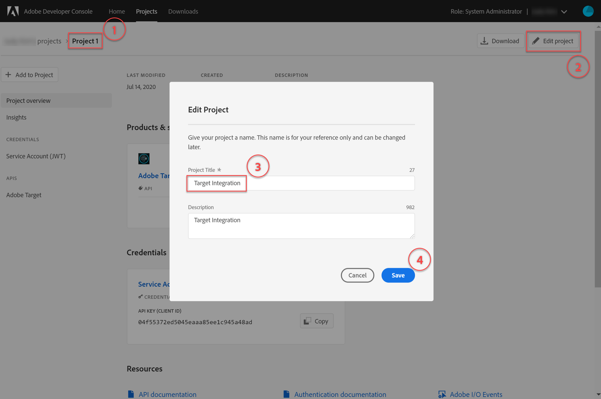

# Adobe Target API の認証の設定

Adobe Target Admin API（以下を含む） [!DNL Recommendations] Admin API は認証によって保護され、許可されたユーザーのみがAdobe Targetにアクセスするために使用できます。 以下を使用： [Adobe Developer Console](https://console.adobe.io/) を使用して、すべてのAdobe Experience Cloudソリューションに対してこの認証を管理できます。 [!DNL Target].

このレッスンでは、Adobe Target API とのやり取りに必要な認証トークンを生成するための事前手順について説明します。 以降の節では、以下をおこないます。

1. Adobe Developer Console でプロジェクト（旧称：統合）を作成します。
2. プロジェクトの詳細をPostmanに書き出します。
3. bearer アクセストークンを生成します。
4. bearer アクセストークンをテストします。

## 前提条件

| リソース | 詳細 |
| --- | --- |
| Postman | これらの手順を正しく完了するには、 [Postmanアプリ](https://www.postman.com/downloads/) ご使用のオペレーティングシステム用。 Postman basic は、アカウントの作成に自由に対応しています。 Adobe Target API を一般に使用するためには必須ではありませんが、Postmanでは API ワークフローが容易になります。Adobe Targetでは、API の実行とその動作方法の学習に役立つ、いくつかのPostmanコレクションが提供されています。 このチュートリアルの残りの部分は、Postmanの作業に関する知識を前提としています。 不明な点は、 [Postmanドキュメント](https://learning.getpostman.com/). |
| 参照 | このチュートリアルの残りの部分では、次のリソースに関する知識が必要となります。<UL><li>[Adobe I/OGithub](https://github.com/adobeio)</li><li>[TargetAdobe I/Oドキュメント](https://developers.adobetarget.com/api/#introduction)</li><li>[Recommendations API ドキュメント](https://developers.adobetarget.com/api/recommendations/)</li></ul> |

## Adobe I/Oプロジェクト

この節では、Adobe Developer Console にアクセスして、のプロジェクトを作成します。 [!DNL Adobe Target]. 詳しくは、 [プロジェクトのドキュメント](https://www.adobe.io/apis/experienceplatform/console/docs.html#!AdobeDocs/adobeio-console/master/projects.md).

<!--1. Generate your private key and public certificate, per the [documentation on authentication](https://www.adobe.io/authentication/auth-methods.html#!AdobeDocs/adobeio-auth/master/JWT/JWTCertificate.md). //<!--as described in **Step 1** of [How to set up Adobe IO: Authentication - Step by Step](https://helpx.adobe.com/marketing-cloud-core/kb/adobe-io-authentication-step-by-step.html). After completing Step 1, return to this tutorial and resume with Step 2, below. // The outcome of this step should be the creation of a `private.key` file and a `certificate_pub.crt` file. Return to this tutorial once you have generated these two files.-->

1. 内 [Adobe Admin Console](https://adminconsole.adobe.com/)を使用する場合は、Adobeユーザーアカウントが [製品管理者](https://helpx.adobe.com/enterprise/using/admin-roles.html) および [開発者](https://helpx.adobe.com/enterprise/using/manage-developers.html) ～へのアクセスをレベルで行う [!DNL Target].

2. 内 [Adobe Developer Console](https://console.adobe.io/)」で、このExperience Cloudを作成する統合組織を選択します。 (1 つの組織に対するアクセス権のみを持っている可能性があることにExperience Cloud)。

   

3. クリック **[!UICONTROL 新規プロジェクトを作成]**.

   

4. クリック **[!UICONTROL API を追加]** をクリックして、プロジェクトに REST API を追加し、Adobe サービスと製品にアクセスします。

   

5. 選択 **[!DNL Adobe Target]** をAdobe サービスとして追加します。 次をクリック： **[!UICONTROL 次へ]** 」ボタンをクリックします。

   

6. 公開鍵と秘密鍵を、Target 用に作成するサービスアカウント統合に関連付けるオプションを選択します。 このチュートリアルでは、 **[!UICONTROL オプション 1:キーペアを生成]** をクリックし、 **[!UICONTROL キーペアを生成]**.
   

7. 結果をメモしておきます。 指示に従って、自動的にダウンロードされた設定ファイル (`config`) で始まります。 「**[!UICONTROL 次へ]**」をクリックします。
   
8. ファイルシステムで、 `config`：前の手順で作成した圧縮設定ファイルです。 これもまた、 `config` ファイルには秘密鍵が含まれています。秘密鍵は後で必要になります。 ファイルシステム内の正確な場所は、次に示す場所とは異なる場合があります。
   
9. Adobe Developerコンソールで、 [製品プロファイル](https://helpx.adobe.com/enterprise/using/manage-products-and-profiles.html) を使用しているプロパティに対応 [!DNL Recommendations]. （プロパティを使用しない場合は、「デフォルトのワークスペース」オプションを選択します）。 クリック **[!UICONTROL 設定済み API を保存]**.
   

10. クリック **[!UICONTROL 統合を作成]**. API が正常に設定されたことを示す一時的なメッセージが表示されます。

11. 最後の手順として、プロジェクトの名前を、元の名前よりもわかりやすい名前に変更します `Project 1`. それには、図のようにナビゲーションパスを使用してプロジェクトに移動し、「 **[!UICONTROL プロジェクトを編集]** アクセスする**[!UICONTROL プロジェクトを編集] モーダルを表示し、プロジェクト名を変更します。

>[!NOTE]
> 
>このチュートリアルでは、プロジェクトに「Target 統合」という名前を付けます。 単なるAdobe Target以外にプロジェクトを使用することを想定している場合は、それに応じて名前を付けることができます。 例えば、Adobe Experience Cloudの他のソリューションで使用できるので、「AdobeAPI」または「Experience CloudAPI」という名前を選択できます。

## プロジェクトの詳細を書き出し

これで、にアクセスするために使用できるAdobeプロジェクトが作成されました。 [!DNL Target]の場合は、必ずAdobeAPI リクエストと共に、そのプロジェクトの詳細を送信する必要があります。 これらの詳細は、複数のAdobeAPI（複数を含む）を操作するために必要です [!DNL Target] API 例えば、統合の詳細には、 [!DNL Target] 管理 API したがって、Postmanで API を使用するには、これらの詳細をPostmanに取り込む必要があります。

Postmanでプロジェクトの詳細を指定する方法は多数ありますが、この節では、事前に作成された機能やコレクションを利用します。 まず、（この節で）統合の詳細をPostman環境に書き出します。 次に（次の節で）、必要なリソースへのアクセス権を付与する bearer アクセストークンを生成します。

>[!NOTE]
>
>任意のExperience Cloudソリューションに適用できるビデオ手順の場合： [!DNL Target]を参照してください。 [Experience PlatformAPI でのPostmanの使用](https://experienceleague.adobe.com/docs/platform-learn/tutorials/platform-api-authentication.html?lang=en). 以下のセクションは、 [!DNL Target] API:
>
> 1. Adobe I/O統合の詳細をPostmanに書き出す
> 2. Postmanでのアクセストークンの生成

>
> これらの手順も以下に示します。

1. まだ [Adobe Developer Console](https://console.adobe.io/)、に移動して、新しいプロジェクトの **[!UICONTROL サービスアカウント (JWT)]** 資格情報。 左側のナビゲーションまたは **[!UICONTROL 資格情報]** 」セクションに表示されます。
   
In **[!UICONTROL 資格情報の詳細]**&#x200B;を使用する場合、 **公開鍵**, **クライアント ID**、およびお客様のサービスアカウントに関連するその他の情報。
   
2. クリックして、 **[!UICONTROL Adobe Target]** API 左側のナビゲーションまたは **[!UICONTROL 接続された製品およびサービス]** 」セクションに表示されます。
   
3. クリック **[!UICONTROL Postman用のダウンロード]** > **[!UICONTROL サービスアカウント (JWT)]** :Postman環境の認証情報をキャプチャする JSON ファイルを作成します。
   
ファイルシステムに JSON ファイルを書き留めます。
   
4. Postmanで、歯車アイコンをクリックして環境を管理し、 **インポート** をクリックして、JSON ファイル（環境）を読み込みます。
   
5. ファイルを選択し、 **開く**.
   
6. Postman **環境の管理** モーダルを表示し、新しく読み込んだ環境の名前をクリックして、それを検査します。 ( 環境名は、ここに示す名前とは異なる場合があります。 必要に応じて名前を編集します。 必ずしもAdobeプロジェクトの名前と一致する必要はありません )。
   
7. 注意 `CLIENT_SECRET` および `API_KEY` （他の変数と共に）、Adobe Developerコンソールで定義されたとおりに、統合から取得した値が事前入力されます。 (Postman `CLIENT_SECRET` 変数は `CLIENT SECRET` 開発者コンソールに表示されるAdobe資格情報。 `API_KEY` Postmanも同様に一致する `CLIENT ID` （開発者コンソールの）。 これに対して、注意 `PRIVATE_KEY`, `JWT_TOKEN`、および `ACCESS_TOKEN` が空白の場合。 まず、 `PRIVATE_KEY` の値です。
   

   >[!NOTE]
   >
   >**驚き！**
   >
   >ポップクイズ！ 秘密鍵がどこにあるか覚えてる？
   >その通り、それは `config` Adobe Developer Console からダウンロードしたファイル

8. ファイルシステムから、 `config` ファイルを開き、 `private` キーファイル。
   
9. コンテンツ全体を選択してコピー `private` キーファイル。
   
10. Postmanで、秘密鍵の値を **初期値** および **現在の値** フィールド。
   
11. クリック **[!UICONTROL 更新]**&#x200B;をクリックし、環境モーダルを閉じます。

## bearer アクセストークンの生成

この節では、Adobe Target API とのインタラクションを認証するために必要な bearer アクセストークンを生成します。 bearer アクセストークンを生成するには、（前の節で確立した）統合の詳細を [AdobeIdentity Managementサービス (IMS)](https://www.adobe.io/authentication/auth-methods.html#!AdobeDocs/adobeio-auth/master/AuthenticationOverview/AuthenticationGuide.md). これをおこなう方法はいくつかありますが、このチュートリアルでは、IMS API に対するカスタムPOSTリクエストを作成します。 冗談です。 このチュートリアルでは、プロセスを直接簡単にする、事前設計済みの IMS 呼び出しを含むPostmanコレクションを活用します。 コレクションを読み込んだら、必要に応じて再利用し、Adobe Targetだけでなく他のAdobeAPI 用にも新しいトークンを生成できます。

1. 次に移動： [AdobeIdentity Managementサービス API のサンプル呼び出し](https://github.com/adobe/experience-platform-postman-samples/tree/master/apis/ims).
   
2. 次をクリック： **Adobe I/Oアクセストークン生成Postmanコレクション**.
   
3. このコレクションの生の JSON を取得するには、 **生**、結果の JSON をクリップボードにコピーします。 （または、生の JSONを.json ファイルとして保存できます）。
   
4. Postmanで、生の JSON を貼り付けてクリップボードから送信し、コレクションを読み込みます。 （または、保存した.json ファイルをアップロードすることもできます）。 「**続行**」をクリックします。
   
5. を選択します。 **[!UICONTROL IMS:JWT 生成+ユーザートークンを介した認証]** 「Adobe I/Oアクセストークン生成Postman 」コレクションでリクエストし、環境が選択されていることを確認して、「 」をクリックします。 **送信** をクリックしてトークンを生成します。

   

   >[!NOTE]
   >
   >この bearer アクセストークンは 24 時間有効です。 新しいトークンを生成する必要が生じたら、いつでもリクエストを再度送信します。

6. 環境の管理モーダルを再度開き、環境を選択します。
   
7. 次の点に注意してください。 `ACCESS_TOKEN` および `JWT_TOKEN` 値が入力されるようになりました。
   

>[!NOTE]
>
>Q:JSON Web トークン (JWT) と bearer アクセストークンを生成するには、Adobe I/Oアクセストークン生成Postmanコレクションを使用する必要がありますか？
>
>回答：だめだ！ Adobe I/Oアクセストークン生成のPostmanコレクションは、Postmanで JWT および bearer アクセストークンをより簡単に生成できる便利な方法として利用できます。 または、Adobe Developerコンソール内の機能を使用して、bearer アクセストークンを手動で生成することもできます。

## bearer アクセストークンのテスト

この演習では、お使いの [!DNL Target] アカウント 正常な応答は、Adobeプロジェクトと認証が API を使用するために期待どおりに動作していることを示します。

1. 次をインポート： [Adobe Target Admin APIs Postman Collection](https://developers.adobetarget.com/api/#admin-postman-collection). コレクションがPostmanに読み込まれるまで、すべてのプロンプトに従います。
   
1. コレクションを展開し、 **[!UICONTROL アクティビティのリスト]** リクエスト。
   
1. なお、 `{{access_token}}` は最初は未解決です。 これを解決するには、いくつか異なる方法があります。例えば、 `{{access_token}}` — ただし、このチュートリアルでは、以前使用していたPostman環境を活用するために、代わりに API リクエストを変更します。 これにより、環境は、AdobeAPI 間で共通するすべての変数を単一の一貫した統合として引き続き機能します。
   
1. 置き換えるタイプ `{{access_token}}` と `{{ACCESS_TOKEN}}`.
   
1. 置き換えるタイプ `{{api_key}}` と `{{API_KEY}}`.
   
1. 置き換えるタイプ `{{tenant}}` と `{{TENANT_ID}}`. 注意 `{{TENANT_ID}}` はまだ認識されていません。
   
1. 環境を管理モーダルを開き、環境を選択します。
   
1. 入力して新しい `{{TENANT_ID}}` 環境変数。 テナント ID の値を **初期値** および **現在の値** 新しい `TENANT_ID` 環境変数。

   

   >[!NOTE]
   >
   >テナント ID が [!DNL Target] `clientcode`. 次にログインすると、URL にテナント ID が存在します： [!DNL Target]. テナント ID を取得するには、 [!DNL Adobe Experience Cloud]，開く [!DNL Target]をクリックし、 [!DNL Target] カード。 URL サブドメインで指定されているように、テナント ID の値を使用します。
   >
   >例えば、Adobe Targetにログインした際の URL が
   >
   >`<https://mycompany.experiencecloud.adobe.com/...>`
   >
   >テナント ID が「mycompany」になります。

1. 正しい環境を選択したことを確認した後、リクエストを送信します。 アクティビティのリストを含む応答を受信します。
   

おめでとうございます。 これで、Adobe認証を確認したので、これを使用してAdobe Target API( および他のAdobeAPI) とやり取りできます。 例えば、次のことが可能です。 [Recommendations API の使用](https://experienceleague.adobe.com/docs/target-learn/recommendations-api-tutorial/recs-api-overview.html) を使用して、レコメンデーションを作成または管理します。
