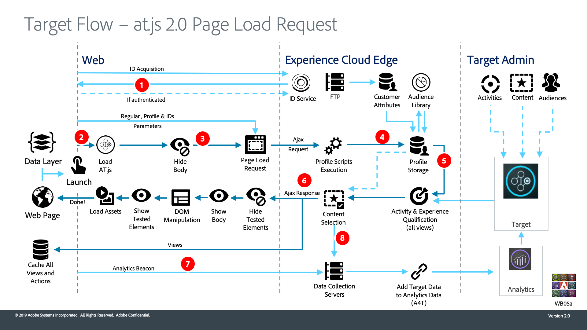
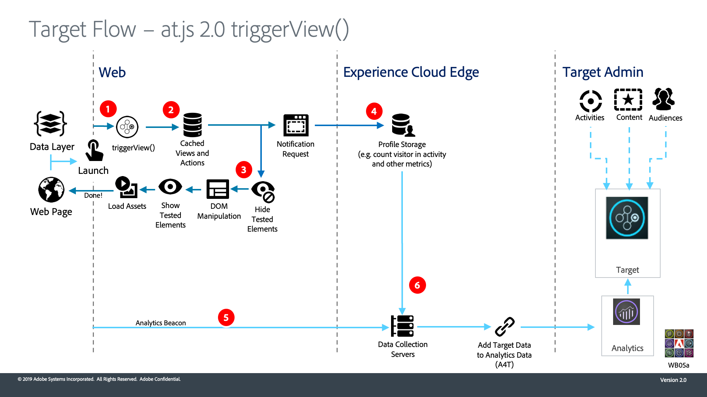

# Adobe Target at.js 2.0の仕組みを理解する

`at.js` 2.0は、Adobe TargetのSPA （シングルページアプリケーション）のサポートを強化し、他のExperience Cloud ソリューションと統合します。 このビデオと図では、すべてがどのようにまとまっているかを説明します。

>[!VIDEO](https://video.tv.adobe.com/v/26250?quality=12)

## アーキテクチャ図

ページ読み込み時の

1. 呼び出しは、Experience Cloud ID （ECID）を返します。 ユーザーが認証された場合、別の呼び出しは顧客IDを同期します。

1. `at.js` ライブラリが同期して読み込まれ、ドキュメント本文が非表示になります（`at.js`は、オプションの事前非表示スニペットをページに実装して非同期で読み込むこともできます）。

1. ページ読み込みリクエストは、設定されたすべてのパラメーター、ECID、SDID、顧客IDを含めて行われます。

1. プロファイルスクリプトが実行され、[!UICONTROL Profile Store]にフィードされます。 ストアは、[!UICONTROL Audience Library]から適格なオーディエンスをリクエストします（例：[!DNL Analytics]から共有されたオーディエンス、Audience Managerなど）。 [!UICONTROL Customer Attributes]はバッチ処理で[!UICONTROL Profile Store]に送信されます。
1. URL、リクエストパラメーター、プロファイルデータに基づいて、[!DNL Target]は、現在のページと今後のビューに対して訪問者に返すアクティビティとエクスペリエンスを決定します

1. ターゲティングされたコンテンツは、ページに送り返されます。オプションで、追加のパーソナライゼーション用のプロファイル値も含まれます。

   現在のページ上のターゲットコンテンツは、デフォルトコンテンツのちらつきを避けて、できるだけ早く表示されます。

   シングルページアプリケーションの将来のビュー用のターゲットコンテンツはブラウザーにキャッシュされるため、ビューがトリガーされたときに追加のサーバーコールなしで即座に適用できます。 （`triggerView()`の動作については、次の図を参照してください）。

1. ページから[!UICONTROL Data Collection] サーバーに[!DNL Analytics] データが送信されました
1. [!DNL Target] データはSDIDを介してAnalytics データと照合され、[!DNL Analytics] レポートストレージに処理されます。 [!DNL Analytics]個のデータは、A4T レポートを使用して[!DNL Analytics]と[!DNL Target]の両方で表示できます。

triggerView （）関数が使用されている場合の

1. `adobe.target.triggerView()`がシングルページアプリケーションで呼び出されます
1. ビューのターゲットコンテンツは、キャッシュから読み取られます

1. ターゲットコンテンツは、デフォルトコンテンツのちらつきを避けて、できるだけ早く表示されます

1. アクティビティおよび増分指標で訪問者をカウントするために、[!DNL Target] [!UICONTROL Profile Store]に通知リクエストが送信されます
1. [!DNL Analytics] データがSPAから[!UICONTROL Data Collection] サーバーに送信されます

1. [!DNL Target] データが[!DNL Target] バックエンドから[!UICONTROL Data Collection] サーバーに送信されます。 [!DNL Target] データはSDIDを介して[!DNL Analytics] データと照合され、[!DNL Analytics] レポートストレージに処理されます。 [!DNL Analytics]個のデータは、A4T レポートを使用して[!DNL Analytics]と[!DNL Target]の両方で表示できます。

## その他のリソース

* [シングルページアプリケーションでのat.js 2.0の実装](implement-atjs-20-in-a-single-page-application.md)
* [Adobe TargetのVisual Experience Composer for Single Page Applications （SPA VEC）の使用](../experiences/use-the-visual-experience-composer-for-single-page-applications.md)
