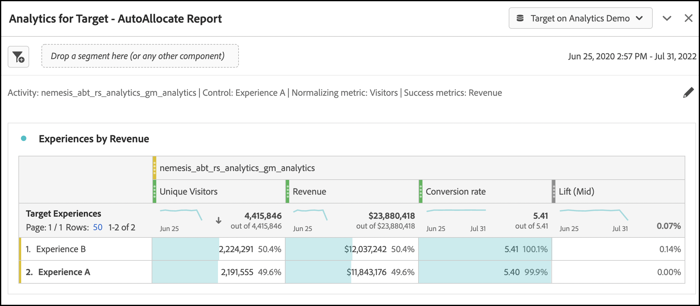

# Analysis Workspace for [!DNL Auto-Allocate] アクティビティ

An [!DNL Auto-Allocate] 「 」アクティビティでは、2 つ以上のエクスペリエンスの中から勝者を特定し、テストの実施と学習が続く間に、自動的にその勝者に配分するトラフィックを増やします。 用の Analytics for Target(A4T) 統合 [!DNL Auto-Allocate] では、レポートデータをAdobe Analyticsで確認したり、Adobe Analyticsで定義されたカスタムイベントや指標に対しても最適化したりできます。

豊富な分析機能はAdobe Analytics Analysis Workspaceで使用できますが、デフォルトの **[!UICONTROL Analytics for Target]** 正しく解釈するには、パネルが必要です [!DNL Auto-Allocate] アクティビティ、 [最適化基準](https://experienceleague.adobe.com/docs/target/using/integrate/a4t/a4t-at-aa.html?lang=en#supported).

このチュートリアルでは、分析に推奨される変更について説明します [!DNL Auto-Allocate] アクティビティを参照してください。 主な概念は次のとおりです。

* 訪問者は、常に、 [!DNL Auto-Allocate] アクティビティ。
* 指標がAdobe Analytics指標の場合、コンバージョン率に適した分子は、アクティビティの設定時に選択した最適化条件のタイプによって異なります。
   * 「個別訪問者コンバージョン率の最大化」の最適化基準では、コンバージョン率が算出されます。このコンバージョン率の分子は、指標の正の値を持つ個別訪問者の数です。
   * 「訪問者ごとの指標値を最大化*」には、Adobe Analyticsの通常の指標値を分子とするコンバージョン率があります。 これは、デフォルトで **[!UICONTROL Analytics for Target]** パネルを使用して、
* 最適化指標が Target が定義したコンバージョン指標の場合、デフォルトは **[!UICONTROL Analytics for Target]** Workspace のパネルは、パネルの設定を処理します。
* Workspace で表示される信頼性の数値は、 [自動配分で使用されるより保守的な統計](https://experienceleague.adobe.com/docs/target/using/activities/auto-allocate/automated-traffic-allocation.html?lang=en#section_98388996F0584E15BF3A99C57EEB7629)を削除する必要があります。

## 用の A4T の作成 [!DNL Auto-Allocate] Workspace のパネル

用の A4T を作成するには、以下を実行します。 [!DNL Auto-Allocate] レポートは **[!UICONTROL Analytics for Target]** パネルに表示されます。 次に、以下の選択を行います。

1. **[!UICONTROL コントロールエクスペリエンス]**:任意のエクスペリエンスを選択できます
2. **[!UICONTROL 指標の標準化]**:訪問者を選択 — 自動配分は、常に個別訪問者別にコンバージョン率を正規化します。
3. **[!UICONTROL 成功指標]**:アクティビティの作成時に使用した指標と同じ指標を選択します。これが Target が定義したコンバージョン指標の場合は、 **アクティビティコンバージョン**. それ以外の場合は、使用したAdobe Analytics指標を選択します。

*図 1:用の Analytics for Target パネルのセットアップ [!DNL Auto-Allocate] アクティビティ。*

>[!NOTE]
>
> また、事前設計された **[!UICONTROL Analytics for Target]** パネルを使用します。

## 「訪問者あたりの指標値を最大化」の最適化条件による Target のコンバージョン指標または Analytics 指標

デフォルトの A4T パネルが [!DNL Auto-Allocate] 目標指標が Target コンバージョンか、最適化条件「訪問者あたりの指標値を最大化」を持つ Analytics 指標であるアクティビティ。

このパネルの例の 1 つは売上高指標です。「訪問者あたりの指標値の最大化」がアクティビティ作成時の最適化条件として選択されています。 前述のように、 [!DNL Auto-Allocate] では、 **[!UICONTROL Analytics for Target]** パネル。 したがって、信頼性指標と、関連する上昇率指標と上昇率指標を削除することをお勧めします。

*図 2:の推奨レポート [!DNL Auto-Allocate] アクティビティの最適化条件に含まれる Analytics 指標による訪問者あたりの指標値の最大化を参照してください。 これらのタイプの指標および Target で定義されたコンバージョン指標の場合、デフォルトは&#x200B;**[!UICONTROL Analytics for Target]**workspace のパネルを使用できます。*

## Analytics 指標と「個別訪問者コンバージョン率を最大化」最適化条件

Adobe Analytics指標を *個別訪問者コンバージョン率の最大化*、デフォルト **[!UICONTROL Analytics for Target]** workspace のパネルは変更する必要があります。

成功指標は、コンバージョン指標が肯定的だった個別訪問者の数になりました。 これは、指標の正の値を持つヒットをフィルタリングするセグメントを作成することで実現できます。 次のように、このセグメントを作成します。

1. を選択します。 **コンポーネント** > **セグメントを作成** 」オプションを使用します。
1. アクティビティ作成時に使用する指標を左側のパネルから **定義** 」ボックスに入力します。
1. 指標の値を選択します。 **より大きい** 0 の数値。
1. 次の **次を含む** ドロップダウン、選択 **訪問者**
1. セグメントに適切な名前を付けます

セグメントの作成例を次の図に示します。ここで、売上高がプラスの訪問者を選択します。

*図 3:最適化条件が「個別訪問者コンバージョン率の最大化」と等しいAdobe Analytics指標のセグメント作成。 この例では、指標は売上高で、最適化の目標は、正の売上高を持つ訪問者数を最大化することです。*

適切なセグメントが作成されたら、デフォルトの  **[!UICONTROL Analytics for Target]** workspace のパネルは変更できます。

1. 秒を追加 **実訪問者数** 既存の訪問者指標列と共に表示される指標
2. 最初の列の下に作成したセグメントをドラッグして、図 4 のようなパネルを作成します。 この違いに注目してください。つまり、正の売上高を持つユニーク訪問者の数は、各エクスペリエンスに割り当てられたユニーク訪問者の合計数の一部です。
   
   *図 4:新しく作成したセグメントによる個別訪問者のフィルタリング*
3. コンバージョン率は、 [迅速に計算される](https://experienceleague.adobe.com/docs/analytics-learn/tutorials/components/calculated-metrics/quick-calculated-metrics-in-analysis-workspace.html?lang=en) 1 列目と 2 列目の両方をハイライト表示し、右クリックして、選択する **選択から指標を作成** > **除算**. デフォルトのコンバージョン率は削除し、次の図に示すように、この新しい計算指標に置き換える必要があります。 新しく作成した計算指標を編集して **形式** > **割合** 図のように、小数点以下 2 桁までです。
   

   *図 4:2 値化された売上高コンバージョン指標のコンバージョン率を示す最終的な自動配分パネル*

## まとめ

上記の手順では、 [!DNL Workspace] 自動配分レポートデータを表示します。 まとめると、次のようになります。

* 指標が、Target が定義したコンバージョン指標、または最適化条件を含むAdobe Analytics指標の場合。 *訪問者あたりの指標値の最大化*&#x200B;を使用する場合は、訪問者を標準化指標として設定したデフォルトのワークスペースパネルを使用する必要があります。
* 指標がAdobe Analytics指標で、最適化基準「個別訪問者コンバージョン率を最大化」が設定されている場合は、指標が正の数を示す訪問者の割合として定義されたコンバージョン率を使用する必要があります。 これは、個別訪問者数指標をフィルタリングする対応するセグメントを作成することでおこなわれます。
