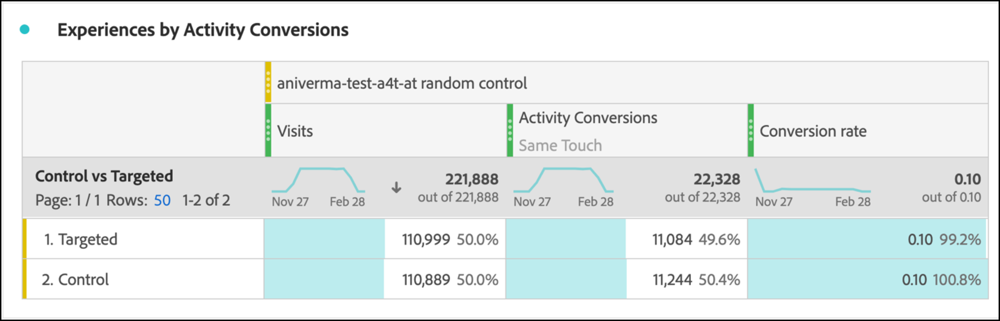
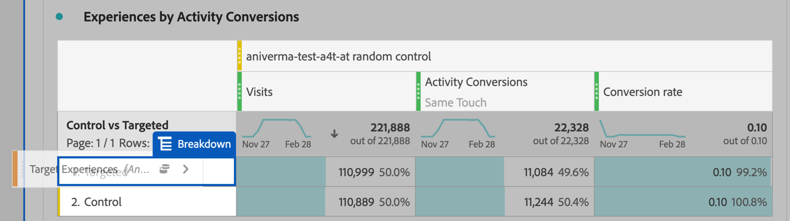
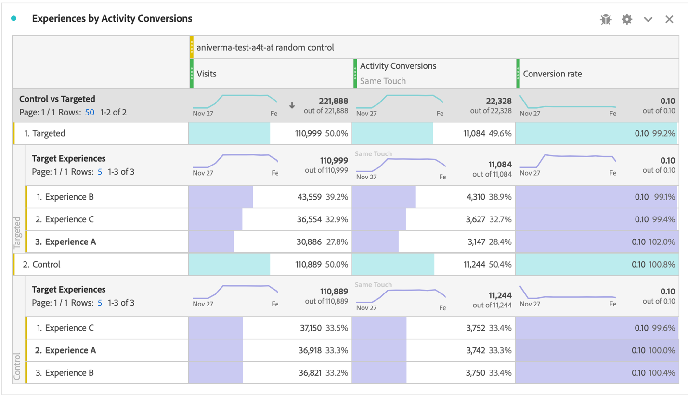
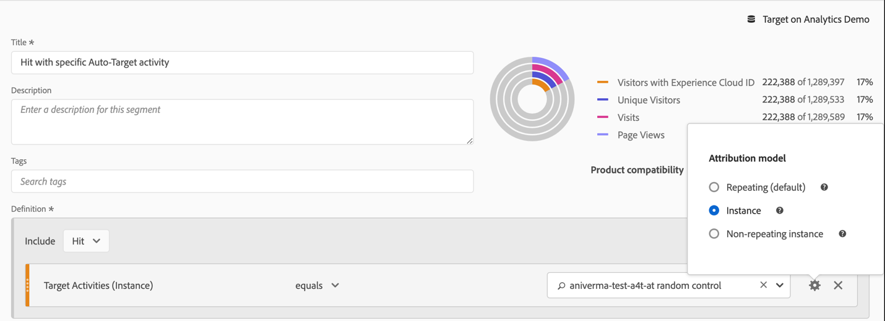
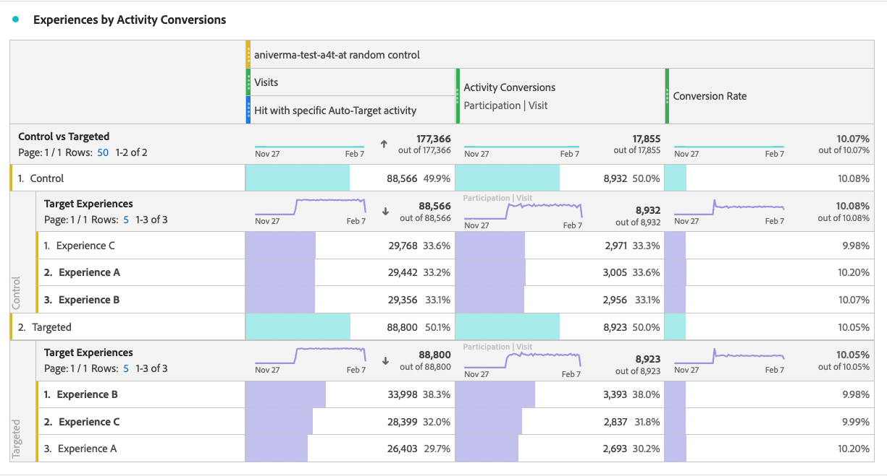
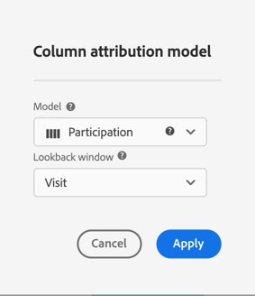
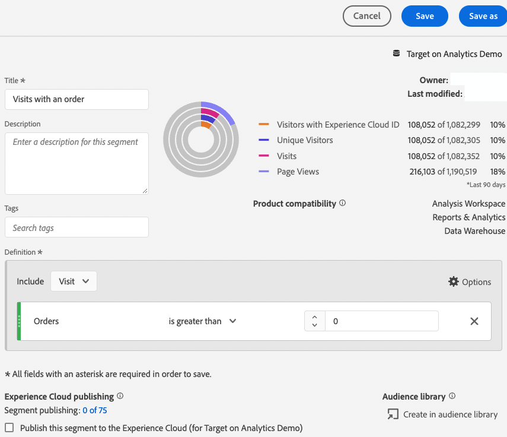

# [!DNL Auto-Target]件のアクティビティに対して[!DNL Analysis Workspace]でA4T レポートを設定します

>[!IMPORTANT]
>
>[!UICONTROL Auto-Target]のアクティビティの場合、[!DNL Analytics Workspace]のレポートを確認し、A4T パネルを手動で作成する必要があります。

[!DNL Auto-Target] アクティビティの[!UICONTROL Analytics for Target] （A4T）統合では、[!DNL Adobe Target] アンサンブルマシンラーニング （ML） アルゴリズムを使用して、訪問者のプロファイル、行動、コンテキストに基づいて各訪問者に最適なエクスペリエンスを選択し、[!DNL Adobe Analytics]目標指標を使用します。

豊富な分析機能は[!DNL Adobe Analytics] [!DNL Analysis Workspace]で利用できますが、実験アクティビティ （手動[!UICONTROL A/B Test]と[!UICONTROL Auto-Allocate]）とパーソナライゼーションアクティビティ （[!UICONTROL [!UICONTROL Auto-Target]]）の違いにより、[!DNL Auto-Target] アクティビティを正しく解釈するには、デフォルトの&#x200B;**[!UICONTROL Analytics for Target]** パネルに対するいくつかの変更が必要です。

このチュートリアルでは、次の主要な概念に基づいて、[!DNL Analysis Workspace]の[!UICONTROL Auto-Target] アクティビティを分析する際に推奨される変更について説明します。

* **[!UICONTROL Control vs Targeted]** ディメンションを使用すると、[!UICONTROL Control]個のエクスペリエンスと[!UICONTROL Auto-Target]個のアンサンブルマシンラーニングアルゴリズムで提供されるエクスペリエンスを区別できます。
* 訪問は、エクスペリエンスレベルのパフォーマンスの内訳を表示する際に、正規化指標として使用する必要があります。 さらに、[Adobe Analyticsのデフォルトのカウント手法には、ユーザーが実際にアクティビティコンテンツ &#x200B;](https://experienceleague.adobe.com/docs/target/using/integrate/a4t/a4t-faq/a4t-faq-viewing-reports.html#metrics){target=_blank}を表示しない訪問が含まれる場合がありますが、このデフォルトの動作は、適切な範囲のセグメントを使用して変更できます（詳細は以下を参照）。
* 訪問ルックバックスコープのアトリビューションは、所定のアトリビューションモデルの「訪問ルックバックウィンドウ」とも呼ばれ、トレーニングフェーズ中に[!DNL Adobe Target] ML モデルで使用され、目標指標を分類する場合は、同じ（デフォルト以外の）アトリビューションモデルを使用する必要があります。

## [!DNL Analysis Workspace] での [!UICONTROL Auto-Target] パネル用の A4T の作成

[!UICONTROL Auto-Target]報告書のA4Tを作成するには、次に示すように、[!DNL Analysis Workspace]の&#x200B;**[!UICONTROL Analytics for Target]** パネルから開始するか、フリーフォームテーブルから開始します。 次に、以下の選択を行います。

1. **[!UICONTROL Control Experience]**：任意のエクスペリエンスを選択できますが、後でこの選択を上書きします。 [!UICONTROL Auto-Target]のアクティビティの場合、コントロール エクスペリエンスは実際にはコントロール戦略です。a）すべてのエクスペリエンス間でランダムに提供するか、b）単一のエクスペリエンスを提供します（この選択は、[!DNL Adobe Target]のアクティビティ作成時に行われます）。 選択肢（b）を選択した場合でも、[!UICONTROL Auto-Target] アクティビティは特定のエクスペリエンスをコントロールとして指定しました。 このチュートリアルで説明した、[!UICONTROL Auto-Target]のアクティビティのA4Tを分析する方法に従ってください。
2. **[!UICONTROL Normalizing Metric]**: [!UICONTROL Visits]を選択します。
3. **[!UICONTROL Success Metrics]**：レポートする指標を選択できますが、一般的に、[!DNL Target]でのアクティビティ作成時に最適化のために選択したのと同じ指標でレポートを表示する必要があります。

   [!UICONTROL Auto-Target] アクティビティの![[!UICONTROL Analytics for Target] パネル設定。](assets/Figure1.png)

   *図1: [!UICONTROL Auto-Target] アクティビティの[!UICONTROL Analytics for Target] パネル設定。*

>[!TIP]
>
>[!UICONTROL Analytics for Target] パネルを[!UICONTROL Auto-Target] アクティビティ用に設定するには、任意のコントロールエクスペリエンスを選択し、正規化指標として[!UICONTROL Visits]を選択し、[!DNL Target] アクティビティ作成時に最適化のために選択したのと同じ目標指標を選択します。

## [!UICONTROL Control vs.Targeted] ディメンションを使用して、[!DNL Target] アンサンブル ML モデルをコントロールと比較します

デフォルトのA4T パネルは、クラシック（手動）の[!UICONTROL A/B Test]または[!UICONTROL Auto-Allocate] アクティビティ用に設計されており、目標は個々のエクスペリエンスのパフォーマンスとコントロールエクスペリエンスを比較することです。 ただし、[!UICONTROL Auto-Target] アクティビティでは、最初の順序の比較は、コントロール *戦略*&#x200B;とターゲット *戦略*&#x200B;の間で行う必要があります。 つまり、[!UICONTROL Auto-Target] アンサンブル ML モデルの全体的なパフォーマンスの上昇率を制御戦略に対して決定します。

この比較を実行するには、**[!UICONTROL Control vs Targeted (Analytics for Target)]** ディメンションを使用します。 ドラッグ&amp;ドロップして、デフォルトのA4T レポートの&#x200B;**[!UICONTROL Target Experiences]** ディメンションを置き換えます。

この置き換えにより、A4T パネルのデフォルトの[!UICONTROL Lift and Confidence]計算が無効になることに注意してください。 混乱を避けるために、次のレポートを残して、これらの指標をデフォルトパネルから削除できます。

[!DNL Analysis Workspace]の[!UICONTROL Experiences by Activity Conversions] パネル

*図2: [!DNL Auto-Target] アクティビティの推奨ベースラインレポート。 このレポートは、対象トラフィック （アンサンブル ML モデルによって提供される）と制御トラフィックを比較するように設定されています。*

>[!NOTE]
>
>現在、[!UICONTROL Auto-Target]のA4T レポートの[!UICONTROL Control vs Targeted] ディメンションでは[!UICONTROL Lift and Confidence]個の数値を使用できません。 サポートが追加されるまでは、[信頼計算機](https://experienceleague.adobe.com/docs/target/assets/complete_confidence_calculator.xlsx)をダウンロードして、[!UICONTROL Lift and Confidence]を手動で計算できます。

## エクスペリエンスレベルで指標の内訳を追加する

アンサンブルマシンラーニングモデルのパフォーマンスについてさらにinsightを深めるために、**[!UICONTROL Control vs Targeted]** ディメンションのエクスペリエンスレベルの内訳を調べることができます。 [!DNL Analysis Workspace]で、**[!UICONTROL Target Experiences]** ディメンションをレポートにドラッグし、コントロール ディメンションとターゲットディメンションをそれぞれ個別に分割します。

[!DNL Analysis Workspace]の[!UICONTROL Experiences by Activity Conversions] パネル

*図3: ターゲットエクスペリエンス別のターゲットディメンションの分類*

結果のレポートの例を次に示します。

[!DNL Analysis Workspace]の[!UICONTROL Experiences by Activity Conversions] パネル

*図4：エクスペリエンスレベルの内訳が記載された標準[!UICONTROL Auto-Target] レポート。 目標指標が異なる場合があり、制御戦略が単一のエクスペリエンスを持つ場合があることに注意してください。*

>[!TIP]
>
>[!DNL Analysis Workspace]で、歯車アイコンをクリックして[!UICONTROL Conversion Rate]列の割合を非表示にし、エクスペリエンスのコンバージョン率に注目し続けることができます。 コンバージョン率は10進数としてフォーマットされますが、それに応じてパーセンテージとして解釈されます。

## 「[!UICONTROL Visits]」が[!UICONTROL Auto-Target] アクティビティの正規化指標として正しい理由

[!UICONTROL Auto-Target] アクティビティを分析する場合は、常にデフォルトの正規化指標として[!UICONTROL Visits]を選択してください。 [!UICONTROL Auto-Target]のパーソナライゼーションでは、訪問ごとに1回（正式には[!DNL Target] セッションごとに1回）訪問者のエクスペリエンスが選択されます。つまり、訪問者に表示されるエクスペリエンスは、訪問ごとに1回ずつ変更できます。 したがって、[!UICONTROL Unique Visitors]を正規化指標として使用すると、1人のユーザーが（異なる訪問で）複数のエクスペリエンスを表示する可能性があるという事実により、コンバージョン率が混乱する可能性があります。

単純な例では、次の点を示しています。2人の訪問者が2つのエクスペリエンスしかないキャンペーンに参加するシナリオを考えてみましょう。 最初の訪問者は2回訪問します。 初回訪問時にはエクスペリエンス Aに割り当てられますが、2回目の訪問時にはエクスペリエンス Bに割り当てられます（2回目の訪問時にプロファイルの状態が変化するため）。 2回目の訪問後、訪問者は注文してコンバージョンしました。 コンバージョンは、直近に表示されたエクスペリエンス（エクスペリエンス B）に起因します。 2人目の訪問者も2回訪問し、その両方でエクスペリエンス Bが表示されますが、コンバージョンには至りません。

訪問者レベルと訪問レベルのレポートを比較してみましょう。

| エクスペリエンス | ユニーク訪問者 | 訪問 | コンバージョン数 | 訪問者標準コンバージョン率 | 訪問/正規化コンバージョン率 |
| --- | --- | --- | --- | --- | --- |
| A | 1 | 1 | - | 0% | 0% |
| B | 2 | 3 | 1 | 50% | 33.3% |
| 合計 | 2 | 4 | 1 | 50% | 25％ |

*表1：意思決定が訪問に固執するシナリオ（通常のA/B テストと同様に、訪問者ではなく）について、訪問者正規化レポートと訪問正規化レポートを比較する例。 訪問者正規化された指標は、このシナリオでは混乱します。*

表に示すように、訪問者レベルの数値には明確な不整合があります。 合計ユニーク訪問者が2人いるにもかかわらず、これは各体験に対する個々のユニーク訪問者の合計ではありません。 訪問レベルのコンバージョン率は必ずしも間違っているわけではありませんが、個々の体験を比較すれば、訪問レベルのコンバージョン率はもっと理にかなっています。 正式には、分析の単位（「訪問」）は決定粘着性の単位と同じであり、つまり、指標のエクスペリエンスレベルの内訳を追加して比較することができます。

## アクティビティへの実際の訪問のフィルター

[!DNL Target] アクティビティへの訪問に対する[!DNL Adobe Analytics]のデフォルトのカウント方法には、ユーザーが[!DNL Target] アクティビティとインタラクションしなかった訪問が含まれる場合があります。 これは、[!DNL Target] アクティビティの割り当てが[!DNL Analytics]訪問者コンテキストに保持される方法が原因です。 その結果、[!DNL Target] アクティビティへの訪問数が増えることがあり、コンバージョン率が低下する可能性があります。

ユーザーが実際に[!UICONTROL Auto-Target] アクティビティを操作した訪問についてレポートを作成する場合（アクティビティへのエントリ、表示イベントまたは訪問イベント、コンバージョンなど）、次の操作を実行できます。

1. 該当する[!DNL Target] アクティビティからのヒットを含む特定のセグメントを作成し、次に
1. このセグメントを使用して[!UICONTROL Visits]指標をフィルタリングします。

**セグメントを作成するには：**

1. [!DNL Analysis Workspace] ツールバーの&#x200B;**[!UICONTROL Components > Create Segment]** オプションを選択します。
2. セグメントの&#x200B;**[!UICONTROL Title]**&#x200B;を指定してください。 次の例では、セグメントの名前は[!DNL "Hit with specific Auto-Target activity"]です。
3. **[!UICONTROL Target Activities]** ディメンションをセグメント **[!UICONTROL Definition]** セクションにドラッグします。
4. **[!UICONTROL equals]**&#x200B;演算子を使用します。
5. 特定の[!DNL Target] アクティビティを検索します。
6. 歯車アイコンをクリックし、次の図に示すように&#x200B;**[!UICONTROL Attribution model > Instance]**&#x200B;を選択します。
7. **[!UICONTROL Save]** をクリックします。

[!DNL Analysis Workspace]の セグメント

*図5：ここに示すようなセグメントを使用して、[!UICONTROL Auto-Target] レポート*&#x200B;のA4Tの[!UICONTROL Visits] メトリックをフィルタリングします

セグメントを作成したら、それを使用して[!UICONTROL Visits]指標をフィルタリングするため、[!UICONTROL Visits]指標には、ユーザーが[!DNL Target] アクティビティとインタラクションした訪問のみが含まれます。

**このセグメントを使用して[!UICONTROL Visits]をフィルタリングするには：**

1. 新しく作成したセグメントをコンポーネントツールバーからドラッグし、青い&#x200B;**[!UICONTROL Filter by]** プロンプトが表示されるまで&#x200B;**[!UICONTROL Visits]**&#x200B;指標ラベルのベースにカーソルを合わせます。
2. セグメントを解除します。 フィルターがその指標に適用されます。

最後のパネルは次のように表示されます。

[!DNL Analysis Workspace]の[!UICONTROL Experiences by Activity Conversions] パネル

*図6: [!UICONTROL Visits]指標に「特定の自動ターゲットアクティビティでヒット」セグメントが適用されたレポートパネル。 このセグメントは、ユーザーが問題の[!DNL Target] アクティビティを実際に操作した訪問のみがレポートに含まれるようにします。*

## 目標指標とアトリビューションが最適化基準に合致していることを確認します

A4T統合により、[!DNL Adobe Analytics]が&#x200B;*パフォーマンスレポートの生成*&#x200B;に使用するのと同じコンバージョンイベントデータを使用して、[!UICONTROL Auto-Target] ML モデルを&#x200B;*トレーニング*&#x200B;できます。 ただし、マシンラーニングモデルのトレーニング時にこのデータを解釈する際に採用しなければならない特定の仮定があります。これは、[!DNL Adobe Analytics]のレポート段階で行われたデフォルトの仮定とは異なります。

具体的には、[!DNL Adobe Target] ML モデルは、訪問範囲のアトリビューションモデルを使用します。 すなわち、マシンラーニングモデルは、コンバージョンがマシンラーニングモデルによって行われた決定に「起因する」ために、アクティビティのコンテンツの表示と同じ訪問でコンバージョンが行われなければならないと仮定します。 これは、[!DNL Target]がモデルのタイムリーなトレーニングを保証するために必要です。[!DNL Target]は、モデルのトレーニングデータに追加する前に、コンバージョンを最大30日間待つことはできません（[!DNL Adobe Analytics]のレポートのデフォルトのアトリビューションウィンドウ）。

したがって、[!DNL Target] モデルで使用されるアトリビューション （トレーニング中）と、データのクエリに使用されるデフォルトのアトリビューション （レポート生成中）の違いは、不一致につながる可能性があります。 実際にはアトリビューションに問題がある場合、マシンラーニングモデルのパフォーマンスが低いように見えることもあります。

>[!TIP]
>
>マシンラーニングモデルが、レポートで表示する指標とは異なる指標に対して最適化されている場合、モデルは期待どおりに実行されない可能性があります。 これを回避するには、レポートの目標指標で、[!DNL Target] ML モデルで使用される指標の定義とアトリビューションが同じであることを確認します。

正確な指標の定義とアトリビューションの設定は、アクティビティの作成中に指定した[最適化基準](https://experienceleague.adobe.com/docs/target/using/integrate/a4t/a4t-at-aa.html?lang=ja#supported){target=_blank}によって異なります。

### ターゲットが定義したコンバージョン、または[!DNL Analytics]個の指標（1訪問あたりの指標値の最大化&#x200B;*件*）

指標が[!DNL Target]のコンバージョンである場合、または&#x200B;**訪問あたりの指標値を最大化**&#x200B;する[!DNL Analytics]の指標である場合、目標指標の定義により、同じ訪問で複数のコンバージョンイベントを発生させることができます。

[!DNL Target] ML モデルで使用されているのと同じアトリビューション手法を持つ目標指標を表示するには、次の手順に従います。

1. 目標指標のギアアイコンにカーソルを合わせます。

   

1. 表示されるメニューから、**[!UICONTROL Data settings]**&#x200B;までスクロールします。
1. **[!UICONTROL Use non-default  attribution model]**&#x200B;を選択します（まだ選択されていない場合）。

   

1. **[!UICONTROL Edit]** をクリックします。
1. **[!UICONTROL Model]**: **[!UICONTROL Participation]**、および&#x200B;**[!UICONTROL Lookback window]**: **[!UICONTROL Visit]**&#x200B;を選択します。

   

1. **[!UICONTROL Apply]** をクリックします。

これらの手順により、目標メトリック イベントが&#x200B;*いつでも* （「参加」）発生した場合、レポートが目標メトリックをエクスペリエンスの表示に確実に関連付けるようにします。このイベントは、エクスペリエンスが表示された同じ訪問で発生します。

### *ユニーク訪問コンバージョン率*&#x200B;の[!DNL Analytics]指標

**肯定的な指標セグメントで訪問を定義**

最適化基準として「*ユニーク訪問コンバージョン率を最大化*」を選択したシナリオでは、コンバージョン率の正しい定義は、指標の値が正の訪問の割合です。 これは、指標の正の値を持つ訪問に絞り込むセグメントを作成し、訪問指標をフィルタリングすることで実現できます。

1. 以前と同様に、[!DNL Analysis Workspace] ツールバーの&#x200B;**[!UICONTROL Components > Create Segment]** オプションを選択します。
2. セグメントの&#x200B;**[!UICONTROL Title]**&#x200B;を指定してください。

   次の例では、セグメントの名前は[!DNL "Visits with an order"]です。

3. 最適化目標で使用した基本指標をセグメントにドラッグします。

   以下の例では、**orders**&#x200B;指標を使用しています。これにより、コンバージョン率は、注文が記録された訪問回数の割合を測定します。

4. セグメント定義コンテナの左上で、**[!UICONTROL Include]** **訪問**&#x200B;を選択します。
5. **[!UICONTROL is greater than]**&#x200B;演算子を使用し、値を0に設定します。

   値を0に設定すると、このセグメントには、注文指標が正の場合に訪問が含まれます。

6. **[!UICONTROL Save]** をクリックします。

*図7：正の順序で訪問するセグメント定義のフィルタリング。 アクティビティの最適化指標に応じて、注文を適切な指標*&#x200B;に置き換える必要があります

**これをアクティビティフィルター指標**&#x200B;の訪問回数に適用します

このセグメントを使用して、正の数の注文を持つ訪問と、[!DNL Auto-Target] アクティビティのヒットがあった場所をフィルタリングできるようになりました。 指標をフィルタリングする手順は以前と似ており、新しいセグメントを既にフィルタリングされた訪問指標に適用した後、レポートパネルは図8のようになります

*図8：正しいユニーク訪問回数コンバージョン指標を含むレポートパネル：アクティビティからのヒットが記録された訪問回数と、コンバージョン指標（この例の注文）が0以外の場所です。*

## 最後のステップ：上記の魔法を捉えたコンバージョン率を作成します

前述のセクションの[!UICONTROL Visit]と目標指標の変更により、[!DNL Auto-Target] レポートパネルのデフォルト A4Tに対して行う必要がある最終的な変更は、適切にフィルタリングされた「訪問」指標に対する正しい比率（修正された目標指標の比率）であるコンバージョン率を作成することです。

次の手順を使用して[!UICONTROL Calculated Metric]を作成します。

1. [!DNL Analysis Workspace] ツールバーの&#x200B;**[!UICONTROL Components > Create Metric]** オプションを選択します。
1. 指標の&#x200B;**[!UICONTROL Title]**&#x200B;を指定します。 例えば、「Activity XXXの訪問修正コンバージョン率」などです。
1. **[!UICONTROL Format]** = パーセントおよび&#x200B;**[!UICONTROL Decimal Places]** = 2を選択してください。
1. アクティビティに関連する目標指標（例：[!UICONTROL Activity Conversions]）を定義にドラッグし、この目標指標の歯車アイコンを使用して、前述のようにアトリビューションモデルを（参加|訪問）に調整します。
1. 「**[!UICONTROL Definition]**」セクションの右上にある「**[!UICONTROL Add > Container]**」を選択します。
1. 2つのコンテナ間の除算（÷）演算子を選択します。
1. 以前に作成したセグメントを、この特定の[!DNL Auto-Target] アクティビティに対してこのチュートリアルの「特定の[!UICONTROL Auto-Target] アクティビティでヒット」という名前でドラッグします。
1. **[!UICONTROL Visits]**&#x200B;指標をセグメントコンテナにドラッグします。
1. **[!UICONTROL Save]** をクリックします。

>[!TIP]
>
> [&#x200B; クイック計算指標の機能](https://experienceleague.adobe.com/docs/analytics-learn/tutorials/components/calculated-metrics/quick-calculated-metrics-in-analysis-workspace.html?lang=ja)を使用して、この指標を作成することもできます。

計算指標の完全な定義を次に示します。

*図7：訪問修正およびアトリビューション修正モデル コンバージョン率メトリックの定義。 （この指標は、目標指標とアクティビティによって異なります。 つまり、この指標の定義は、アクティビティ間で再利用できません。）*

>[!IMPORTANT]
>
>A4T パネルの[!UICONTROL Conversion] レート指標は、コンバージョンイベントまたはテーブル内の正規化指標にリンクされていません。 このチュートリアルで提案した変更を行うと、[!UICONTROL Conversion]率は変更に自動的に適応しません。 したがって、コンバージョンイベントのアトリビューションまたは正規化指標（またはその両方）に変更を加えた場合は、上記のように、[!UICONTROL Conversion]率も変更する最後の手順として覚えておく必要があります。

## 概要：[!UICONTROL Auto-Target]件のレポートの最終サンプル [!DNL Analysis Workspace] パネル

上記のすべての手順を1つのパネルに組み合わせると、次の図は[!UICONTROL Auto-Target]A4T アクティビティの推奨レポートの全体像を示しています。 このレポートは、[!DNL Target] ML モデルで目標指標を最適化するために使用されるものと同じです。 このレポートには、このチュートリアルで説明したすべてのニュアンスと推奨事項が含まれています。 このレポートは、従来の[!DNL Target] – レポート駆動型[!UICONTROL Auto-Target] アクティビティで使用されるカウント方法にも最も近いものです。

クリックして画像を展開。

Analysis Workspaceの[!DNL Analysis Workspace]&rbrack;(assets/Figure10.png "A4T レポートの!&lbrack;A4T レポートの最終版"){width="600" zoomable="yes"}

*図10：このチュートリアルの前のセクションで説明した指標の定義に対するすべての調整を組み合わせた、[!DNL Adobe Analytics] [!DNL Workspace]のA4T [!UICONTROL Auto-Target] レポートの最終版。*
