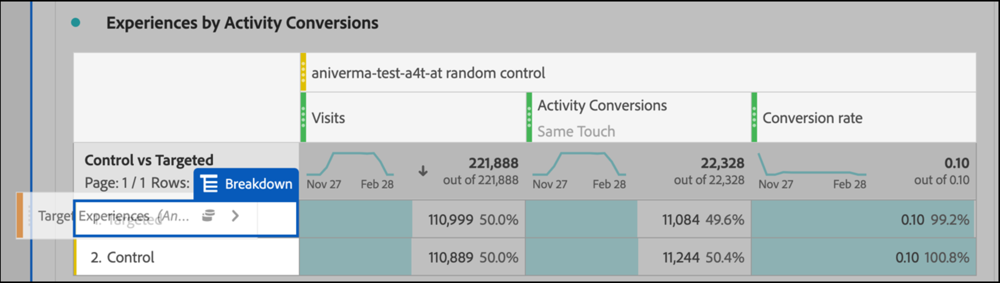

# Analysis Workspaceでの[!DNL Auto-Target]アクティビティのA4Tレポートの設定

[!DNL Auto-Target]アクティビティ向けのターゲット用Analytics(A4T)統合では、Adobe Targetのアンサンブル機械学習(ML)アルゴリズムを使用して、プロファイル、行動およびコンテキストに基づいて、すべてAdobe Analytics目標指標を使用して、各訪問者に最適なエクスペリエンスを選択します。

Adobe AnalyticsAnalysis Workspaceでは豊富な分析機能を利用できますが、実験アクティビティ（手動A/Bと自動配分）とパーソナライズアクティビティ([!DNL Auto-Target])の違いにより、[!DNL Auto-Target]アクティビティを正しく解釈するには、デフォルトの&#x200B;**[!UICONTROL ターゲット]**&#x200B;パネルに対する変更が必要です。

このチュートリアルでは、Workspaceで[!DNL Auto-Target]アクティビティを分析する際に推奨される変更について説明します。これは、次の主要な概念に基づいています。

* **[!UICONTROL コントロール対ターゲット]**&#x200B;ディメンションは、コントロールのエクスペリエンスと[!DNL Auto-Target]アンサンブルMLアルゴリズムが提供するエクスペリエンスとを区別するために使用できます。
* パフォーマンスのエクスペリエンスレベルの分類を表示する場合、訪問回数を標準化指標として使用する必要があります。 また、[Adobe Analyticsのデフォルトのカウント手法には、ユーザーが実際にアクティビティのコンテンツを参照しない訪問も含まれますが、このデフォルト動作は、適切なスコープのセグメント（以下の詳細）を使用して変更できます。](https://experienceleague.adobe.com/docs/target/using/integrate/a4t/a4t-faq/a4t-faq-viewing-reports.html?lang=en#metrics)
* 訪問のルックバックのスコープ属性（所定のアトリビューションモデルに対する「訪問のルックバックウィンドウ」とも呼ばれます）は、トレーニングフェーズ中にAdobe TargetのMLモデルで使用され、目標指標を分類する際にも同じ（デフォルト以外の）アトリビューションモデルを使用します。

## Workspaceで[!DNL Auto-Target]パネル用のA4Tを作成

[!DNL Auto-Target]レポート用のA4Tを作成するには、Workspaceの&#x200B;**[!UICONTROL ターゲット用のAnalytics]**&#x200B;パネルで以下に示す開始を使用するか、フリーフォームテーブルで開始します。 次に、次のように選択します。

1. **[!UICONTROL コントロールエクスペリエンス]**:どのエクスペリエンスも選択できます。ただし、後でこの選択を上書きします。[!DNL Auto-Target]アクティビティの場合、コントロールエクスペリエンスは実際にはコントロール戦略で、a)すべてのエクスペリエンスからランダムに提供、b)単一のエクスペリエンスを提供します(この選択はAdobe Targetのアクティビティ作成時に行われます)。 (b)を選択すると(a0/>アクティビティが特定のエクスペリエンスをコントロールとして指定した)場合でも、[!DNL Auto-Target]アクティビティのA4Tの分析には、このチュートリアルで説明されているアプローチに従う必要があります。[!DNL Auto-Target]
2. **[!UICONTROL 指標の標準化]**:「訪問回数」を選択します。
3. **[!UICONTROL 成功指標]**:レポートする指標は選択できますが、通常は、Adobe Targetでのアクティビティ作成時に最適化用に選択した指標と同じ指標に関する表示レポートを作成する必要があります。

*pngFigure 1: [!DNL Auto-Target] アクティビティ用のターゲットパネルの設定の分析。*

>[!NOTE]
>
>自動ターゲットアクティビティ用にターゲットパネルのAnalyticsを設定するには、任意のコントロールエクスペリエンスを選択し、正規化指標として「訪問回数」を選択し、ターゲットアクティビティの作成時に最適化用に選択したのと同じ目標指標を選択します。

## コントロールとターゲットディメンションを使用して、Adobe TargetのアンサンブルMLモデルとコントロールを比較します。

デフォルトのA4Tパネルは、従来の（手動の）A/Bテストまたは自動配分アクティビティ用に設計されており、ここで目標は、個々のエクスペリエンスのパフォーマンスとコントロールのエクスペリエンスとを比較することです。 ただし、[!DNL Auto-Target]アクティビティでは、最初の順序の比較は、制御&#x200B;*戦略*&#x200B;と対象&#x200B;*戦略*&#x200B;の間で行う必要があります（つまり、制御戦略に対する[!DNL Auto-Target]アンサンブルモデル全体のパフォーマンスの上昇率を決定します）。

この比較を実行するには、**[!UICONTROL 制御とターゲット設定(Analytics forターゲット)]**&#x200B;ディメンションを使用します。 デフォルトのA4Tレポートの&#x200B;**[!UICONTROL ターゲットエクスペリエンス]**&#x200B;ディメンションをドラッグ&amp;ドロップして置き換えます。

この置き換えにより、A4Tパネルのデフォルトの上昇率と信頼性の計算が無効になることに注意してください。 混乱を避けるために、これらの指標をデフォルトのパネルから削除できます。ただし、次のレポートは残ります。

*pngFigure 2: [!DNL Auto-Target] アクティビティ向けの推奨ベースラインレポート。このレポートは、（アンサンブルMLモデルが提供する）ターゲットトラフィックを制御トラフィックと比較するように設定されています。*

>[!NOTE]
>
>現在、自動ターゲット用のA4Tレポートのコントロールとターゲットディメンションに対して、上昇率と信頼性の数値を使用できません。 サポートが追加されるまで、上昇率と信頼性は、[信頼性計算ツール](https://experienceleague.adobe.com/docs/target/assets/complete_confidence_calculator.xlsx?lang=en)をダウンロードして手動で計算できます。

## 指標の追加エクスペリエンスレベルの分類

アンサンブルMLモデルのパフォーマンスをさらに深く理解するために、**[!UICONTROL コントロールとターゲット]**&#x200B;ディメンションのエクスペリエンスレベルの分類を調べます。 Workspaceで、**[!UICONTROL ターゲットエクスペリエンス]**&#x200B;ディメンションをレポートにドラッグし、コントロールディメンションとターゲットディメンションをそれぞれ個別に分類します。

*pngFigure 3:ターゲットディメンションをターゲットエクスペリエンス別に分類する*

結果のレポートの例を次に示します。

*pngFigure 4:エクスペリエンスレベルの分類を含む標準 [!DNL Auto-Target] レポート。目標指標が異なる場合があり、制御戦略に単一のエクスペリエンスが含まれている可能性があることをメモしておきます。*

>[!TIP]
>
>Workspaceで、ギアアイコンをクリックして、「コンバージョン率」列の「割合」を非表示にし、エクスペリエンスのコンバージョン率に集中しやすくします。 コンバージョン率は小数として形式設定されますが、それに応じてパーセントとして解釈されます。

## 「訪問回数」が[!DNL Auto-Target]アクティビティの正しい標準化指標である理由

[!DNL Auto-Target]アクティビティを分析する場合は、常に、デフォルトの標準化指標として「訪問回数」を選択します。 [!DNL Auto-Target] パーソナライゼーションは、訪問者に対して1回の訪問につき1回エクスペリエンスを選択します(正式には、Adobe Targetセッションにつき1回)。つまり、ユーザーに表示されるエクスペリエンスは、1回の訪問ごとに変更できます。したがって、実訪問者数を標準化指標として使用する場合、1人のユーザーが複数のエクスペリエンス（異なる訪問）を見ることになると、コンバージョン率を混乱させます。

この点を簡単な例で示します。2人の訪問者が2つのエクスペリエンスしかないキャンペーンに入るシナリオを考えてみましょう。 最初の訪問者は2回訪問します。 訪問者は、最初の訪問時にエクスペリエンスAに割り当てられますが、2回目の訪問時にエクスペリエンスBに割り当てられます(2回目の訪問時のプロファイルの状態の変化が原因)。 2回目の訪問の後、訪問者は注文を発行してコンバージョンします。 コンバージョンは、最も最近表示されたエクスペリエンス（エクスペリエンスB）に関連付けられます。 2番目の訪問者も2回訪問し、エクスペリエンスBは両方とも表示されますが、コンバージョンは行われません。

訪問者レベルのレポートと訪問レベルのレポートを比較してみましょう。

| エクスペリエンス | 実訪問者数 | 訪問回数 | コンバージョン数 | 訪問者標準。 コンヴ レート | 訪問の標準。 コンヴ レート |
| --- | --- | --- | --- | --- | --- |
| A | 1 | 3 | - | 0% | 0% |
| B | 2 | 3 | 1 | 50% | 33.3% |
| 合計 | 2 | 4 | 1 | 50% | 25％ |
*表1:例では、決定が訪問に対して固定される(通常のA/Bテストのように、訪問者ではなく)シナリオに関して、訪問者標準化レポートと訪問が正規化されたレポートを比較します。訪問者標準化指標は、このシナリオでは混乱を招きます。*

表に示すように、訪問者レベルの数値には明らかに不一致があります。 合計で2つの個別訪問者があるにもかかわらず、これは各エクスペリエンスに対する個別の個別訪問者の合計ではありません。 訪問者レベルのコンバージョン率は必ずしも間違っているとは限りませんが、個々のエクスペリエンスを比較すると、訪問レベルのコンバージョン率は非常に意味があると言えます。 正式には、分析の単位（「訪問回数」）は、意思決定の定着性の単位と同じです。つまり、指標のエクスペリエンスレベルの分類を追加して比較できます。

## アクティビティへの実際の訪問のフィルタ

ターゲットアクティビティへの訪問のデフォルトのカウント手法には、ターゲットがAdobe Analyticsアクティビティに対して操作を行わなかった訪問が含まれる場合があります。 これは、ターゲットアクティビティの割り当てがAnalytics訪問者コンテキストで保持されるためです。 その結果、ターゲットアクティビティへの訪問回数が水増しされ、コンバージョン率が低下する場合があります。

ユーザーが自動ターゲットアクティビティと実際にやり取りした(アクティビティへの入口、表示/訪問のイベント、またはコンバージョンを通じて)訪問回数をレポートしたい場合、次のことができます。

1. 目的のターゲットアクティビティからのヒットを含む特定のセグメントを作成し、
1. このセグメントを使用して訪問回数指標をフィルターします。

**セグメントを作成するには：**

1. ワークスペースツールバーで、**[!UICONTROL コンポーネント/セグメントを作成]**&#x200B;オプションを選択します。
2. セグメントの&#x200B;**[!UICONTROL タイトル]**&#x200B;を入力します。 次の例では、セグメント名は[!DNL "Hit with specific Auto-Target activity"]です。
3. **[!UICONTROL ターゲットアクティビティ]**&#x200B;ディメンションをセグメント&#x200B;**[!UICONTROL 定義]**&#x200B;セクションにドラッグします。
4. **[!UICONTROL equals]**&#x200B;演算子を使用します。
5. 特定のターゲットアクティビティを検索します。
6. 歯車アイコンを選択し、下の図に示すように、**[!UICONTROL アトリビューションモデル/インスタンス]**&#x200B;を選択します。
7. 「**[!UICONTROL 保存]**」をクリックします。

*pngFigure 5:ここに示すようなセグメントを使用して、 [!DNL Auto-Target] レポート用のA4Tの訪問指標をフィルターします*

セグメントが作成されたら、そのセグメントを使用して訪問回数指標をフィルターするので、訪問回数指標にはターゲットが訪問者アクティビティとやり取りをした訪問のみが含まれます。

**このセグメントを使用して訪問をフィルタするには：**

1. 新しく作成したセグメントをコンポーネントツールバーからドラッグし、**[!UICONTROL 訪問回数]**&#x200B;指標ラベルのベースの上にマウスポインターを置いて、青い&#x200B;**[!UICONTROL フィルター(]**)プロンプトが表示されるまで待ちます。
2. セグメントを解放します。 フィルターがその指標に適用されます。

最後のパネルは次のように表示されます。

*pngFigure 6:「特定の自動ターゲットアクティビティでヒット」セグメントが  訪問指標に適用されたレポートパネル。これにより、ユーザーが実際に該当するターゲットアクティビティとやり取りした訪問のみがレポートに含まれます。*

## MLモデルのトレーニングと目標指標の生成のアトリビューションの調整

A4Tの統合により、[!DNL Auto-Target]のMLモデルは、*パフォーマンスレポート*&#x200B;を生成するのと同じコンバージョンイベントデータを使用して、*トレーニング*&#x200B;を受けることができます。 ただし、MLモデルのトレーニング時にこのデータを解釈する際に使用する必要がある前提条件はいくつかあります。これは、Adobe Analyticsのレポート段階で行われたデフォルトの前提条件とは異なります。

特に、Adobe TargetのMLモデルでは、訪問スコープのアトリビューションモデルを使用します。 つまり、MLモデルが行った決定に対して「コンバージョンを関連付ける」には、アクティビティのコンテンツの表示と同じ訪問でコンバージョンが発生する必要があると想定します。 これは、ターゲットがモデルのタイムリーなトレーニングを保証するために必要です。ターゲットは、モデルのトレーニングデータに含めるまで、コンバージョン(Adobe Analyticsのレポートのデフォルトのアトリビューションウィンドウ)を最大30日間待つことはできません。

したがって、ターゲットのモデルで使用されるアトリビューション（トレーニング中）とデータのクエリーで使用されるデフォルトアトリビューション（レポート生成中）の違いによって、不一致が生じる可能性があります。 MLモデルのパフォーマンスが悪いように見える場合もありますが、実際の問題はアトリビューションにあります。

>[!TIP]
>
>MLモデルが、レポートで表示している指標とは異なる関連性を持つ指標に対して最適化を行っている場合、モデルが期待どおりに動作しない可能性があります。 これを防ぐには、レポートの目標指標で、ターゲットのMLモデルで使用されているのと同じアトリビューションを使用するようにします。

Adobe TargetのMLモデルと同じアトリビューション手法を使用する表示目標指標を分析するには、次の手順に従います。

1. 目標指標の歯車アイコンの上にカーソルを置きます。
   
1. 表示されるメニューから、**[!UICONTROL データ設定]**&#x200B;までスクロールします。
1. 「**[!UICONTROL デフォルト以外のアトリビューションモデルを使用]**」を選択します（まだ選択されていない場合）。
   
1. 「**[!UICONTROL 編集]**」をクリックします。
1. **[!UICONTROL モデル]**&#x200B;を選択：**[!UICONTROL パーティシペーション]**&#x200B;と&#x200B;**[!UICONTROL ルックバックウィンドウ]**:****にアクセスします。
   
1. 「**[!UICONTROL 適用]**」をクリックします。

これらの手順により、あるエクスペリエンスが表示された訪問と同じ訪問で目標指標のイベントが&#x200B;*いつ*（「パーティシペーション」）も発生した場合に、レポートで目標指標がエクスペリエンスの表示に関連付けられます。

## 最後の手順：上記のマジックをキャプチャするコンバージョン率を作成します

前の節の訪問と目標指標を変更した場合、[!DNL Auto-Target]レポートパネルのデフォルトのA4Tに対して行う必要がある最終的な変更は、適切なアトリビューションを持つ目標指標と適切にフィルタリングされた「訪問回数」指標との正しい比率のコンバージョン率を作成することです。

これを行うには、次の手順を使用して計算指標を作成します。

1. ワークスペースツールバーで、**[!UICONTROL コンポーネント/指標]**&#x200B;を作成オプションを選択します。
1. 指標の&#x200B;**[!UICONTROL タイトル]**&#x200B;を入力します。 例えば、「アクティビティXXXの訪問修正コンバージョン率」などです。
1. 「**[!UICONTROL 形式]** =パーセント」および「**[!UICONTROL 小数点以下の桁数]** = 2」を選択します。
1. アクティビティに関連する目標指標(例えば、アクティビティコンバージョン)を定義にドラッグし、前述のように、この目標指標の歯車アイコンを使用してアトリビューションモデルを（パーティシペーション|訪問）に調整します。
1. 「**[!UICONTROL コンテナ]**」セクションの右上から追加、**[!UICONTROL /定義]**&#x200B;を選択します。
1. 2つのコンテナ間の除算(÷)演算子を選択します。
1. このチュートリアルでは、以前に作成したセグメント(「特定の[!DNL Auto-Target]アクティビティを含むヒット」)を、この特定の[!DNL Auto-Target]アクティビティ用にドラッグします。
1. **[!UICONTROL 訪問回数]**&#x200B;指標をセグメントコンテナにドラッグします。
1. 「**[!UICONTROL 保存]**」をクリックします。

計算指標の完全な定義を次に示します。

*pngFigure 7:訪問および属性を修正したモデルコンバージョン率指標の定義。(この指標は、目標指標とアクティビティに依存します。 つまり、このメトリック定義はアクティビティ間で再利用できません。)*

>[!IMPORTANT]
>
>A4Tパネルのコンバージョン率指標は、コンバージョンイベントまたはテーブルの標準化指標にリンクされていません。 このチュートリアルで提案された変更を行った場合、コンバージョン率は自動的に変更に適応しません。 したがって、コンバージョンイベントの属性と標準化指標の1つ（または両方）に変更を加えた場合は、前述のように、コンバージョン率も変更する最後の手順として記憶する必要があります。

## サマリ：[!DNL Auto-Target]レポートの最終的なワークスペースパネルの例

下の図は、上記のすべての手順を1つのパネルに組み合わせた結果です。[!DNL Auto-Target] A4Tアクティビティ向けの推奨レポートの完全な表示を示しています。 このレポートは、ターゲットの機械学習モデルが目標指標を最適化するために使用するものと同じで、このチュートリアルで説明するすべてのニュアンスと推奨事項が組み込まれています。 また、このレポートは、従来のターゲットレポート駆動[!DNL Auto-Target]アクティビティで使用されていたカウント手法にも最も近いものです。

*pngFigure 8:このドキュメントの前の節で説明した指標定義に対するすべての調整を組み合わせた、Adobe Analyticsワークスペースの最後のA4T [!DNL Auto-Target] レポートです。*
