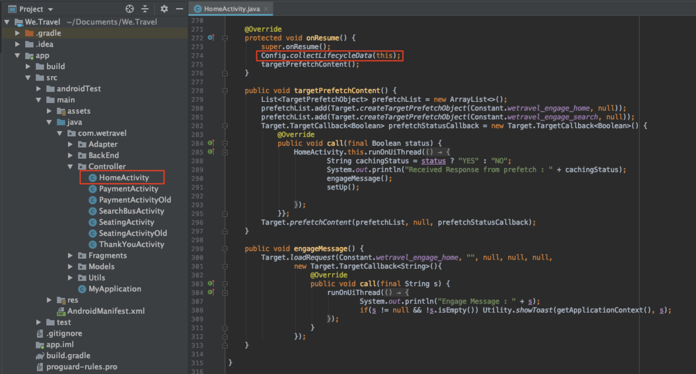
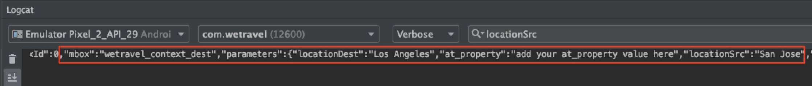

# リクエストへのパラメーターの追加

このレッスンでは、前のレッスンで追加した[!DNL Target] リクエストにAdobe ライフサイクル指標とカスタムパラメーターを追加します。 これらの指標とパラメーターは、後のチュートリアルでパーソナライズされたオーディエンスを作成するために使用します。

## 学習目標

このレッスンの最後には、次のことが可能になります。

* Adobe モバイルライフサイクル指標の追加
* プリフェッチリクエストへのパラメーターの追加
* ライブロケーションへのパラメーターの追加
* 両方のリクエストのパラメーターを検証する

## ライフサイクルパラメーターの追加

[Adobe モバイルライフサイクル指標](https://experienceleague.adobe.com/docs/mobile-services/android/metrics.html?lang=en)を有効にしましょう。 これにより、ユーザーのデバイスとアプリとのエンゲージメントに関する豊富な情報を含む位置情報リクエストにパラメーターが追加されます。 次のレッスンでは、ライフサイクルリクエストが提供するデータを使用してオーディエンスを構築します。

ライフサイクル指標を有効にするには、HomeActivity コントローラーを再度開き、onResume （）関数に`Config.collectLifecycleData(this);`を追加します。



### プリフェッチ要求のライフサイクルパラメーターの検証

エミュレーターを実行し、Logcatを使用してライフサイクルパラメーターを検証します。 「プリフェッチ」をフィルタリングして、プリフェッチ応答を検索し、新しいパラメーターを探します。


HomeActivity コントローラーに`Config.collectLifecycleData()`を追加しただけですが、ThankYou画面にもTarget リクエストで送信されたライフサイクル指標が表示されます。

## at_property パラメーターをプリフェッチリクエストに追加します

Adobe Target プロパティは[!DNL Target] インターフェイスで定義され、アプリとweb サイトをパーソナライズするための境界を設定するために使用されます。 at_property パラメーターは、オファーとアクティビティにアクセスして維持する特定のプロパティを識別します。 プリフェッチおよびライブロケーションのリクエストにプロパティを追加します。

>[!NOTE]
>
>ライセンスに応じて、[!DNL Target] インターフェイスにプロパティ オプションが表示される場合とされない場合があります。 これらのオプションがない場合や、社内でプロパティを使用していない場合は、このレッスンの次のセクションに進んでください。

at_property値は、[!UICONTROL Setup] > [!UICONTROL Properties]の下の[!DNL Target] インターフェイスで取得できます。  プロパティにカーソルを合わせ、コードスニペットアイコンを選択し、`at_property`値をコピーします。

をコピー

次のように、プリフェッチリクエストの各場所のパラメーターとして追加します。

次に、`targetPrefetchContent()`関数の更新されたコードを示します（必ず&#x200B;_[!UICONTROL your at_property value goes here]_プレースホルダーテキストを更新してください）。

```java
public void targetPrefetchContent() {
        List<TargetPrefetchObject> prefetchList = new ArrayList<>();

        Map<String, Object> params1;
        params1 = new HashMap<String, Object>();
        params1.put("at_property", "your at_property value goes here");

        prefetchList.add(Target.createTargetPrefetchObject(Constant.wetravel_engage_home, params1));
        prefetchList.add(Target.createTargetPrefetchObject(Constant.wetravel_engage_search, params1));
        Target.TargetCallback<Boolean> prefetchStatusCallback = new Target.TargetCallback<Boolean>() {
            @Override
            public void call(final Boolean status) {
                HomeActivity.this.runOnUiThread(new Runnable() {
                    @Override
                    public void run() {
                        String cachingStatus = status ? "YES" : "NO";
                        System.out.println("Received Response from prefetch : " + cachingStatus);
                        engageMessage();
                        setUp();

                    }
                });
            }};
        Target.prefetchContent(prefetchList, null, prefetchStatusCallback);
    }
```

### パラメーターに関する注意

今後のプロジェクトでは、追加のパラメーターを実装する必要があるかもしれません。 `createTargetPrefetchObject()` メソッドでは、`locationParams`、`orderParams`、`productParams`の3種類のパラメーターを使用できます。 これらのパラメーターをプリフェッチ要求に追加する方法の詳細については、[のドキュメントを参照してください](https://experienceleague.adobe.com/docs/mobile-services/android/target-android/c-mob-target-prefetch-android.html?lang=en)。

また、プリフェッチリクエストの各場所に異なる場所パラメーターを追加することもできます。 例えば、param2という別のマップを作成し、新しいパラメーターを作成してから、ある場所にparam2を設定し、別の場所にparam1を設定することができます。 例を次に示します。

```java
prefetchList.add(Target.createTargetPrefetchObject(location1_name, params1);
prefetchList.add(Target.createTargetPrefetchObject(location2_name, params2);
```

## プリフェッチリクエストのat_property パラメーターを検証する

次に、エミュレーターを実行し、Logcatを使用して、両方の場所のプリフェッチ要求と応答にat_propertyが表示されていることを確認します。


## ライブ位置情報リクエストへのカスタムパラメーターの追加

ライブ位置情報リクエスト（wetravel_context_dest）は、前回のレッスンで追加されたため、予約プロセスの最終確認画面に関連するプロモーションを表示することができました。 ユーザーの宛先に基づいてプロモーションをパーソナライズし、それをリクエストのパラメーターとして追加します。 また、tropの原点とat_propertyの値のパラメーターも追加します。

次のパラメーターをThankYouActivity コントローラーのtargetLoadRequest （）関数に追加します。

targetLoadRequest （）関数の更新されたコードを次に示します（プレースホルダーテキストの「at_property値をここに追加」を必ず更新してください）。

```java
public void targetLoadRequest(final ArrayList<Recommandation> recommandations) {
    Map<String, Object> locationParams = new HashMap<>();
    locationParams.put("at_property","add your at_property value here");
    locationParams.put("locationSrc", (""+Utility.getInSharedPreference(ThankYouActivity.this,Constant.departure,"")));
    locationParams.put("locationDest", (""+Utility.getInSharedPreference(ThankYouActivity.this,Constant.destination,"")));

    Target.loadRequest(Constant.wetravel_context_dest, "", null, null, locationParams, new Target.TargetCallback<String>() {
        @Override
        public void call(final String response) {
        try {
            runOnUiThread(new Runnable() {
                @Override
                public void run() {
                    AppDialogs.dialogLoaderHide();
                    filterRecommendationBasedOnOffer(recommandations, response);
                    recommandationbAdapter.notifyDataSetChanged();
                }
            });
        } catch (Exception e) {
            e.printStackTrace();
        }
        }
    });
    Target.clearPrefetchCache();
}
```

### ライブ位置情報リクエストのカスタムパラメーターの検証

エミュレーターを実行し、Logcatを開きます。 いずれかのパラメーターをフィルタリングして、リクエストに必要なパラメーターが含まれていることを確認します。


>[!NOTE]
>
>注文確認リクエストとパラメーター：このデモ プロジェクトでは使用されませんが、通常、注文の詳細は実際の実装でキャプチャされるため、[!DNL Target]は注文の詳細を指標/ディメンションとして使用できます。 注文確認リクエストとパラメーターの実装方法[については、ドキュメントを参照してください](https://experienceleague.adobe.com/docs/mobile-services/android/target-android/c-target-methods.html?lang=en)。

>[!NOTE]
>
>Analytics for Target （A4T）: Adobe Analyticsを[!DNL Target]のレポートソースとして設定できます。 これにより、Target SDKで収集されたすべての指標/ディメンションをAdobe Analyticsで表示できるようになります。 詳しくは、[A4Tの概要](https://experienceleague.adobe.com/docs/target/using/integrate/a4t/a4t.html?lang=en)を参照してください。

すばらしい！ パラメーターが設定されたので、これらのパラメーターを使用してAdobe Targetでオーディエンスやオファーを作成する準備が整いました。

**[次：「オーディエンスとオファーを作成」 >](create-audiences-and-offers.md)**
