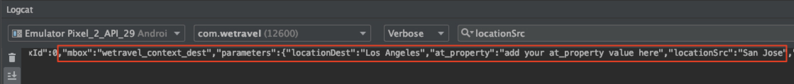

# リクエストへのパラメーターの追加

このレッスンでは、前のレッスンで追加した [!DNL Target] リクエストにAdobe ライフサイクル指標とカスタムパラメーターを追加します。 これらの指標とパラメーターは、チュートリアルの後半で、パーソナライズされたオーディエンスの作成に使用されます。

## 学習目標

このレッスンを終了すると、次の操作を実行できるようになります。

* Adobe モバイルライフサイクル指標の追加
* プリフェッチ・リクエストへのパラメータの追加
* ライブロケーションへのパラメーターの追加
* 両方のリクエストのパラメーターを検証

## ライフサイクル パラメータを追加する

[Adobe モバイルライフサイクル指標 ](https://experienceleague.adobe.com/docs/mobile-services/android/metrics.html?lang=en) を有効にしましょう。 これにより、ユーザーのデバイスに関する豊富な情報とアプリのエンゲージメントを含むロケーションリクエストにパラメーターが追加されます。 次のレッスンでは、ライフサイクルリクエストで提供されるデータを使用して、オーディエンスを作成します。

ライフサイクル指標を有効にするには、HomeActivity コントローラを再度開き、onResume （）関数に `Config.collectLifecycleData(this);` を追加します。


### プリフェッチ・リクエストのライフサイクル・パラメータの検証

エミュレーターを実行し、Logcat を使用してライフサイクルパラメーターを検証します。 「prefetch」をフィルタリングしてプリフェッチ応答を探し、新しいパラメータを探します。


HomeActivity コントローラーへの追加は `Config.collectLifecycleData()` のみですが、Target リクエストと共に送信されたライフサイクル指標も「ありがとうございます」画面に表示されます。

## プリフェッチ・リクエストに at_property パラメータを追加します。

Adobe Target プロパティは、[!DNL Target] インターフェイスで定義され、アプリや web サイトをパーソナライズするための境界線を確立するために使用されます。 at_property パラメーターは、オファーとアクティビティにアクセスし、維持管理する特定のプロパティを識別します。 プリフェッチ リクエストとライブ ロケーション リクエストにプロパティを追加します。

>[!NOTE]
>
>[!DNL Target] インターフェイスには、ライセンスに応じて「プロパティ」オプションが表示される場合とされない場合があります。 これらのオプションがない場合、または会社でプロパティを使用していない場合は、このレッスンの次のセクションに進んでください。

at_property の値は、[!DNL Target] インターフェイスの [!UICONTROL Setup] > [!UICONTROL Properties] で取得できます。  プロパティの上にマウスポインターを置き、コードスニペットアイコンを選択し、`at_property` の値をコピーします。


プリフェッチリクエストの各場所のパラメーターとして、次のように追加します。

以下は、`targetPrefetchContent()` 関数の更新されたコードです（_[!UICONTROL your at_property value goes here]_&#x200B;のプレースホルダーテキストを必ず更新してください）。

```java
public void targetPrefetchContent() {
        List<TargetPrefetchObject> prefetchList = new ArrayList<>();

        Map<String, Object> params1;
        params1 = new HashMap<String, Object>();
        params1.put("at_property", "your at_property value goes here");

        prefetchList.add(Target.createTargetPrefetchObject(Constant.wetravel_engage_home, params1));
        prefetchList.add(Target.createTargetPrefetchObject(Constant.wetravel_engage_search, params1));
        Target.TargetCallback<Boolean> prefetchStatusCallback = new Target.TargetCallback<Boolean>() {
            @Override
            public void call(final Boolean status) {
                HomeActivity.this.runOnUiThread(new Runnable() {
                    @Override
                    public void run() {
                        String cachingStatus = status ? "YES" : "NO";
                        System.out.println("Received Response from prefetch : " + cachingStatus);
                        engageMessage();
                        setUp();

                    }
                });
            }};
        Target.prefetchContent(prefetchList, null, prefetchStatusCallback);
    }
```

### パラメーターに関する注意

今後のプロジェクトでは、追加のパラメーターを実装する必要が生じる場合があります。 `createTargetPrefetchObject()` メソッドを使用すると、`locationParams`、`orderParams`、`productParams` の 3 種類のパラメーターを使用できます。 [ プリフェッチリクエストへのこれらのパラメーターの追加について詳しくは ](https://experienceleague.adobe.com/docs/mobile-services/android/target-android/c-mob-target-prefetch-android.html?lang=en) ドキュメントを参照してください。

また、プリフェッチ・リクエストでは、場所ごとに異なる場所のパラメータを追加できます。 たとえば、param2 という別のマップを作成し、そのマップに新しいパラメータを配置してから、ある場所に param2 を設定し、他の場所に param1 を設定できます。 次に例を示します。

```java
prefetchList.add(Target.createTargetPrefetchObject(location1_name, params1);
prefetchList.add(Target.createTargetPrefetchObject(location2_name, params2);
```

## プリフェッチリクエストの at_property パラメーターを検証します

次に、エミュレーターを実行し、Logcat を使用して、両方の場所のプリフェッチ要求および応答で at_property が表示されていることを確認します。


## ライブ場所リクエストへのカスタムパラメーターの追加

前のレッスンでライブの場所のリクエスト（wetravel_context_dest）を追加したので、予約プロセスの最終確認画面に関連するプロモーションを表示できるようになりました。 ユーザーの宛先に基づいてプロモーションをパーソナライズし、それをリクエストのパラメーターとして追加します。 また、trop origin と at_property 値のパラメーターも追加します。

ThankYouActivity コントローラーの targetLoadRequest （）関数に次のパラメーターを追加します。

次に、targetLoadRequest （）関数の更新されたコードを示します（「at_property 値をここに追加」プレースホルダーテキストを更新してください）。

```java
public void targetLoadRequest(final ArrayList<Recommandation> recommandations) {
    Map<String, Object> locationParams = new HashMap<>();
    locationParams.put("at_property","add your at_property value here");
    locationParams.put("locationSrc", (""+Utility.getInSharedPreference(ThankYouActivity.this,Constant.departure,"")));
    locationParams.put("locationDest", (""+Utility.getInSharedPreference(ThankYouActivity.this,Constant.destination,"")));

    Target.loadRequest(Constant.wetravel_context_dest, "", null, null, locationParams, new Target.TargetCallback<String>() {
        @Override
        public void call(final String response) {
        try {
            runOnUiThread(new Runnable() {
                @Override
                public void run() {
                    AppDialogs.dialogLoaderHide();
                    filterRecommendationBasedOnOffer(recommandations, response);
                    recommandationbAdapter.notifyDataSetChanged();
                }
            });
        } catch (Exception e) {
            e.printStackTrace();
        }
        }
    });
    Target.clearPrefetchCache();
}
```

### ライブの場所リクエストでのカスタムパラメーターの検証

エミュレーターを実行し、Logcat を開きます。 パラメーターの 1 つをフィルタリングして、リクエストに必要なパラメーターが含まれていることを確認します。


>[!NOTE]
>
>注文確認のリクエストとパラメーター：このデモプロジェクトでは使用しませんが、注文の詳細は通常、実際の実装で取得 [!DNL Target] れるので、注文の詳細を指標やディメンションとして使用できます。 詳しくは、注文確認リクエストとパラメーターの実装方法に関する手順 [ ドキュメント ](https://experienceleague.adobe.com/docs/mobile-services/android/target-android/c-target-methods.html?lang=en) 参照してください。

>[!NOTE]
>
>Analytics for Target （A4T）: Adobe Analyticsを [!DNL Target] のレポートソースとして設定できます。 これにより、Target SDKで収集されたすべての指標やディメンションをAdobe Analyticsで表示できます。 詳しくは、[A4T の概要 ](https://experienceleague.adobe.com/docs/target/using/integrate/a4t/a4t.html?lang=en) を参照してください。

すばらしい！ これでパラメーターが用意できたので、次にこれらのパラメーターを使用して、Adobe Targetでオーディエンスとオファーを作成します。

**[次へ：「オーディエンスとオファーの作成」 >](create-audiences-and-offers.md)**
