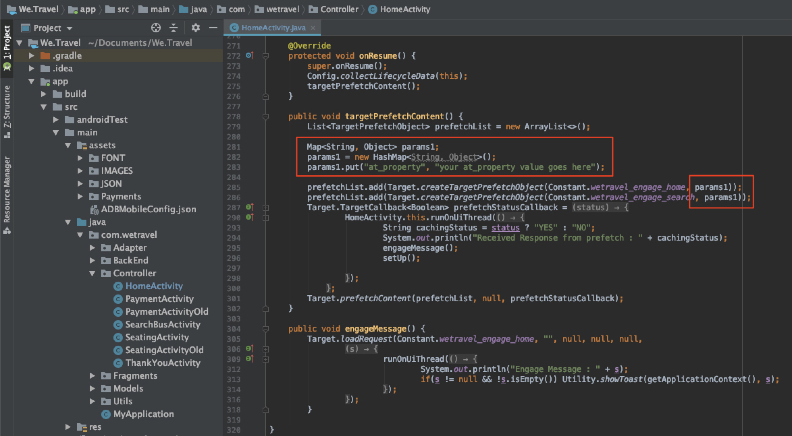

# リクエスト追加のパラメーター

このレッスンでは、前のレッスンで追加した[!DNL Target]リクエストに、Adobeのライフサイクル指標とカスタムパラメーターを追加します。 これらの指標とパラメーターは、後のチュートリアルでパーソナライズされたオーディエンスの作成に使用されます。

## 学習目標

このレッスンを終了すると、次のことができます。

* Adobe追加モバイルのライフサイクル指標
* プリフェッチ要求追加のパラメータ
* ライブ場所追加のパラメーター
* 両方のリクエストのパラメーターの検証

## ライフサイクル追加パラメータ

[Adobeのモバイルライフサイクル指標](https://docs.adobe.com/content/help/en/mobile-services/android/metrics.html)を有効にします。 これにより、ユーザーのデバイスに関する豊富な情報やアプリの使用に関する情報を含む場所のリクエストにパラメーターが追加されます。 次のレッスンでは、ライフサイクルリクエストが提供するデータを使用してオーディエンスを作成します。

ライフサイクル指標を有効にするには、HomeActivityコントローラを再度開き、onResume()関数に`Config.collectLifecycleData(this);`を追加します。


### プリフェッチ要求のライフサイクルパラメータの検証

エミュレータを実行し、Logcatを使用してライフサイクルパラメータを検証します。 「プリフェッチ」のフィルタを適用し、プリフェッチ応答を検索し、新しいパラメータを探します。


HomeActivityコントローラーに`Config.collectLifecycleData()`を追加しただけですが、ターゲットリクエストと共に送信されたライフサイクル指標は、「ありがとうございます」画面にも表示されます。

## プリフェッチ要求追加のat_propertyパラメータ

Adobe Targetのプロパティは[!DNL Target]インターフェイスで定義され、アプリやWebサイトの個人化の境界を確立するために使用されます。 at_propertyパラメーターは、オファーとアクティビティがアクセスされ、保守される特定のプロパティを指定します。 プリフェッチ要求とライブ・ロケーション要求にプロパティを追加します。

>[!NOTE]
>
>ライセンスに応じて、[!DNL Target]インターフェイスにプロパティオプションが表示される場合と表示されない場合があります。 これらのオプションがない場合、または会社でプロパティを使用しない場合は、このレッスンの次のセクションに進んでください。

[!UICONTROL セットアップ] > [!UICONTROL プロパティ]の下の[!DNL Target]インターフェイスでat_property値を取得できます。  プロパティの上にマウスポインターを置き、コードスニペットアイコンを選択して`at_property`値をコピーします。


次のよ追加うなプリフェッチ要求の各場所のパラメーターとして使用します。

以下に、`targetPrefetchContent()`関数の更新されたコードを示します（_[!UICONTROL at_propertyの値を必ずここ]_&#x200B;プレースホルダーテキストに更新してください！）。

```java
public void targetPrefetchContent() {
        List<TargetPrefetchObject> prefetchList = new ArrayList<>();

        Map<String, Object> params1;
        params1 = new HashMap<String, Object>();
        params1.put("at_property", "your at_property value goes here");

        prefetchList.add(Target.createTargetPrefetchObject(Constant.wetravel_engage_home, params1));
        prefetchList.add(Target.createTargetPrefetchObject(Constant.wetravel_engage_search, params1));
        Target.TargetCallback<Boolean> prefetchStatusCallback = new Target.TargetCallback<Boolean>() {
            @Override
            public void call(final Boolean status) {
                HomeActivity.this.runOnUiThread(new Runnable() {
                    @Override
                    public void run() {
                        String cachingStatus = status ? "YES" : "NO";
                        System.out.println("Received Response from prefetch : " + cachingStatus);
                        engageMessage();
                        setUp();

                    }
                });
            }};
        Target.prefetchContent(prefetchList, null, prefetchStatusCallback);
    }
```

### パラメーターに関する注意

将来のプロジェクトでは、追加のパラメーターを実装する必要が生じる場合があります。 `createTargetPrefetchObject()`メソッドでは、次の3種類のパラメーターを使用できます。`locationParams`、`orderParams`、および`productParams`。 プリフェッチ要求](https://docs.adobe.com/content/help/en/mobile-services/android/target-android/c-mob-target-prefetch-android.html)にこれらのパラメータを追加する方法の詳細は、[のドキュメントを参照してください。

また、プリフェッチ要求の各場所に異なる場所パラメータを追加できます。 例えば、param2という別のマップを作成し、新しいパラメータを配置して、ある場所にparam2を設定し、別の場所にparam1を設定することができます。 次に例を示します。

```java
prefetchList.add(Target.createTargetPrefetchObject(location1_name, params1);
prefetchList.add(Target.createTargetPrefetchObject(location2_name, params2);
```

## プリフェッチ要求のat_propertyパラメータの検証

エミュレータを実行し、Logcatを使用して、両方の場所のプリフェッチ要求と応答でat_propertyが表示されていることを確認します。
を検証

## Live Locationリクエストの追加カスタムパラメーター

前のレッスンで追加したライブロケーションリクエスト(wetravel_context_dest)により、予約プロセスの最終確認画面に関連するプロモーションを表示できます。 ユーザーの行き先に基づいてプロモーションをパーソナライズし、それをリクエストのパラメーターとして追加することを希望します。 trop接触チャネルーとat_property値のパラメーターも追加します。

ThankYouActivityコントローラー追加のtargetLoadRequest()関数に対する次のパラメーター。

次に、targetLoadRequest()関数の更新されたコードを示します（「at_property値をここに追加」プレースホルダテキストを必ず更新してください）。

```java
public void targetLoadRequest(final ArrayList<Recommandation> recommandations) {
    Map<String, Object> locationParams = new HashMap<>();
    locationParams.put("at_property","add your at_property value here");
    locationParams.put("locationSrc", (""+Utility.getInSharedPreference(ThankYouActivity.this,Constant.departure,"")));
    locationParams.put("locationDest", (""+Utility.getInSharedPreference(ThankYouActivity.this,Constant.destination,"")));

    Target.loadRequest(Constant.wetravel_context_dest, "", null, null, locationParams, new Target.TargetCallback<String>() {
        @Override
        public void call(final String response) {
        try {
            runOnUiThread(new Runnable() {
                @Override
                public void run() {
                    AppDialogs.dialogLoaderHide();
                    filterRecommendationBasedOnOffer(recommandations, response);
                    recommandationbAdapter.notifyDataSetChanged();
                }
            });
        } catch (Exception e) {
            e.printStackTrace();
        }
        }
    });
    Target.clearPrefetchCache();
}
```

### ライブロケーションリクエストのカスタムパラメーターの検証

エミュレータを実行し、Logcatを開きます。 いずれかのパラメーターをフィルターして、リクエストに必要なパラメーターが含まれていることを確認します。


>[!NOTE]
>
>注文確認のリクエストとパラメーター：このデモプロジェクトでは使用されていませんが、注文の詳細は通常実際の実装に取り込まれるので、[!DNL Target]は注文の詳細を指標/ディメンションとして使用できます。 注文確認リクエストとパラメーター](https://docs.adobe.com/content/help/en/mobile-services/android/target-android/c-target-methods.html)を[導入する方法については、ドキュメントを参照してください。

>[!NOTE]
>
>ターゲットの分析(A4T):Adobe Analyticsは[!DNL Target]のレポートソースとして設定できます。 これにより、ターゲットSDKが収集したすべての指標/ディメンションをAdobe Analyticsで表示できます。 詳しくは、[A4Tの概要](https://docs.adobe.com/content/help/en/target/using/integrate/a4t/a4t.html)を参照してください。

お疲れさま！ パラメーターが設定されたので、Adobe Targetでオーディエンスやオファーを作成する際にこれらのパラメーターを使用する準備が整いました。

**[次へ：「オーディエンスとオファーの作成」/](create-audiences-and-offers.md)**
