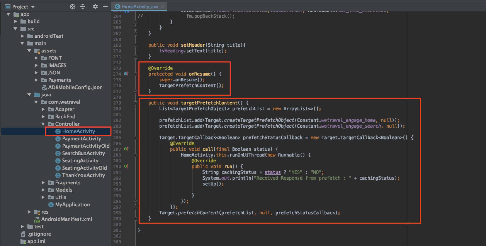
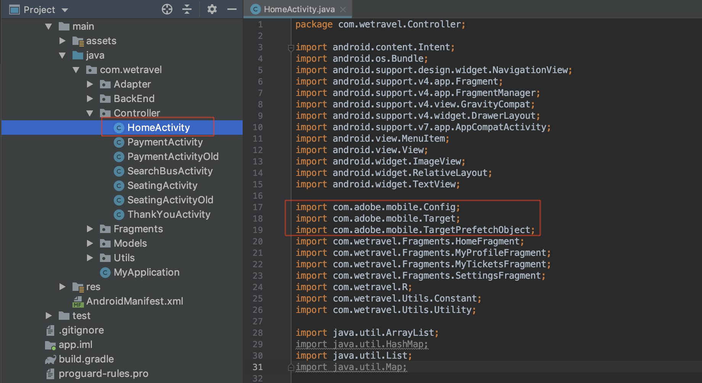
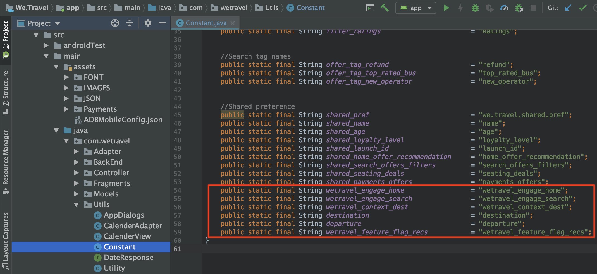
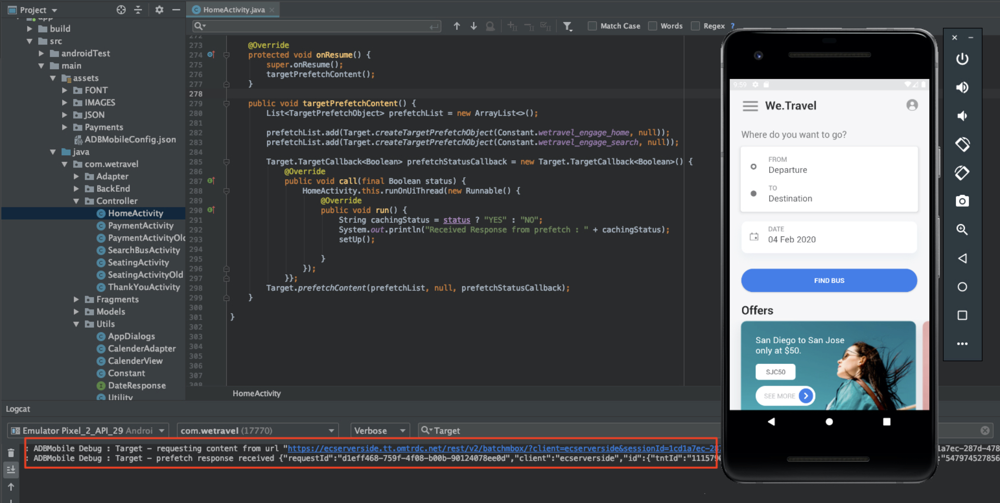
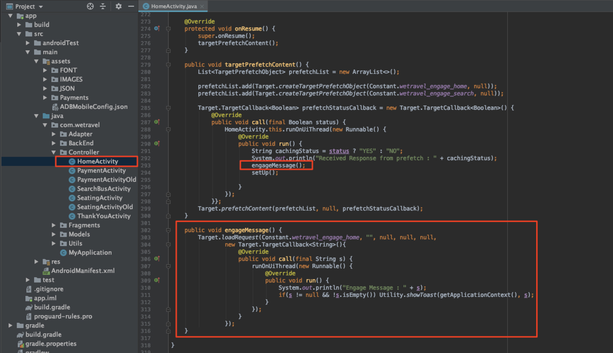
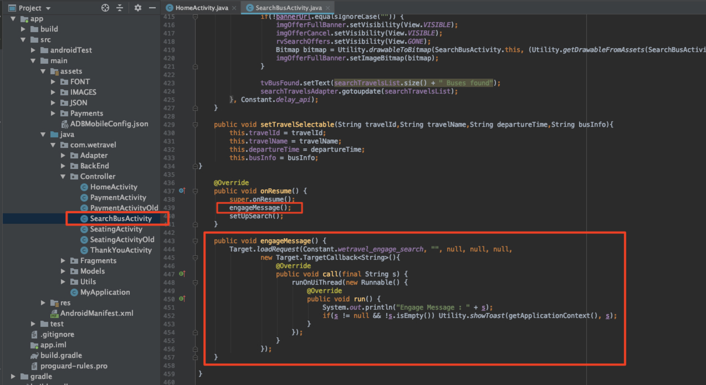
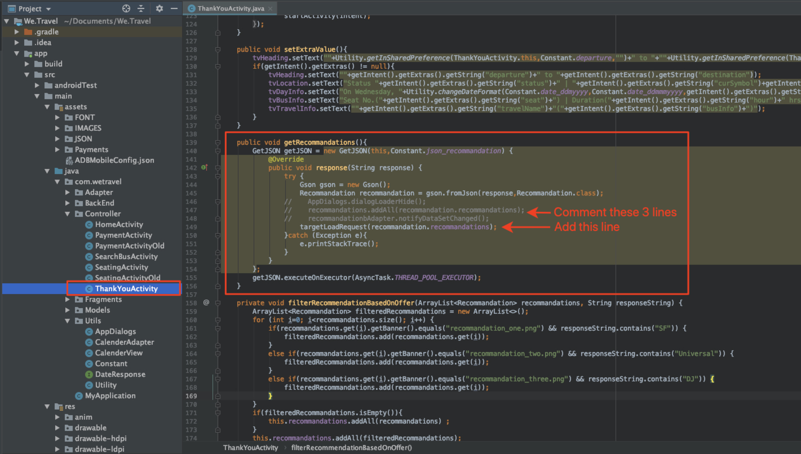
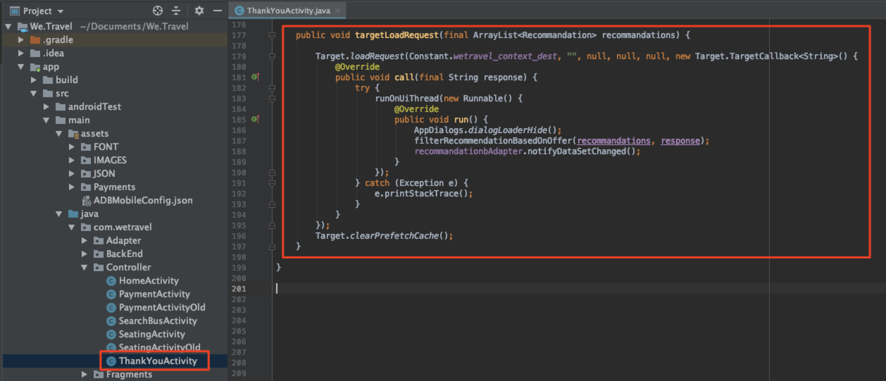
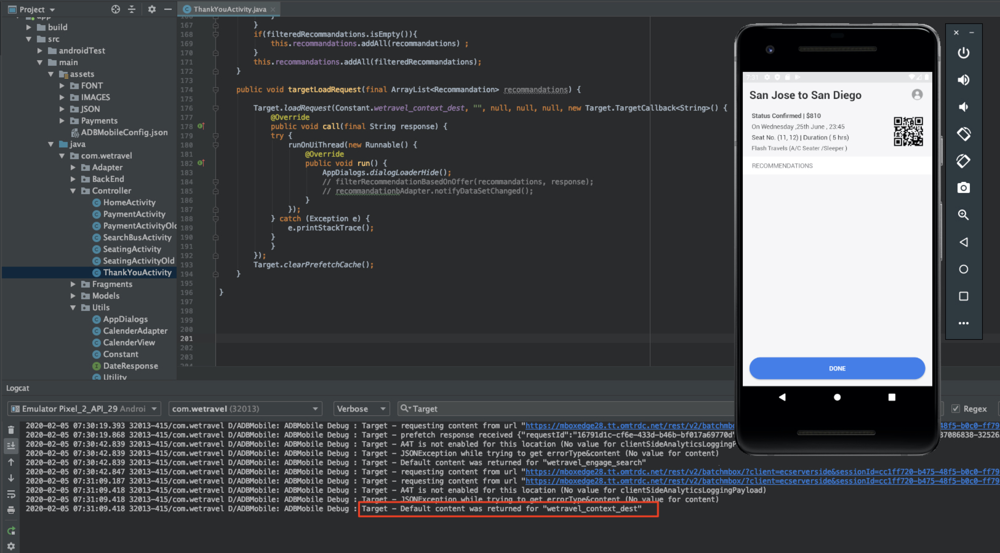
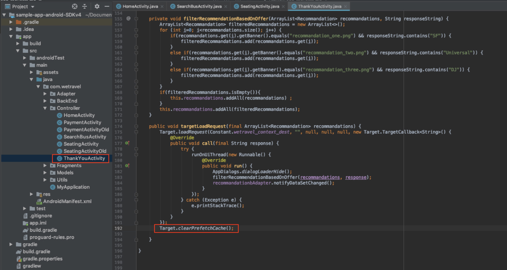

# Adobe Target リクエストの追加

Adobe Mobile Services SDK（v4）には、Adobe Targetのメソッドと機能が用意されており、異なるユーザー向けに異なるエクスペリエンスを使用してアプリをパーソナライズできます。 通常、パーソナライズされたコンテンツを取得し、そのコンテンツの影響を測定するために、アプリからAdobe Targetに1つ以上のリクエストが行われます。

このレッスンでは、[!DNL Target] リクエストを実装して、パーソナライゼーション用にWe.Travel アプリを準備します。

## 前提条件

必ず[&#x200B; サンプルアプリをダウンロードして更新してください](download-and-update-the-sample-app.md)。

## 学習目標

このレッスンの最後には、次のことが可能になります。

* バッチ先行取得リクエストを使用して、複数の[!DNL Target] オファー（パーソナライズされたコンテンツ）をキャッシュします
* プリフェッチされた[!DNL Target]個の場所を読み込む
* [!DNL Target]の場所をリアルタイムで読み込みます（プリフェッチなし）
* キャッシュからプリフェッチされた場所をクリア
* プリフェッチされたリクエストとリアルタイムのリクエストの検証

## 用語

以下に、このチュートリアルの残りの部分で使用するTargetの主な用語の一部を示します。

* **リクエスト：** Adobe Target サーバーへのネットワークリクエスト
* **オファー：**&#x200B;応答で配信される、[!DNL Target] ユーザーインターフェイス （またはAPIを使用）で定義されたコードまたはその他のテキストベースのコンテンツのスニペット。 通常、[!DNL Target]がネイティブモバイルアプリで使用される場合はJSONです。
* **場所：** リクエストに指定されたユーザー定義の名前。特定のリクエストにオファーを関連付けるために[!DNL Target] インターフェイスで使用されます
* **バッチリクエスト：**&#x200B;複数の場所を含む単一のリクエスト
* **先行取得リクエスト：** オファーを取得し、アプリで今後使用するためにメモリにキャッシュする1つのリクエスト
* **バッチ先行取得リクエスト：**&#x200B;複数の場所のオファーを先行取得する単一のリクエスト
* **Audience:** [!DNL Target] インターフェイスで定義されるか、他のAdobe アプリケーションから[!DNL Target]に共有された訪問者のグループ（例：「iPhone X visitors」、「visitors in the California」、「First App Open」）
* **アクティビティ：** [!DNL Target]の構成。場所、オファー、およびオーディエンスをリンクしてパーソナライズされたエクスペリエンスを作成する[!DNL Target] ユーザーインターフェイス （またはAPI）で定義されます

## バッチ先行取得リクエストの追加

We.Travelで最初に実装するリクエストは、ホーム画面に2つの[!DNL Target]箇所を配置したバッチ先行取得リクエストです。 後のレッスンでは、これらの場所に対するオファーを設定し、予約プロセスを通じて新規ユーザーを導くメッセージを表示します。

プリフェッチリクエストは、Adobe Target サーバーレスポンス（オファー）をキャッシュすることで、可能な限り最小限に抑えて[!DNL Target] コンテンツを取得します。 バッチ先行取得リクエストは、異なる場所に関連付けられた複数のオファーを取得してキャッシュします。 プリフェッチされたすべての場所は、ユーザーセッションで今後使用するためにデバイス上にキャッシュされます。 ホーム画面の複数の場所をプリフェッチすることで、訪問者がアプリ内を移動する際に、後で使用するオファーを取得できます。 プリフェッチ方法について詳しくは、[&#x200B; プリフェッチのドキュメント &#x200B;](https://experienceleague.adobe.com/docs/mobile-services/android/target-android/c-mob-target-prefetch-android.html?lang=en)を参照してください。

### バッチ先行取得リクエストの追加

アプリ/メイン/java/com.wetravel/Controllerの下にあるHomeActivity コントローラ（ホーム画面のソースコード）を更新してみましょう。 赤で表示されている2つのコードブロックを追加します。

HomeActivity コントローラ（Home Screenのソースコード）から始めます。これは、アプリ/メイン/java/com.wetravel/コントローラの下にあります。

赤で表示されている2つのコードブロックを追加します。



HomeActivityのコードの最後までスクロールし、`setHeader()`関数の後に次のコードを追加し、現在の`onResume()`関数を&#x200B;*置換*&#x200B;します。

```java
@Override
protected void onResume() {
    super.onResume();
    targetPrefetchContent();
}

public void targetPrefetchContent() {
    List<TargetPrefetchObject> prefetchList = new ArrayList<>();
    prefetchList.add(Target.createTargetPrefetchObject(Constant.wetravel_engage_home, null));
    prefetchList.add(Target.createTargetPrefetchObject(Constant.wetravel_engage_search, null));
    Target.TargetCallback<Boolean> prefetchStatusCallback = new Target.TargetCallback<Boolean>() {
        @Override
        public void call(final Boolean status) {
            HomeActivity.this.runOnUiThread(new Runnable() {
                @Override
                public void run() {
                    String cachingStatus = status ? "YES" : "NO";
                    System.out.println("Received Response from prefetch : " + cachingStatus);
                    setUp();

                }
            });
        }};
    Target.prefetchContent(prefetchList, null, prefetchStatusCallback);
}
```

IDEから、ファイルに読み込まれた[!DNL Target] クラスがないことを警告する可能性があります。 次の赤い色で示すように、HomeActivity コントローラーの上部にある[!DNL Target] クラスを必ず読み込んでください。

```java
import com.adobe.mobile.Target;
import com.adobe.mobile.TargetPrefetchObject;
```



また、「シンボル変数wetravel_engage_homeが見つかりません」や「シンボル変数wetravel_engage_searchが見つかりません」というエラーが表示される可能性があります。 これらを`Constant.java` ファイルに追加します（アプリ/src/main/java/com/wetravel/Utils）。

```java
public static final String wetravel_engage_home = "wetravel_engage_home";
public static final String wetravel_engage_search = "wetravel_engage_search";
```



### バッチ先行取得リクエストコードの説明

| コード | 説明 |
|--- |--- |
| `targetPrefetchContent()` | ユーザー定義関数（SDKの一部ではない）。2つの[!DNL Target]の場所を取得してキャッシュするために[!DNL Target] メソッドを使用します。 |
| `prefetchContent()` | プリフェッチ リクエストを送信する[!DNL Target] SDK メソッド |
| `Constant.wetravel_engage_home` | ホーム画面にオファーコンテンツが表示される[!DNL Target]の場所の名前を先行取得しました |
| `Constant.wetravel_engage_search` | 検索結果画面にオファーコンテンツが表示される[!DNL Target]の場所の名前を先行取得しました。 これはプリフェッチの2番目の場所なので、このプリフェッチリクエストは「プリフェッチバッチリクエスト」と呼ばれます。 |
| setUp （） | [!DNL Target] オファーのプリフェッチ後にアプリのホーム画面をレンダリングするユーザー定義関数 |

### 非同期と同期について

先ほど実装したコードでは、プリフェッチのリクエストは、ホーム画面がレンダリングされる直前に、同期ブロッキング呼び出しとして行われます。 新しいコードをHomeActivity コントローラーに貼り付けると、Target リクエストの後まで`setUp()`関数の実行を`onResume()`関数から移動しました。 これは、アプリが最初に開いたときにコンテンツをパーソナライズするシナリオで役立ちます。Target サーバーのパーソナライズされたコンテンツが、最初の画面がレンダリングされる前に返されるか、タイムアウトすることが保証されるからです。 リクエストを（バックグラウンドで）非同期で読み込むようにするには、代わりに`onCreate()`関数内で`setUp()`を呼び出すだけです。

### バッチ先行取得リクエストの検証

アプリを再ビルドし、Android エミュレーターを開きます。 （以下のスクリーンショットは、Android Q バージョン 9+、API レベル 29でPixel 2を使用しています）。 プリフェッチ応答は、「受信したプリフェッチ応答」と読み取る必要があります。

ホーム画面がレンダリングされると、プリフェッチリクエストが読み込まれます。 Logcatで[!DNL "Target"]をフィルターして、リクエストと応答を確認します。



正常な応答が表示されない場合は、`ADBMobileConfig.json` ファイルの設定とHomeActivity ファイルのコード構文を確認してください。

2つの場所がデバイスにキャッシュされるようになりました。 場所の名前はすぐに[!DNL Target] インターフェイスに遅延読み込まれます。アクティビティで使用する際に、様々なドロップダウンメニューで選択できます。

### キャッシュされた場所ごとに読み込み要求を追加

場所がプリフェッチされ、応答がデバイスにキャッシュされたので、キャッシュからオファーコンテンツを取得する`Target.loadRequest()` メソッドを追加して、アプリケーションの更新に使用できるようにしましょう。 プリフェッチリクエストで実行される`engageMessage()`という新しいカスタムメソッドを追加します。 `engageMessage()`さんが`Target.loadRequest()`さんに電話します。 `engageMessage()`が`setUp()`の前に実行され、画面を設定する前に読み込み要求が呼び出されていることを確認します。

最初に、HomeActivityのwetravel_engage_homeの場所の`engageMessage()`呼び出しとメソッドを追加します。



更新されたコードは次のとおりです。

```java
    public void targetPrefetchContent() {
        List<TargetPrefetchObject> prefetchList = new ArrayList<>();
        Map<String, Object> params1;
        params1 = new HashMap<String, Object>();
        params1.put("at_property", "your at_property value goes here");
        prefetchList.add(Target.createTargetPrefetchObject(Constant.wetravel_engage_home, params1));
        prefetchList.add(Target.createTargetPrefetchObject(Constant.wetravel_engage_search, params1));
        Target.TargetCallback<Boolean> prefetchStatusCallback = new Target.TargetCallback<Boolean>() {
            @Override
            public void call(final Boolean status) {
                HomeActivity.this.runOnUiThread(new Runnable() {
                    @Override
                    public void run() {
                        String cachingStatus = status ? "YES" : "NO";
                        System.out.println("Received Response from prefetch : " + cachingStatus);
                        engageMessage();
                        setUp();
                    }
                });
            }};
        Target.prefetchContent(prefetchList, null, prefetchStatusCallback);
    }
    public void engageMessage() {
        Target.loadRequest(Constant.wetravel_engage_home, "", null, null, null,
            new Target.TargetCallback<String>(){
                @Override
                public void call(final String s) {
                    runOnUiThread(new Runnable() {
                        @Override
                        public void run() {
                            System.out.println("Engage Message : " + s);
                            if(s != null && !s.isEmpty()) Utility.showToast(getApplicationContext(), s);
                        }
                    });
                }
            });
    }
```

次に、SearchBusActivityのwetravel_engage_search場所の`engageMessage()`呼び出しとメソッドを追加します。 `engageMessage()`呼び出しは`setUpSearch()`への呼び出しの前に`onResume()` メソッドで設定されているため、画面が設定される前に実行されます。



更新されたコードは次のとおりです。

```java
    @Override
    public void onResume() {
        super.onResume();
        engageMessage();
        setUpSearch();
    }
    public void engageMessage() {
        Target.loadRequest(Constant.wetravel_engage_search, "", null, null, null,
                new Target.TargetCallback<String>(){
                    @Override
                    public void call(final String s) {
                        runOnUiThread(new Runnable() {
                            @Override
                            public void run() {
                                System.out.println("Engage Message : " + s);
                                if(s != null && !s.isEmpty()) Utility.showToast(getApplicationContext(), s);
                            }
                        });
                    }
                });
    }
```

SearchBusActivityにTarget メソッドを追加したので、[!DNL Target] クラスを必ずインポートしてください。

```java
import com.adobe.mobile.Target;
import com.adobe.mobile.TargetPrefetchObject;
```

## リアルタイムリクエストの追加

アプリに追加する次のリクエストは、お礼の画面でリアルタイムのリクエストになります。 「リアルタイム」とは、リクエストと応答の両方が即座に適用されることを意味します（後でキャッシュされません）。 後のレッスンでは、このリクエストを使用して、ユーザーの旅行先に合わせてパーソナライズされたエクスペリエンスを構築します。

サンキュー画面でリアルタイムのリクエストを追加します。 ThankYouActivity ファイルでは、赤で示される変更を行います。


ThankYouActivity ファイルの最後までスクロールします。 `getRecommandations()`関数の3行をコメントし、`targetLoadRequest()`関数の呼び出しを追加します。

```java
// AppDialogs.dialogLoaderHide();
// recommandations.addAll(recommandation.recommandations);
// recommandationbAdapter.notifyDataSetChanged();
```

このコード行を`getRecommandations()`関数に追加します。

```java
targetLoadRequest(recommandation.recommandations);
```

次に、`targetLoadRequest()`関数を定義する必要があります。


`filterRecommendationBasedOnOffer()`関数の後にこのコードブロックを追加します。

```java
public void targetLoadRequest(final ArrayList<Recommandation> recommandations) {
    Target.loadRequest(Constant.wetravel_context_dest, "", null, null, null, new Target.TargetCallback<String>() {
        @Override
        public void call(final String response) {
            try {
                runOnUiThread(new Runnable() {
                    @Override
                    public void run() {
                        AppDialogs.dialogLoaderHide();
                        filterRecommendationBasedOnOffer(recommandations, response);
                        recommandationbAdapter.notifyDataSetChanged();
                    }
                });
            } catch (Exception e) {
                e.printStackTrace();
            }
        }
    });
}
```

ThankYouActivityにTarget メソッドを追加したので、必ずTarget クラスをインポートしてください。

```java
import com.adobe.mobile.Target;
import com.adobe.mobile.TargetPrefetchObject;
```

### targetLoadRequest （） コードの説明

| コード | 説明 |
|--- |--- |
| `targetLoadRequest()` | wetravel_context_destの場所を読み込んで表示する`Target.loadRequest()`を起動するユーザー定義関数（SDKの一部ではない） |
| `Target.loadRequest()` | Target サーバーにリクエストを行うSDK メソッド |
| Constant.wetravel_context_dest | 後で[!DNL Target] インターフェイスでアクティビティを構築するときに使用するリクエストに割り当てられた場所名 |
| `filterRecommendationBasedOnOffer()` | アプリ内のユーザー定義関数。Targetの応答から場所のオファーを取得し、オファーのコンテンツに基づいてアプリの変更方法を決定します |
| `recommandations.addAll()` | ThankYou画面が読み込まれたときにデフォルトで実行されていたアプリのユーザー定義関数ですが、Target応答が`filterRecommendationBasedOnOffer()`によって受信および解析された後に実行されるようになりました |

これは、アプリに対してより洗練されたアップデートで、ホーム画面に追加したリクエストで、少し時間をかけて行ったことを確認しましょう。

1. コード行をコメントすることで、3つのデフォルトのプロモーションを表示するアプリの以前の動作を中断しました
1. 代わりに、新しい関数を実行するようにアプリに指示し、任意にtargetLoadRequestという名前を付けました
1. Target.loadRequest メソッドを使用してTargetにリクエストを送信する`targetLoadRequest`関数を定義し、[!DNL Target] オファー応答を受信したときに`filterRecommendationBasedOnOffer()`関数を即座に実行しました
1. `filterRecommendationBasedOnOffer()`関数は応答を解釈し、画面に適用するプロモーションを決定します

これは、モバイルアプリで[!DNL Target]を使用する場合の非常に一般的な使用パターンです。  モバイルアプリのあらゆる側面をパーソナライズできるため、どちらも非常に強力です。 また、[!DNL Target] インターフェイスで後ほど定義するアプリ コードとオファーの調整も必要です。 このような連携のため、一部のパーソナライゼーションのユースケースでは、アクティビティを起動するためにアプリストアでアプリを更新する必要がある場合があります。

### リアルタイムリクエストの検証

Android エミュレーターを開き、すべての手順を実行して旅行を予約します。ホーム > バス検索結果> シート選択、支払いオプション （空白のデータを持つ支払いオプションは機能します）。

最後の「ありがとうございます」画面で、Logcatの応答を見ます。 応答には、「wetravel_context_destに対してデフォルトのコンテンツが返されました」と表示する必要があります。



## キャッシュからのプリフェッチ済み場所のクリア

セッション中にプリフェッチされた場所をクリアする必要がある場合があります。 例えば、予約が発生した場合、ユーザーが「エンゲージ」し、予約プロセスを理解しているため、キャッシュされた場所をクリアすることは理にかなっています。 セッション中に別の旅行を予約した場合、予約を導くためにホーム画面と検索結果画面の元の場所は必要ありません。 キャッシュから場所をクリアし、おそらく割引された2回目の予約やその他の関連シナリオのために新しいオファーを先行取得することがより理にかなっています。 セッション中に予約が行われた場合、ホーム画面と検索結果画面にロジックを追加して、新しい場所を先行取得できます。

この例では、予約が行われる際に、セッションのプリフェッチされた場所をクリアするだけです。 これは、`Target.clearPrefetchCache()`関数を呼び出すことによって行われます。 次に示すように、`targetLoadRequest()`関数内の関数を設定します。

```java
Target.clearPrefetchCache()
```



おめでとうございます。 これで、アプリにパーソナライゼーションのフレームワークが追加されました。 次のレッスンでは、これらの場所にパラメーターを追加して、パーソナライゼーション機能を強化します。

**[次：「パラメーターを追加」 >](add-parameters.md)**
