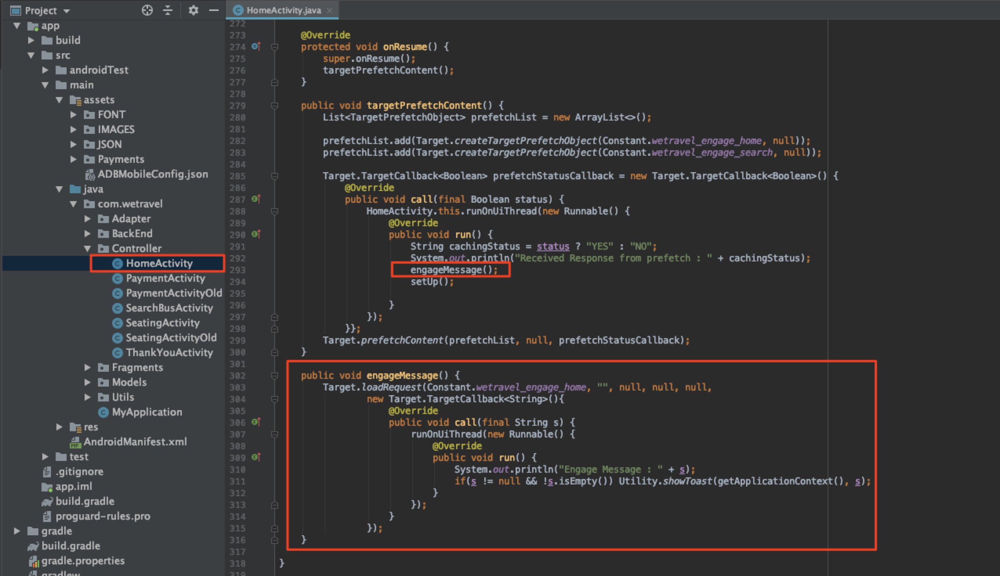

# 追加Adobe Targetの要請

AdobeMobile Services SDK(v4)は、Adobe Targetのメソッドと機能を提供し、様々なユーザーに対して様々なエクスペリエンスを使用してアプリをパーソナライズできるようにします。 通常、パーソナライズされたコンテンツを取得し、そのコンテンツの影響を測定するために、アプリからAdobe Targetに1つ以上のリクエストが行われます。

このレッスンでは、[!DNL Target]リクエストを実装して、パーソナライゼーション用のWe.Travelアプリを準備します。

## 前提条件

必ず[サンプルアプリ](download-and-update-the-sample-app.md)をダウンロードして更新してください。

## 学習目標

このレッスンを終了すると、次のことができます。

* バッチプリフェッチ要求を使用して複数の[!DNL Target]オファー（パーソナライズされたコンテンツ）をキャッシュ
* 事前に読み込まれた[!DNL Target]の場所を読み込みます
* [!DNL Target]の場所をリアルタイムで読み込む（事前に読み込まれていません）
* キャッシュから事前に取得された場所を消去
* プリフェッチされたリクエストとリアルタイムリクエストの検証

## 用語

以下に、このチュートリアルの残りの部分で使用する主なターゲット用語の一部を示します。

* **リクエスト：**  Adobe Targetサーバーへのネットワークリクエスト
* **オファー:**  コードまたはその他のテキストベースのコンテンツのスニペット。 [!DNL Target] ユーザーインターフェイス（またはAPI）で定義され、応答内で配信されます。ネイティブモバイルアプリで[!DNL Target]が使用されている場合は通常、JSONです。
* **場所：リクエ**  ストに与えられるユーザー定義の名前で、オファーを特定のリクエストに関連付けるためにインター [!DNL Target] フェイスで使用されます。
* **バッチリクエスト：複数**  の場所を含む単一のリクエスト
* **プリフェッチ要求：オファー**  を取得し、将来アプリで使用するためにメモリにキャッシュする単一の要求
* **バッチプリフェッチ要求：複数**  の場所のオファーをプリフェッチする単一の要求
* **オーディエンス：イ**  ンター [!DNL Target] フェイスで定義された訪問者のグループ、または他のAdobeアプリケーション [!DNL Target] から共有されたのグループ(例：「iPhone X訪問者」、「訪問者in the California」、「First App Open」)
* **アクティビティ:**  場所、オファー、オーディエンスをリンクし、パーソナライズされたエクスペリエンスを作成する [!DNL Target] ユーザーインターフェイス（またはAPI）で定義される [!DNL Target] 構成体。

## バッチ追加プリフェッチ要求

We.Travelに実装する最初のリクエストは、ホーム画面上の2つの[!DNL Target]場所を持つバッチプリフェッチ要求です。 後のレッスンでは、新しいユーザが予約プロセスを進める際に役立つように、メッセージを表示する場所のオファーを設定します。

プリフェッチ要求は、Adobe Targetサーバの応答(オファー)をキャッシュすることで、可能な限り最小限に[!DNL Target]コンテンツを取得します。 バッチプリフェッチ要求は、複数のオファーを取得してキャッシュし、それぞれが異なる場所に関連付けられています。 事前に取り込まれた場所は、後でユーザーセッションで使用できるように、デバイス上にキャッシュされます。 ホーム画面で複数の場所をプリフェッチすることで、後で訪問者がアプリ内を移動する際に使用するオファーを取得できます。 プリフェッチ方法の詳細については、[プリフェッチドキュメント](https://docs.adobe.com/content/help/en/mobile-services/android/target-android/c-mob-target-prefetch-android.html)を参照してください。

### バッチ追加プリフェッチ要求

HomeActivityコントローラー（ホーム画面のソースコード）を更新します。これは、app > main > java > com.wetravel > Controllerの下にあります。 赤で示す2つのコードブロックを追加します。

HomeActivityコントローラー（ホーム画面のソースコード）との開始は、app > main > java > com.wetravel > Controllerの下にあります。

赤で示す2つのコードブロックを追加します。


HomeActivityのコードの最後まで下にスクロールし、`setHeader()`関数の後に以下に示すコードを追加し、*置き換える*&#x200B;関数を現在の`onResume()`関数の後に追加します。

```java
@Override
protected void onResume() {
    super.onResume();
    targetPrefetchContent();
}

public void targetPrefetchContent() {
    List<TargetPrefetchObject> prefetchList = new ArrayList<>();
    prefetchList.add(Target.createTargetPrefetchObject(Constant.wetravel_engage_home, null));
    prefetchList.add(Target.createTargetPrefetchObject(Constant.wetravel_engage_search, null));
    Target.TargetCallback<Boolean> prefetchStatusCallback = new Target.TargetCallback<Boolean>() {
        @Override
        public void call(final Boolean status) {
            HomeActivity.this.runOnUiThread(new Runnable() {
                @Override
                public void run() {
                    String cachingStatus = status ? "YES" : "NO";
                    System.out.println("Received Response from prefetch : " + cachingStatus);
                    setUp();

                }
            });
        }};
    Target.prefetchContent(prefetchList, null, prefetchStatusCallback);
}
```

ファイルに[!DNL Target]クラスをインポートしていないと、IDEから警告が表示される場合があります。 次の赤で示すように、HomeActivityコントローラーの上部にある[!DNL Target]クラスを必ずインポートしてください。

```java
import com.adobe.mobile.Target;
import com.adobe.mobile.TargetPrefetchObject;
```


また、「シンボル変数が見つかりません」と「シンボル変数が見つかりませんwetravel_engage_home」、「シンボル変数が見つかりません」というエラーが表示される場合もあります。 これ追加らは`Constant.java`ファイル(app > src > main > java > com > wetravel > Utils)に追加します。

```java
public static final String wetravel_engage_home = "wetravel_engage_home";
public static final String wetravel_engage_search = "wetravel_engage_search";
```


### バッチプリフェッチ要求コードの説明

| コード | 説明 |
|--- |--- |
| `targetPrefetchContent()` | [!DNL Target]メソッドを使用して2つの[!DNL Target]の場所を取得しキャッシュする、ユーザー定義関数（SDKの一部ではありません）。 |
| `prefetchContent()` | プリフェッチ要求を送信する[!DNL Target] SDKメソッド |
| `Constant.wetravel_engage_home` | [!DNL Target]の場所の名前が事前に取得され、オファーの内容がホーム画面に表示されます。 |
| `Constant.wetravel_engage_search` | [!DNL Target]ロケーション名を事前に取得し、検索結果画面にオファーの内容を表示します。 これはプリフェッチの2番目の場所なので、このプリフェッチ要求は「プリフェッチバッチ要求」と呼ばれます。 |
| setUp() | [!DNL Target]オファーを事前に取得した後にアプリのホーム画面をレンダリングするユーザー定義関数 |

### 非同期と同期について

先ほど導入したコードを使用して、プリフェッチ要求は、ホーム画面がレンダリングされる直前に、同期呼び出し（ブロック呼び出し）として行われます。 新しいコードをHomeActivityコントローラーに貼り付けたとき、`setUp()`関数の実行を`onResume()`関数からターゲット要求の後まで移動しました。 これは、アプリを最初に開いたときにコンテンツをパーソナライズするシナリオで有益です。最初の画面がレンダリングされる前に、ターゲットサーバーからパーソナライズされたコンテンツが返された（またはタイムアウトした）ことを確認できるからです。 リクエストを（バックグラウンドで）非同期に読み込むには、代わりに`onCreate()`関数内で`setUp()`を呼び出します。

### バッチプリフェッチ要求の検証

アプリを再構築し、Androidエミュレーターを開きます。 （以下のスクリーンショットは、Android Qバージョン9以降のAPIレベル29でピクセル2を使用しています）。 プリフェッチ応答は「プリフェッチ応答受信」と読み取る必要があります。

ホーム画面がレンダリングされるときは、プリフェッチ要求を読み込む必要があります。 Logcatを使用して、[!DNL "Target"]をフィルターし、リクエストと応答を確認します。


正常な応答が表示されない場合は、`ADBMobileConfig.json`ファイルの設定とHomeActivityファイルのコード構文を確認します。

現在は、2つの場所がデバイスにキャッシュされます。 場所名は、[!DNL Target]インターフェイスに間もなく遅延読み込みされます。アクティビティで使用する場合は、様々なドロップダウンメニューで選択できます。

### キャッシュされた各場所の追加要求の読み込み

場所が事前に取得され、応答がデバイスにキャッシュされたので、オファーの内容をキャッシュから取得する`Target.loadRequest()`メソッドを追加して、アプリケーションを更新できるようにします。 プリフェッチ要求で実行する`engageMessage()`という新しいカスタムメソッドを追加します。 `engageMessage()` が呼び出 `Target.loadRequest()`されます。`engageMessage()` の前 `setUp()` に実行し、読み込み要求が呼び出された後で画面が設定されるようにします。

まず、HomeActivityのwetravel_engage_homeの場所に`engageMessage()`コール&amp;メソッドを追加します。



次に、更新されたコードを示します。

```java
    public void targetPrefetchContent() {
        List<TargetPrefetchObject> prefetchList = new ArrayList<>();
        Map<String, Object> params1;
        params1 = new HashMap<String, Object>();
        params1.put("at_property", "your at_property value goes here");
        prefetchList.add(Target.createTargetPrefetchObject(Constant.wetravel_engage_home, params1));
        prefetchList.add(Target.createTargetPrefetchObject(Constant.wetravel_engage_search, params1));
        Target.TargetCallback<Boolean> prefetchStatusCallback = new Target.TargetCallback<Boolean>() {
            @Override
            public void call(final Boolean status) {
                HomeActivity.this.runOnUiThread(new Runnable() {
                    @Override
                    public void run() {
                        String cachingStatus = status ? "YES" : "NO";
                        System.out.println("Received Response from prefetch : " + cachingStatus);
                        engageMessage();
                        setUp();
                    }
                });
            }};
        Target.prefetchContent(prefetchList, null, prefetchStatusCallback);
    }
    public void engageMessage() {
        Target.loadRequest(Constant.wetravel_engage_home, "", null, null, null,
            new Target.TargetCallback<String>(){
                @Override
                public void call(final String s) {
                    runOnUiThread(new Runnable() {
                        @Override
                        public void run() {
                            System.out.println("Engage Message : " + s);
                            if(s != null && !s.isEmpty()) Utility.showToast(getApplicationContext(), s);
                        }
                    });
                }
            });
    }
```

次に、SearchBusActivityのwetravel_engage_searchの場所に`engageMessage()`コール&amp;メソッドを追加します。 `engageMessage()`呼び出しは、`setUpSearch()`呼び出しの前に`onResume()`メソッドに設定されているので、画面が設定される前に実行されます。


次に、更新されたコードを示します。

```java
    @Override
    public void onResume() {
        super.onResume();
        engageMessage();
        setUpSearch();
    }
    public void engageMessage() {
        Target.loadRequest(Constant.wetravel_engage_search, "", null, null, null,
                new Target.TargetCallback<String>(){
                    @Override
                    public void call(final String s) {
                        runOnUiThread(new Runnable() {
                            @Override
                            public void run() {
                                System.out.println("Engage Message : " + s);
                                if(s != null && !s.isEmpty()) Utility.showToast(getApplicationContext(), s);
                            }
                        });
                    }
                });
    }
```

SearchBusActivityにターゲットメソッドを追加したばかりなので、必ず[!DNL Target]クラスをインポートしてください。

```java
import com.adobe.mobile.Target;
import com.adobe.mobile.TargetPrefetchObject;
```

## リ追加アルタイムリクエスト

次にアプリに追加するリクエストは、「ありがとうございます」画面にリアルタイムでリクエストされます。 「リアルタイム」とは、リクエストが行われ、応答が直ちに適用される（後でキャッシュされるのではない）という意味です。 後のレッスンでは、このリクエストを使用して、ユーザーの旅行先に合わせてパーソナライズしたエクスペリエンスを作成します。

では、「ありがとうございます」画面にリアルタイムのリクエストを追加します。 ThankYouActivityファイルで、赤で表示される変更を行います。


ThankYouActivityファイルの最後までスクロールします。 `getRecommandations()`関数の3行をコメントアウトし、`targetLoadRequest()`関数の呼び出しを追加します。

```java
// AppDialogs.dialogLoaderHide();
// recommandations.addAll(recommandation.recommandations);
// recommandationbAdapter.notifyDataSetChanged();
```

追加`getRecommandations()`関数に対するコードの次の行：

```java
targetLoadRequest(recommandation.recommandations);
```

次に、`targetLoadRequest()`関数を定義する必要があります。
&lt;a1/追加>ありがとうございます画面上のリアルタイムの場所](assets/thankyou2.jpg)![

追加このコードは`filterRecommendationBasedOnOffer()`関数の後に次のようにブロックされます。

```java
public void targetLoadRequest(final ArrayList<Recommandation> recommandations) {
    Target.loadRequest(Constant.wetravel_context_dest, "", null, null, null, new Target.TargetCallback<String>() {
        @Override
        public void call(final String response) {
            try {
                runOnUiThread(new Runnable() {
                    @Override
                    public void run() {
                        AppDialogs.dialogLoaderHide();
                        filterRecommendationBasedOnOffer(recommandations, response);
                        recommandationbAdapter.notifyDataSetChanged();
                    }
                });
            } catch (Exception e) {
                e.printStackTrace();
            }
        }
    });
}
```

ThankYouActivityにターゲットメソッドを追加した後なので、必ずターゲットクラスをインポートしてください。

```java
import com.adobe.mobile.Target;
import com.adobe.mobile.TargetPrefetchObject;
```

### targetLoadRequest()コードの説明

| コード | 説明 |
|--- |--- |
| `targetLoadRequest()` | `Target.loadRequest()`が起動し、wetravel_context_destの場所を読み込んで表示するユーザー定義関数（SDKの一部ではありません） |
| `Target.loadRequest()` | ターゲットサーバーにリクエストを送信するSDKメソッド |
| Constant.wetravel_context_dest | [!DNL Target]インターフェイスでアクティビティを構築する際に、後で使用する要求に割り当てられる場所の名前です。 |
| `filterRecommendationBasedOnOffer()` | オファーの応答から場所のオファーを取得し、ターゲットのコンテンツに基づいてアプリの変更方法を決定する、アプリのユーザー定義関数 |
| `recommandations.addAll()` | 「ありがとうございます」画面が読み込まれたときにデフォルトで実行されるアプリ内のユーザー定義関数ですが、`filterRecommendationBasedOnOffer()`がターゲット応答を受け取って解析した後に実行されるようになりました |

これは、ホーム画面に追加したリクエストを使用してアプリに対して行ったより高度な更新です。次に、行った操作を確認します。

1. コード行をコメントアウトして、アプリの以前の3つのデフォルトのプロモーション表示の動作を中断しました。
1. 代わりに新しい関数を実行するようにアプリに指示しました。この関数の名前は、任意にtargetLoadRequestという名前にしました。
1. `targetLoadRequest`関数を定義して、ターゲット.loadRequestメソッドを使用してターゲットにリクエストを行い、[!DNL Target]オファーの応答を受け取ったらすぐに`filterRecommendationBasedOnOffer()`関数を実行します
1. `filterRecommendationBasedOnOffer()`関数は応答を解釈し、どのプロモーションを画面に適用するかを決定します

これは、モバイルアプリで[!DNL Target]を使用する場合の非常に一般的な使用パターンです。  どちらも非常に強力で、モバイルアプリのほとんどすべての側面をパーソナライズできます。 また、アプリのコードと、後で[!DNL Target]インターフェイスで定義するオファーとの間の調整も必要です。 この調整のため、一部のパーソナライゼーションの使用例では、アクティビティを起動するためにアプリストアのアプリを更新する必要がある場合があります。

### リアルタイムリクエストの検証

Androidエミュレーターを開き、次のすべての手順に従って旅行を予約します。ホーム/バス検索結果/座席選択、支払いオプション（空白のデータを含む支払いオプションはすべて有効）。

最後の「ありがとうございます」画面で、Logcatの回答を見てください。 応答には、「Default content was returned for &quot;wetravel_context_dest&quot;:


## プリフェッチされた場所をキャッシュからクリア

セッション中に、プリフェッチされた場所をクリアする必要がある場合があります。 例えば、予約が発生した場合、ユーザーが「関与」しているので、キャッシュされている場所をクリアして予約プロセスを理解した方が効果的です。 セッション中に別の旅行を予約した場合、ホーム画面や検索結果画面で予約の案内をする際に、元の場所は必要ありません。 キャッシュから場所をクリアし、新しいオファーをプリフェッチして、2回目の予約を割り引かれたり、別の関連シナリオに対応したりする方が、より効果的です。 セッション中に予約が発生した場合に新しい場所を先読みするロジックをホーム画面および検索結果画面に追加できます。

この例では、予約が発生したセッションで事前に取得された場所を消去します。 これは`Target.clearPrefetchCache()`関数を呼び出すことで行われます。 `targetLoadRequest()`関数内に次のように設定します。

```java
Target.clearPrefetchCache()
```


おめでとう！ これで、アプリにパーソナライゼーションのフレームワークが追加されました。 次のレッスンでは、これらの場所にパラメータを追加することで、パーソナライゼーション機能を強化します。

**[次へ：&quot;追加パラメーター&quot; >](add-parameters.md)**
