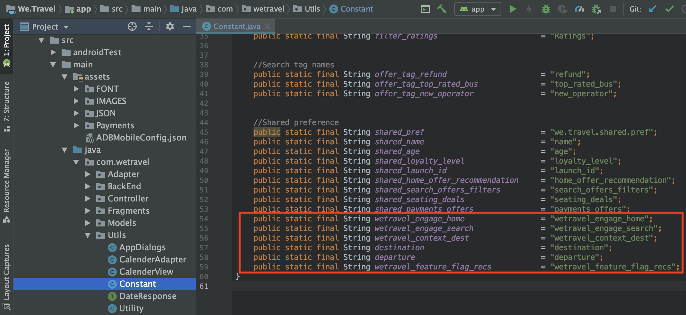

# Adobe Target要求の追加

AdobeMobile Services SDK(v4) は、Adobe Targetのメソッドおよび機能を提供し、様々なユーザーに対して様々なエクスペリエンスを提供してアプリをパーソナライズできます。 通常、アプリからAdobe Targetに対して 1 つ以上の要求がおこなわれ、パーソナライズされたコンテンツが取得され、そのコンテンツの影響を測定します。

このレッスンでは、 [!DNL Target] リクエストを実装して、パーソナライゼーション用の We.Travel アプリを準備します。

## 前提条件

必ず [ をダウンロードし、サンプルアプリ ](download-and-update-the-sample-app.md) を更新してください。

## 学習内容

このレッスンを最後まで学習すると、次の内容を習得できます。

* バッチプリフェッチ要求を使用して、複数の [!DNL Target] オファー（パーソナライズされたコンテンツ）をキャッシュ
* プリフェッチされた [!DNL Target] の場所を読み込む
* [!DNL Target] の場所をリアルタイムで読み込む（プリフェッチされない）
* プリフェッチされた場所をキャッシュからクリア
* プリフェッチされたリクエストとリアルタイムリクエストの検証

## 用語

このチュートリアルの後半で使用する Target の主な用語を以下に示します。

* **リクエスト：**  Adobe Targetサーバーへのネットワークリクエスト
* **オファー：**  ユーザーインターフェイス（または API を使用）で定義され、応答で配信されるコードまたはその他のテキストベースのコンテンツのスニペットで [!DNL Target] す。通常、[!DNL Target] がネイティブのモバイルアプリで使用されている場合は JSON です。
* **場所：**  リクエストに指定されたユーザー定義の名前。オファーを特定のリクエストに関連付ける [!DNL Target] ためのインターフェイスで使用されます。
* **バッチリクエスト：**  複数の場所を含む単一のリクエスト
* **プリフェッチリクエスト：**  オファーを取得し、将来アプリで使用するためにメモリにキャッシュする単一のリクエスト
* **バッチプリフェッチ要求：**  複数の場所のオファーをプリフェッチする単一の要求
* **オーディエンス：**  インターフェイスで定義さ [!DNL Target] れた訪問者のグループ、または他の [!DNL Target] Adobeアプリケーション ( 例：「iPhone X 訪問者」、「Visitors in the California」、「First App Open」)
* **アクティビティ：**  場所、オ [!DNL Target] ファー、オーディエンスをリンク [!DNL Target] し、パーソナライズされたエクスペリエンスを作成するユーザーインターフェイス（または API を使用）で定義される構成体

## バッチプリフェッチ要求の追加

We.Travel で実装する最初のリクエストは、ホーム画面上の 2 つの [!DNL Target] 場所を含むバッチプリフェッチリクエストです。 後のレッスンでは、新規ユーザーが予約プロセスを進めるのに役立つメッセージを表示するこれらの場所のオファーを設定します。

プリフェッチリクエストは、Adobe Targetサーバーの応答（オファー）をキャッシュすることで、可能な限り最小限の [!DNL Target] コンテンツを取得します。 バッチプリフェッチリクエストは、複数のオファーを取得してキャッシュし、それぞれが異なる場所に関連付けられます。 プリフェッチされたすべての場所は、今後のユーザーセッションでの使用のためにデバイス上にキャッシュされます。 ホーム画面の複数の場所を先取りすることで、後で訪問者がアプリ内を移動する際に使用するオファーを取得できます。 プリフェッチメソッドの詳細については、[ プリフェッチのドキュメント ](https://experienceleague.adobe.com/docs/mobile-services/android/target-android/c-mob-target-prefetch-android.html?lang=en) を参照してください。

### バッチプリフェッチ要求の追加

HomeActivity コントローラ（Home Screen のソースコード）を更新します。このコントローラは、app > main > java > com.wetravel > Controller の下にあります。 赤で表示される 2 つのコードブロックを追加します。

まず、HomeActivity コントローラ（Home Screen のソースコード）を使用します。このコントローラは、app/main/java/com.wetravel/Controller の下にあります。

赤で表示される 2 つのコードブロックを追加します。


HomeActivity のコードの最後まで下にスクロールし、以下に示すコードを `setHeader()` 関数の後に追加し、*replacing* 現在の `onResume()` 関数に追加します。

```java
@Override
protected void onResume() {
    super.onResume();
    targetPrefetchContent();
}

public void targetPrefetchContent() {
    List<TargetPrefetchObject> prefetchList = new ArrayList<>();
    prefetchList.add(Target.createTargetPrefetchObject(Constant.wetravel_engage_home, null));
    prefetchList.add(Target.createTargetPrefetchObject(Constant.wetravel_engage_search, null));
    Target.TargetCallback<Boolean> prefetchStatusCallback = new Target.TargetCallback<Boolean>() {
        @Override
        public void call(final Boolean status) {
            HomeActivity.this.runOnUiThread(new Runnable() {
                @Override
                public void run() {
                    String cachingStatus = status ? "YES" : "NO";
                    System.out.println("Received Response from prefetch : " + cachingStatus);
                    setUp();

                }
            });
        }};
    Target.prefetchContent(prefetchList, null, prefetchStatusCallback);
}
```

IDE では、[!DNL Target] クラスがファイルにインポートされていないことを警告する場合があります。 次の赤で示すように、HomeActivity コントローラの最上部に [!DNL Target] クラスを必ずインポートしてください。

```java
import com.adobe.mobile.Target;
import com.adobe.mobile.TargetPrefetchObject;
```


また、「cannot find symbol variable wetravel_engage_home」と「cannot find symbol variable wetravel_engage_search」のエラーが表示される場合もあります。 これらを `Constant.java` ファイルに追加します (app > src > main > java > com > wetravel > Utils)。

```java
public static final String wetravel_engage_home = "wetravel_engage_home";
public static final String wetravel_engage_search = "wetravel_engage_search";
```



### バッチプリフェッチ要求コードの説明

| コード | 説明 |
|--- |--- |
| `targetPrefetchContent()` | [!DNL Target] メソッドを使用して 2 つの [!DNL Target] の場所を取得し、キャッシュする、ユーザー定義の関数（SDK の一部ではありません）。 |
| `prefetchContent()` | プリフェッチ要求を送信する [!DNL Target] SDK メソッド |
| `Constant.wetravel_engage_home` | ホーム画面にオファーコンテンツを表示する [!DNL Target] ロケーション名をプリフェッチ |
| `Constant.wetravel_engage_search` | [!DNL Target] ロケーション名をプリフェッチしました。この名前は、検索結果画面にオファーコンテンツを表示します。 これはプリフェッチの 2 番目の場所なので、このプリフェッチ要求は「プリフェッチバッチ要求」と呼ばれます。 |
| setUp() | [!DNL Target] オファーがプリフェッチされた後にアプリのホーム画面をレンダリングするユーザー定義関数 |

### 非同期と同期について

実装したコードでは、プリフェッチ要求は、ホーム画面がレンダリングされる直前に、同期呼び出しでブロック呼び出しとしておこなわれます。 新しいコードを HomeActivity コントローラーに貼り付けると、`setUp()` 関数の実行を `onResume()` 関数から Target リクエストの後まで移動しました。 これは、アプリを最初に開いたときにコンテンツをパーソナライズするシナリオで役立ちます。最初の画面がレンダリングされる前に、Target サーバーからパーソナライズされたコンテンツが返される（またはタイムアウトする）からです。 リクエストが（バックグラウンドで）非同期で読み込まれるようにするには、代わりに `onCreate()` 関数内で `setUp()` を呼び出します。

### バッチプリフェッチ要求の検証

アプリを再構築し、Android エミュレーターを開きます。 （以下のスクリーンショットは、Android Q バージョン 9 以降、API レベル 29 のピクセル 2 を使用しています）。 プリフェッチ応答は、「プリフェッチ応答を受信しました」と読み取られます。

ホーム画面がレンダリングされたら、プリフェッチ要求を読み込む必要があります。 Logcat で、[!DNL "Target"] をフィルターして、要求と応答を確認します。


正常な応答が表示されない場合は、HomeActivity ファイルの `ADBMobileConfig.json` ファイルおよびコード構文の設定を確認します。

これで、2 つの場所がデバイスにキャッシュされます。 場所名は [!DNL Target] インターフェイスにまもなく遅延読み込みされ、アクティビティで使用する際に、様々なドロップダウンメニューで選択できます。

### キャッシュされた各場所に対する読み込み要求の追加

場所がプリフェッチされ、応答がデバイスにキャッシュされたので、オファーコンテンツをキャッシュから取得する `Target.loadRequest()` メソッドを追加して、アプリケーションの更新に使用できるようにします。 プリフェッチ要求で実行される新しいカスタムメソッド `engageMessage()` を追加します。 `engageMessage()` が呼び出されま `Target.loadRequest()`す。`engageMessage()` がの前に実 `setUp()` 行され、読み込みリクエストが画面の設定前に呼び出されるようにします。

まず、HomeActivity の wetravel_engage_home の場所に対して `engageMessage()` 呼び出しおよびメソッドを追加します。


更新されたコードを次に示します。

```java
    public void targetPrefetchContent() {
        List<TargetPrefetchObject> prefetchList = new ArrayList<>();
        Map<String, Object> params1;
        params1 = new HashMap<String, Object>();
        params1.put("at_property", "your at_property value goes here");
        prefetchList.add(Target.createTargetPrefetchObject(Constant.wetravel_engage_home, params1));
        prefetchList.add(Target.createTargetPrefetchObject(Constant.wetravel_engage_search, params1));
        Target.TargetCallback<Boolean> prefetchStatusCallback = new Target.TargetCallback<Boolean>() {
            @Override
            public void call(final Boolean status) {
                HomeActivity.this.runOnUiThread(new Runnable() {
                    @Override
                    public void run() {
                        String cachingStatus = status ? "YES" : "NO";
                        System.out.println("Received Response from prefetch : " + cachingStatus);
                        engageMessage();
                        setUp();
                    }
                });
            }};
        Target.prefetchContent(prefetchList, null, prefetchStatusCallback);
    }
    public void engageMessage() {
        Target.loadRequest(Constant.wetravel_engage_home, "", null, null, null,
            new Target.TargetCallback<String>(){
                @Override
                public void call(final String s) {
                    runOnUiThread(new Runnable() {
                        @Override
                        public void run() {
                            System.out.println("Engage Message : " + s);
                            if(s != null && !s.isEmpty()) Utility.showToast(getApplicationContext(), s);
                        }
                    });
                }
            });
    }
```

次に、SearchBusActivity の wetravel_engage_search の場所に対して `engageMessage()` 呼び出しとメソッドを追加します。 `engageMessage()` 呼び出しは、`setUpSearch()` の呼び出しの前の `onResume()` メソッドで設定され、画面が設定される前に実行されます。


更新されたコードを次に示します。

```java
    @Override
    public void onResume() {
        super.onResume();
        engageMessage();
        setUpSearch();
    }
    public void engageMessage() {
        Target.loadRequest(Constant.wetravel_engage_search, "", null, null, null,
                new Target.TargetCallback<String>(){
                    @Override
                    public void call(final String s) {
                        runOnUiThread(new Runnable() {
                            @Override
                            public void run() {
                                System.out.println("Engage Message : " + s);
                                if(s != null && !s.isEmpty()) Utility.showToast(getApplicationContext(), s);
                            }
                        });
                    }
                });
    }
```

Target メソッドを SearchBusActivity に追加したばかりなので、必ず [!DNL Target] クラスをインポートしてください。

```java
import com.adobe.mobile.Target;
import com.adobe.mobile.TargetPrefetchObject;
```

## リアルタイムリクエストの追加

次に、アプリに追加するリクエストは、「ありがとうございます」画面でのリアルタイムリクエストになります。 「リアルタイム」とは、両方のリクエストがおこなわれ、応答が即座に適用されることを意味します（後でキャッシュされることはありません）。 後のレッスンでは、このリクエストを使用して、ユーザーの旅行先に合わせてパーソナライズされたエクスペリエンスを構築します。

次に、ありがとう画面でリアルタイムリクエストを追加します。 ThankYouActivity ファイルで、赤で表示される変更を行います。


ThankYouActivity ファイルの最後までスクロールします。 `getRecommandations()` 関数の 3 行をコメントアウトし、`targetLoadRequest()` 関数の呼び出しを追加します。

```java
// AppDialogs.dialogLoaderHide();
// recommandations.addAll(recommandation.recommandations);
// recommandationbAdapter.notifyDataSetChanged();
```

次のコード行を `getRecommandations()` 関数に追加します。

```java
targetLoadRequest(recommandation.recommandations);
```

次に、`targetLoadRequest()` 関数を定義する必要があります。


このコードブロックを `filterRecommendationBasedOnOffer()` 関数の後に追加します。

```java
public void targetLoadRequest(final ArrayList<Recommandation> recommandations) {
    Target.loadRequest(Constant.wetravel_context_dest, "", null, null, null, new Target.TargetCallback<String>() {
        @Override
        public void call(final String response) {
            try {
                runOnUiThread(new Runnable() {
                    @Override
                    public void run() {
                        AppDialogs.dialogLoaderHide();
                        filterRecommendationBasedOnOffer(recommandations, response);
                        recommandationbAdapter.notifyDataSetChanged();
                    }
                });
            } catch (Exception e) {
                e.printStackTrace();
            }
        }
    });
}
```

Target メソッドを ThankYouActivity に追加したばかりなので、必ず Target クラスをインポートしてください。

```java
import com.adobe.mobile.Target;
import com.adobe.mobile.TargetPrefetchObject;
```

### targetLoadRequest() コードの説明

| コード | 説明 |
|--- |--- |
| `targetLoadRequest()` | `Target.loadRequest()` を呼び出し、 wetravel_context_dest の場所を読み込んで表示する、ユーザー定義の関数（SDK の一部ではない） |
| `Target.loadRequest()` | Target サーバーにリクエストを送信する SDK メソッド |
| Constant.wetravel_context_dest | 後で [!DNL Target] インターフェイスでアクティビティを作成する際に使用する、リクエストに割り当てられる場所の名前 |
| `filterRecommendationBasedOnOffer()` | 場所のオファーを Target の応答から受け取り、オファーのコンテンツに基づいてアプリの変更方法を決定する、アプリのユーザー定義関数 |
| `recommandations.addAll()` | ThankYou 画面が読み込まれたときにデフォルトで実行されるように使用されたアプリ内のユーザー定義関数ですが、Target 応答を受け取り、`filterRecommendationBasedOnOffer()` で解析した後に実行されるようになりました。 |

これは、アプリを更新した後、ホーム画面に追加したリクエストを使用して、より高度な更新をおこなったので、操作内容を確認します。

1. コードの行をコメントアウトすることで、アプリの以前の動作で 3 つのデフォルトのプロモーションを表示するのを中断しました
1. 代わりに、targetLoadRequest という任意の名前を付けた新しい関数を実行するようにアプリに指示しました。
1. Target.loadRequest メソッドを使用して Target に要求を送信し、 [!DNL Target] オファーの応答を受信したらすぐに `filterRecommendationBasedOnOffer()` 関数を実行する `targetLoadRequest` 関数を定義しました
1. `filterRecommendationBasedOnOffer()` 関数は応答を解釈し、画面に適用するプロモーションを決定します

これは、モバイルアプリで [!DNL Target] を使用する場合の非常に一般的な使用パターンです。  モバイルアプリのほとんどあらゆる側面をパーソナライズできる点は、どちらも非常に強力です。 また、アプリのコードと、後で [!DNL Target] インターフェイスで定義するオファーとの間の調整も必要です。 この調整のため、一部のパーソナライゼーションの使用例では、アクティビティを起動するために、App Store のアプリを更新する必要が生じる場合があります。

### リアルタイムリクエストの検証

Android エミュレーターを開き、すべての手順を実行して旅行を予約します。ホーム/バス検索結果/座席選択、支払いオプション（空のデータを含むすべての支払いオプションが機能します）。

最後の「ありがとうございます」画面で、Logcat の反応を見てください。 応答は、「Default content was returned for &quot;wetravel_context_dest&quot;:


## プリフェッチされた場所をキャッシュから消去

セッション中にプリフェッチされた場所をクリアする必要がある場合があります。 例えば、予約が発生した場合、ユーザーが「関与」し、予約プロセスを理解したので、キャッシュされた場所を消去すると効果的です。 セッション中に別の旅行を予約した場合、ホーム画面や検索結果画面の元の場所を使用して予約をガイドする必要はありません。 キャッシュから場所をクリアし、新しいオファーをプリフェッチして、割引された 2 回目の予約やその他の関連シナリオをプリフェッチする方が、より合理的です。 セッション中に予約がおこなわれた場合に新しい場所をプリフェッチするロジックをホーム画面と検索結果画面に追加できます。

この例では、予約がおこなわれたときに、セッションで事前に取得された場所のみを消去します。 これは、`Target.clearPrefetchCache()` 関数を呼び出すことで行われます。 次に示すように、`targetLoadRequest()` 関数内に関数を設定します。

```java
Target.clearPrefetchCache()
```


おめでとう！ これで、アプリにパーソナライゼーションのフレームワークが組み込まれました。 次のレッスンでは、パーソナライゼーション機能を強化し、これらの場所にパラメーターを追加します。

**[次へ：「パラメータの追加」>](add-parameters.md)**
