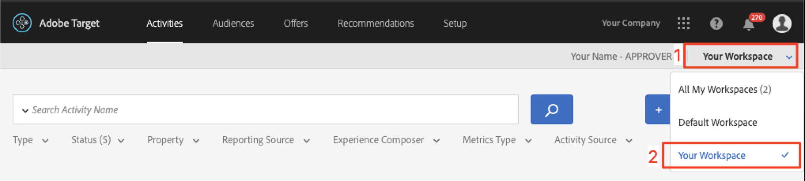

# Adobe Targetでのオーディエンスとオファーの作成

このレッスンでは、前のレッスンで実装した 3 つの場所について、[!DNL Target] インターフェイスを参照して、オーディエンスとオファーを作成します。

## 学習目標

このレッスンを終了すると、次の操作を実行できるようになります。

* Adobe Target でのオーディエンスの作成
* Adobe Targetでのオファーの作成

具体的には、このレッスンでは、チュートリアルの最初に定義したパーソナライゼーションのユースケースを達成するために必要なオーディエンスとオファーを作成します。 「ホーム」画面と「検索」画面を使用して、アプリユーザーが旅行を予約するのを支援します。また、「ありがとうございます」画面を使用して、ユーザーの宛先に基づいて関連するプロモーションをいくつか表示します。 次の表は、このレッスンで作成する各場所の内容を示しています。

| 場所 | オーディエンス | オファー |
| --- | --- | --- |
| wetravel_engage_home | 新規モバイルアプリユーザー | 「出発地と目的地を選択して、利用可能なバス路線を検索する」 |
| wetravel_engage_search | 新規モバイルアプリユーザー | 「フィルターを使用して検索結果を絞り込む」 |
| wetravel_engage_home | 再びモバイルアプリユーザー | 「おかえりなさい！ チェックアウト時にプロモーションコード BACK30 を使用すると、10% の割引が受けられます。」 |
| wetravel_engage_search | 再びモバイルアプリユーザー | デフォルトコンテンツ |
| wetravel_context_dest | 目的地：サンディエゴ | &quot;DJ&quot; |
| wetravel_context_dest | 目的地：ロサンゼルス | 「ユニバーサル」 |

## Workspaceを選択

会社で [ プロパティとワークスペース ] を使用してアプリと Web サイトをパーソナライズするための境界を確立し、前のレッスンで at_property パラメータを実装した場合は、このレッスンを進める前に、まず自分が正しいWorkspaceに属していることを確認する必要があります。 プロパティとワークスペースを使用しない場合は、この手順を無視してください。 前のレッスンで使用したWorkspaceを選択し、at_property の値をコピーします。

 例

## オーディエンスを作成

次に、アプリのパーソナライズに使用するオーディエンスを作成します。

### 新規ユーザー用のオーディエンスの作成

Adobe Target オーディエンスは、訪問者の特定のグループを識別するために使用されます。 オファーは、これらの特定のグループをターゲットにすることができます。 最初の 2 つの場所では、「新規ユーザー」オーディエンスを使用します。

1. 上部ナビゲーションの「**[!UICONTROL Audiences]**」をクリックします。
1. **[!UICONTROL Create Audience]** ボタンをクリックします。
   

1. オーディエンス名として **[!UICONTROL New Mobile App Users]** と入力します。
1. 「**[!UICONTROL Add Rule]**」を選択します。
1. **[!UICONTROL Custom]** ルールを選択します。
   

1. 「**[!UICONTROL a.Launches]**」を選択します。
1. 「**[!UICONTROL is less than]**」を選択します。
1. **5** と入力します。
1. 新しいオーディエンスを保存します。
   

### 再ユーザー用のオーディエンスの作成

上記と同じ手順に従って、再ユーザーのオーディエンスを作成します。

1. オーディエンスに「_モバイルアプリユーザーを返す_ という名前を付けます。
1. **[!UICONTROL a.Launches is greater than or equal to 5]** をカスタムルールとして使用します。
1. 新しいオーディエンスを保存します。

   

>[!NOTE]
>
>[!DNL Target] Mobile SDK で収集されるすべてのライフサイクル指標およびディメンションは、先頭に「a」（例：a.Launches）が付き、ドロップダウンメニューの「カスタム」オプションで使用でき、オーディエンスの構築に使用できます。

### サンディエゴへの旅行を予約するユーザー向けのオーディエンスの作成

次に、We.Travel アプリが提供する宛先の一部に対して、いくつかのオーディエンスを作成します。 前のレッスンでは、wetravel_context_dest 位置リクエストの位置パラメータとして宛先を渡しました。 このパラメーターは、ドロップダウンメニューの「カスタム」オプションで使用できます。

>[!NOTE]
>
>カスタムドロップダウンに表示される予定のパラメーターが [!DNL Target] インターフェイスに表示されない場合は、そのパラメーターが実際にリクエストで渡されていることを再確認してください。 がリクエストに含まれているが、[!DNL Target] インターフェイスに遅延読み込みされていない場合は、パラメーター名を入力し、Enter キーを押すだけで、オーディエンスの定義を続行できます

1. オーディエンスに _宛先：サンディエゴ_ という名前を付けます。
1. _locationDest contains San Diego_ という定義のカスタムルールを使用します。
1. 新しいオーディエンスを保存します。

   

### ロサンゼルスへの旅行を予約するユーザー向けのオーディエンスの作成

1. オーディエンスに _宛先：ロサンゼルス_ という名前を付けます
1. _locationDest contains Los Angeles_ という定義のカスタムルールを使用します。
1. 新しいオーディエンスを保存します。

## オファーを作成

次に、これらのメッセージを表示するオファーを作成します。 なお、オファーはコードまたはコンテンツのスニペットであり、[!DNL Target] 応答で配信されます。 ほとんどの場合、[!DNL Target] ユーザーインターフェイスで作成されますが、API を使用するか、Adobe Experience Managerとエクスペリエンスフラグメントを統合して作成することもできます。 モバイルアプリでは、JSON オファーが一般的です。 このチュートリアルでは、任意のプレーンテキストコンテンツ（JSON を含む）をアプリに配信するために使用できるHTMLオファーを使用します。

### 新規ユーザー用オファーの作成

まず、新規ユーザーへのメッセージ用のオファーを作成します。

1. 上部ナビゲーションの「**[!UICONTROL Offers]**」をクリックします。
1. **[!UICONTROL Create]** をクリックします。
1. 「**[!UICONTROL HTML Offer]**」を選択します。

   

1. オファーに名前を付けます _ホーム：新しいユーザーを引き付ける_。
1. _Select Source and Destination to search for available bus_ をコードとして入力します。
1. 新規オファーを保存します。

   

### 再来訪ユーザー向けオファーの作成

次に、再ユーザー用の 1 つのオファーを作成します（2 番目のオファーはデフォルトコンテンツで、何も表示されません）。

1. オファーに _ホーム：再来訪ユーザー_ という名前を付けます。
1. Enter _おかえりなさい！ チェックアウト時にプロモーションコード BACK30 を使用すると、10% の割引が受けられます。HTMLコードとしてを_ します。
1. 新規オファーを保存します。

   

### サンディエゴオファーの作成

「DJ」が ThankYou アクティビティに戻されると、filterRecommendationBasedOnOffer （）関数のロジックに「Rock Night with DJ SAM」のバナーが表示されます。

1. オファーに _サンディエゴのプロモーション_ という名前を付けます。
1. HTMLコードとして _DJ_ と入力します。
1. 新規オファーを保存します。

### ロサンゼルスに行くユーザー向けのオファーを作成

「Universal」が「ThankYou」アクティビティに戻されると、filterRecommendationBasedOnOffer （）関数のロジックに「Universal Studios」のバナーが表示されます。

1. オファーに _ロサンゼルスのプロモーション_ という名前を付けます。
1. HTMLコードとして _ユニバーサル_ と入力します。
1. 新規オファーを保存します。

## まとめ

これで、オーディエンスとオファーが用意されました。 次のレッスンでは、場所、オーディエンス、オファーを結び付けて、パーソナライズされたエクスペリエンスを作成するアクティビティを作成します。

**[次へ：「レイアウトのパーソナライズ」 >](personalize-layouts.md)**
