# Adobe Targetでのオーディエンスとオファーの作成

このレッスンでは、[!DNL Target] インターフェイスに移動し、前のレッスンで実装した3つの場所のオーディエンスとオファーを構築します。

## 学習目標

このレッスンの最後には、次のことが可能になります。

* Adobe Target でのオーディエンスの作成
* Adobe Targetでのオファーの作成

具体的には、このレッスンでは、チュートリアルの開始時に定義されたパーソナライゼーションのユースケースを達成するために必要なオーディエンスとオファーを作成します。 ホーム画面と検索画面を使用してアプリのユーザーが旅行を予約できるようにし、「ありがとう」画面を使用して、ユーザーの目的地に基づいて関連するプロモーションを表示します。 以下の表は、このレッスンで構築する場所を示しています。

| 場所 | オーディエンス | オファー |
| --- | --- | --- |
| wetravel_engage_home | 新しいモバイルアプリユーザー | 「出発地と目的地を選択して、利用可能なバスルートを検索する」 |
| wetravel_engage_search | 新しいモバイルアプリユーザー | 「フィルターを使用して検索結果を絞り込む」 |
| wetravel_engage_home | モバイルアプリユーザーの再訪問 | 「おかえりなさい！ チェックアウト時にプロモーションコード BACK30を使用すると、10%の割引を受けることができます。」 |
| wetravel_engage_search | モバイルアプリユーザーの再訪問 | デフォルトコンテンツ |
| wetravel_context_dest | 目的地：サンディエゴ | 「DJ」 |
| wetravel_context_dest | 目的地：ロサンゼルス | 「ユニバーサル」 |

## Workspaceを選択します

会社でプロパティとワークスペースを使用してアプリやweb サイトをパーソナライズするための境界を設定し、最後のレッスンでat_property パラメーターを実装した場合は、このレッスンを進める前に、まず正しいWorkspaceに属していることを確認する必要があります。 プロパティとワークスペースを使用しない場合は、この手順を無視してください。 前のレッスンで使用したWorkspaceを選択して、at_property値をコピーします。

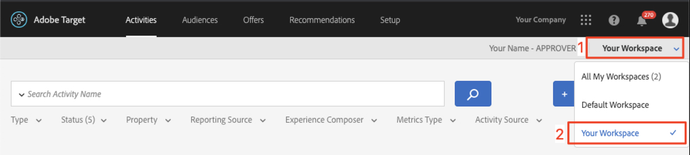

## オーディエンスを作成

次に、アプリのパーソナライズに使用するオーディエンスを作成します。

### 新規ユーザーのオーディエンスの作成

Adobe Target Audiencesは、特定の訪問者グループを特定するために使用します。 オファーは、それらの特定のグループをターゲットにすることができます。 最初の2つの場所では、「新規ユーザー」オーディエンスを使用します。

1. 上部のナビゲーションで「**[!UICONTROL Audiences]**」をクリックします。
1. 「**[!UICONTROL Create Audience]**」ボタンをクリックします。
   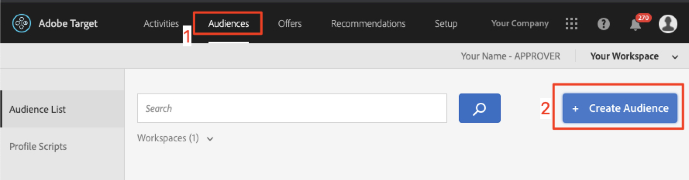

1. オーディエンス名として&#x200B;**[!UICONTROL New Mobile App Users]**&#x200B;を入力します。
1. **[!UICONTROL Add Rule]**&#x200B;を選択します。
1. **[!UICONTROL Custom]** ルールを選択します。
   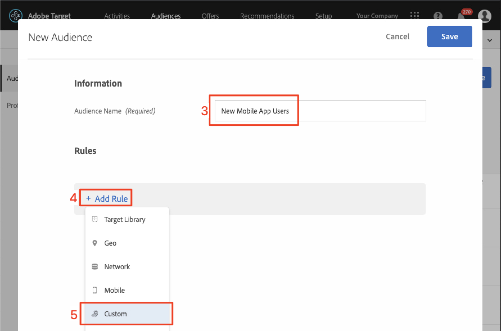

1. **[!UICONTROL a.Launches]**&#x200B;を選択します。
1. **[!UICONTROL is less than]**&#x200B;を選択します。
1. **5**&#x200B;と入力します。
1. 新しいオーディエンスを保存します。
   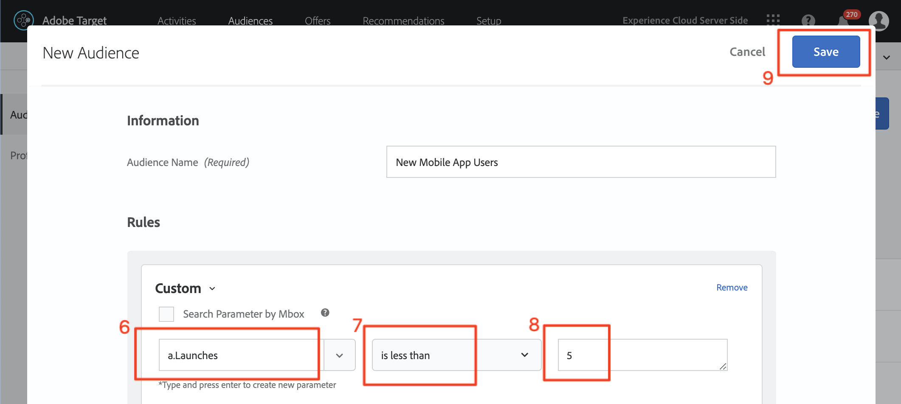

### リピートユーザー向けのオーディエンスの作成

上記と同じ手順に従って、リピートユーザー用のオーディエンスを作成します。

1. オーディエンスに&#x200B;_モバイルアプリユーザーを返す_&#x200B;という名前を付けます。
1. **[!UICONTROL a.Launches is greater than or equal to 5]**&#x200B;をカスタムルールとして使用します。
1. 新しいオーディエンスを保存します。

   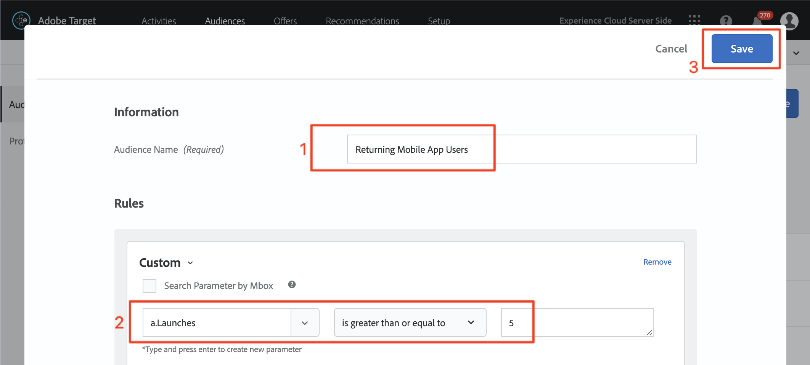

>[!NOTE]
>
>[!DNL Target] モバイル SDKで収集されたすべてのライフサイクル指標とディメンションには「a」（例：a.Launches）が先頭に付けられ、ドロップダウンメニューの「カスタム」オプションで使用でき、オーディエンスの構築に使用できます。

### サンディエゴへの旅行を予約するユーザー向けのオーディエンスの作成

次に、We.Travel アプリが提供する宛先の一部に対して、いくつかのオーディエンスを作成します。 最後のレッスンでは、wetravel_context_dest location リクエストのlocation パラメーターとしてdestinationを渡しました。 このパラメーターは、ドロップダウンメニューの「カスタム」オプションで使用できます。

>[!NOTE]
>
>カスタムドロップダウンに表示されるパラメーターが[!DNL Target] インターフェイスに表示されない場合は、実際にリクエストで渡されていることを再確認します。 がリクエスト内にあることが確認されていて、[!DNL Target] インターフェイスに遅延読み込みが行われていない場合は、パラメーター名を入力してEnter キーを押すだけで、オーディエンスの定義を続行できます

1. オーディエンスに&#x200B;_宛先：サンディエゴ_&#x200B;という名前を付けます。
1. 次の定義でカスタムルールを使用します：_locationDestにサンディエゴが含まれています_。
1. 新しいオーディエンスを保存します。

   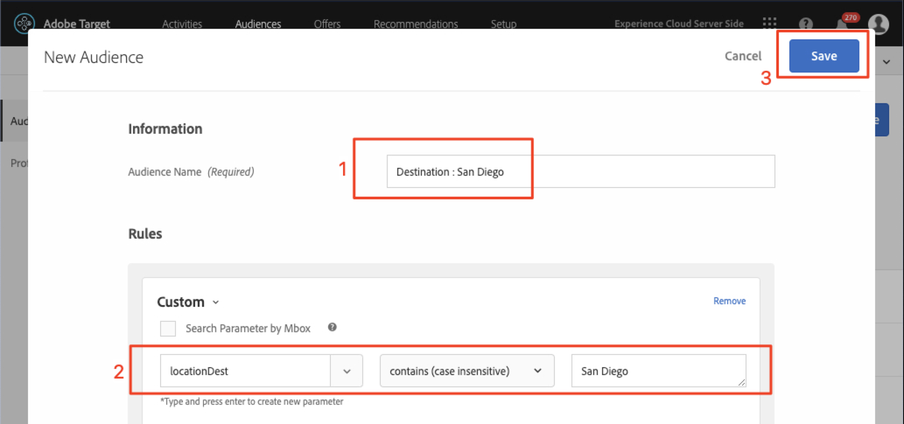

### ロサンゼルスへの旅行を予約するユーザー向けのオーディエンスを作成する

1. オーディエンスに名前を付けます：_宛先：ロサンゼルス_
1. 次の定義でカスタムルールを使用します。_locationDest contains Los Angeles_
1. 新しいオーディエンスを保存します。

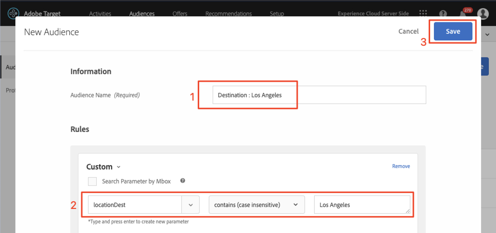

## オファーの作成

次に、これらのメッセージを表示するオファーを作成します。 リマインダーとして、オファーはコード/コンテンツのスニペットであり、[!DNL Target]応答で配信されます。 これらは[!DNL Target] ユーザーインターフェイスで作成されることが多いものですが、API経由で作成することも、Adobe Experience Managerとエクスペリエンスフラグメント統合を使用して作成することもできます。 モバイルアプリでは、JSON オファーが一般的です。 このチュートリアルでは、HTML オファーを使用します。このオファーは、任意のプレーンテキストコンテンツ（JSONを含む）をアプリに配信するために使用できます。

### 新規ユーザー向けオファーの作成

まず、新規ユーザーへのメッセージのオファーを作成します。

1. 上部のナビゲーションで「**[!UICONTROL Offers]**」をクリックします。
1. **[!UICONTROL Create]** をクリックします。
1. **[!UICONTROL HTML Offer]**&#x200B;を選択します。

   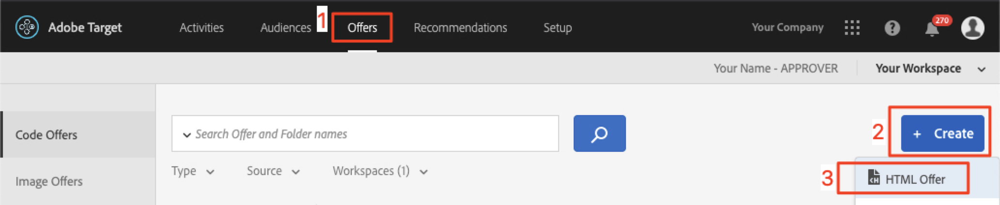

1. オファーに&#x200B;_Home: Engage New Users_&#x200B;という名前を付けます。
1. 「_Sourceと宛先を選択」と入力して、使用可能なバス_&#x200B;をコードとして検索します。
1. 新しいオファーを保存します。

   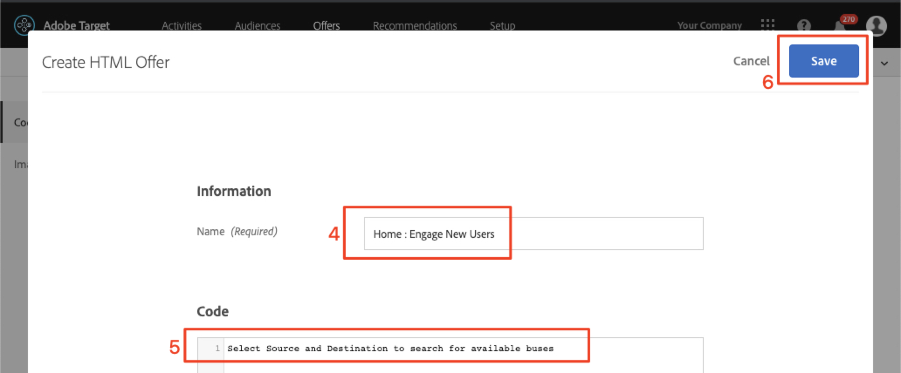

### リピートユーザー向けのオファーの作成

次に、リピートユーザー向けの1つのオファーを作成します（2番目のオファーはデフォルトのコンテンツで、何も表示されません）。

1. オファーに&#x200B;_Home: リピート ユーザー_&#x200B;という名前を付けます。
1. _おかえりなさい！ チェックアウト時にプロモーションコード BACK30を使用すると、10%の割引が受けられます。_ HTMLコードなどです。
1. 新しいオファーを保存します。

   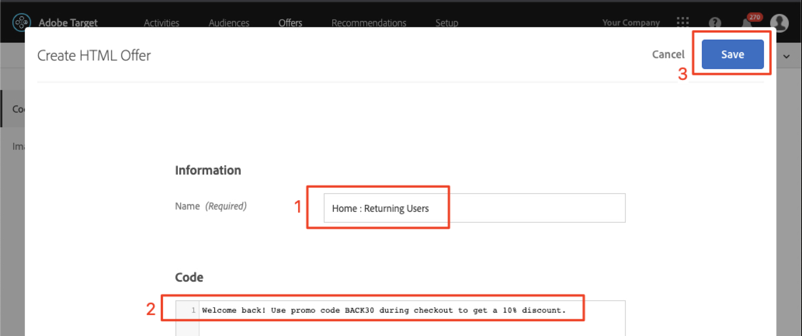

### サンディエゴ・オファーの作成

「DJ」がThankYou アクティビティに戻ると、filterRecommendationBasedOnOffer （）関数のロジックに「Rock Night with DJ SAM」のバナーが表示されます。

1. オファーに「_サンディエゴのプロモーション_」という名前を付けます。
1. HTML コードとして&#x200B;_DJ_&#x200B;を入力します。
1. 新しいオファーを保存します。

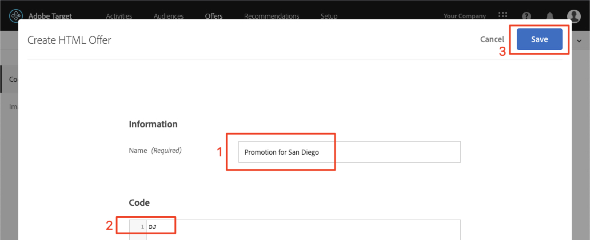

### ロサンゼルスに行くユーザー向けのオファーを作成

ThankYou アクティビティに「Universal」が返されると、filterRecommendationBasedOnOffer （）関数のロジックに「Universal Studios」のバナーが表示されます。

1. オファーに「_ロサンゼルスのプロモーション_」という名前を付けます。
1. HTML コードとして&#x200B;_Universal_&#x200B;を入力します。
1. 新しいオファーを保存します。

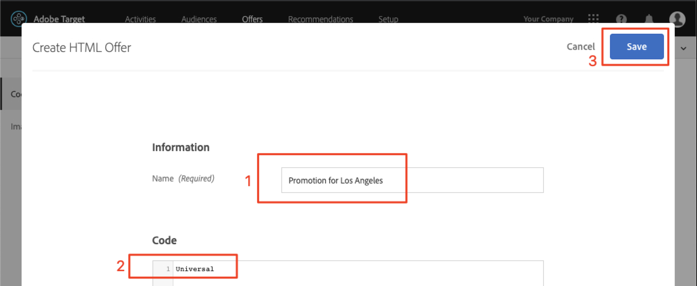

## まとめ

これでオーディエンスとオファーができました。 次のレッスンでは、場所、オーディエンス、オファーを結びつけるアクティビティを構築して、パーソナライズされたエクスペリエンスを作成します。

**[次：「レイアウトをパーソナライズ」 >](personalize-layouts.md)**
