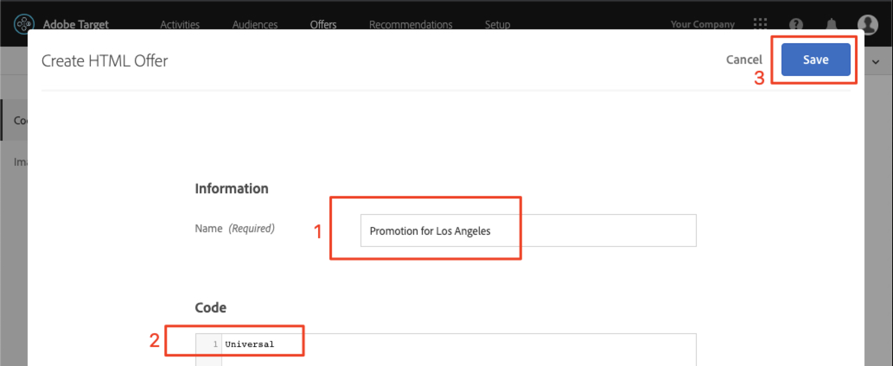

# Adobe Targetでのオーディエンスとオファーの作成

このレッスンでは、 [!DNL Target] インターフェイスを開き、前のレッスンで実装した 3 つの場所用のオーディエンスとオファーを構築します。

## 学習内容

このレッスンを最後まで学習すると、次の内容を習得できます。

* Adobe Target でのオーディエンスの作成
* Adobe Targetでのオファーの作成

具体的には、このレッスンでは、チュートリアルの最初に定義したパーソナライゼーションの使用例を達成するために必要なオーディエンスとオファーを作成します。 アプリユーザーが旅行を予約する際に、「ホーム」画面と「検索」画面を使用し、「ありがとうございます」画面を使用して、ユーザーの目的地に基づいて、関連するプロモーションを表示します。 次の表は、このレッスンで各場所について作成する内容を示しています。

| 場所 | オーディエンス | オファー |
| --- | --- | --- |
| wetravel_engage_home | 新しいモバイルアプリユーザー | &quot;利用可能なバスルートを検索するには、オリジンと宛先を選択してください&quot; |
| wetravel_engage_search | 新しいモバイルアプリユーザー | 「フィルターを使用して検索結果を絞り込む」 |
| wetravel_engage_home | モバイルアプリユーザーの再訪問 | 「おかえり！ チェックアウト時にプロモーションコード BACK30 を使用して、10%の割引を受ける。 |
| wetravel_engage_search | モバイルアプリユーザーの再訪問 | デフォルトコンテンツ |
| wetravel_context_dest | 宛先：サンディエゴ | &quot;DJ&quot; |
| wetravel_context_dest | 宛先：ロサンゼルス | &quot;Universal&quot; |

## ワークスペースの選択

プロパティとワークスペースを使用して、アプリや Web サイトをパーソナライズする際の境界を設定し、前のレッスンで at_property パラメーターを実装した場合は、まず正しい Workspace を使用していることを確認してから、このレッスンを進めてください。 プロパティとワークスペースを使用しない場合は、この手順を無視してください。 前のレッスンで使用したワークスペースを選択して、 at_property 値をコピーします。

## オーディエンスの作成

次に、アプリをパーソナライズするために使用するオーディエンスを作成します。

### 新規ユーザー向けオーディエンスの作成

Adobe Target Audiences は、特定の訪問者グループを識別するために使用します。 その後、オファーをそれらの特定のグループをターゲットに設定できます。 最初の 2 つの場所で、「新規ユーザー」オーディエンスを使用します。

1. 上部のナビゲーションで **[!UICONTROL オーディエンス]** をクリックします。
1. 「**[!UICONTROL オーディエンスを作成]**」ボタンをクリックします。
   

1. オーディエンス名として「**[!UICONTROL 新しいモバイルアプリユーザー]**」と入力します。
1. 「**[!UICONTROL ルールを追加]**」を選択します。
1. **[!UICONTROL カスタム]** ルールを選択します。
   

1. **[!UICONTROL a.Launches]** を選択します。
1. **[!UICONTROL が]** より小さいを選択します。
1. **5** と入力します。
1. 新しいオーディエンスを保存します。
   

### 再訪問者向けオーディエンスの作成

上記と同じ手順に従って、再訪問者用のオーディエンスを作成します。

1. オーディエンスに「_モバイルアプリユーザーを返す_」という名前を付けます。
1. **[!UICONTROL a.Launches が 5]** 以上をカスタムルールとして使用します。
1. 新しいオーディエンスを保存します。

   

>[!NOTE]
>
>[!DNL Target] モバイル SDK で収集されたすべてのライフサイクル指標およびディメンションの前には「a」（例：a.Launches）が付き、ドロップダウンメニューの「カスタム」オプションで使用でき、オーディエンスの作成に使用できます。

### ユーザーのオーディエンスを作成してサンディエゴ旅行を予約

次に、We.Travel アプリで提供される一部の宛先のオーディエンスをいくつか作成します。 最後のレッスンでは、 wetravel_context_dest ロケーションリクエストのロケーションパラメーターとして宛先を渡しました。 そのパラメーターは、ドロップダウンメニューの「カスタム」オプションで使用できます。

>[!NOTE]
>
>「カスタム」ドロップダウンに表示される必要があるパラメーターが [!DNL Target] インターフェイスに表示されない場合は、実際にリクエストで渡されていることを再確認します。 がリクエストに含まれているが、[!DNL Target] インターフェイスに遅延読み込みがおこなわれていない場合は、パラメーター名を入力し、Enter キーを押して、オーディエンスの定義を続行できます

1. オーディエンスに _宛先の名前を付けます。サンディエゴ_。
1. 次の定義でカスタムルールを使用します。_locationDest には San Diego_ が含まれています。
1. 新しいオーディエンスを保存します。

   

### ユーザーのオーディエンスを作成してロサンゼルス旅行を予約

1. オーディエンスに _宛先の名前を付けます。ロサンゼルス_
1. 次の定義でカスタムルールを使用します。_locationDest にはロサンゼルスが含まれています_
1. 新しいオーディエンスを保存します。

## オファーの作成

次に、これらのメッセージを表示するオファーを作成します。 オファーは、[!DNL Target] 応答で配信されるコード/コンテンツのスニペットです。 ほとんどの場合、[!DNL Target] ユーザーインターフェイスで作成されますが、API を使用するか、Adobe Experience Managerとのエクスペリエンスフラグメント統合を使用して作成することもできます。 モバイルアプリでは、JSON オファーが一般的です。 このチュートリアルでは、HTMLオファーを使用します。これは、任意の平文コンテンツ（JSON を含む）をアプリに配信するのに使用できます。

### 新規ユーザー向けオファーの作成

まず、新規ユーザーへのメッセージのオファーを作成します。

1. 上部のナビゲーションで **[!UICONTROL オファー]** をクリックします。
1. 「 **[!UICONTROL 作成]**」をクリックします。
1. 「**[!UICONTROL HTMLオファー]**」を選択します。

   

1. オファーに「_Home:新しいユーザーのエンゲージメント_。
1. _Select Source and Destination と入力して、使用可能なバス_ をコードとして検索します。
1. 新しいオファーを保存します。

   

### 再訪問者向けオファーの作成

次に、再訪問者向けの 1 つのオファーを作成します（2 つ目のオファーはデフォルトコンテンツで、何も表示されません）。

1. オファーに「_Home:ユーザーを返す_。
1. _お帰り！ チェックアウト時にプロモーションコード BACK30 を使用すると、10%の割引を受けることができます。_ をHTMLコードとして。
1. 新しいオファーを保存します。

   

### サンディエゴオファーの作成

「DJ」が「ThankYou」アクティビティに戻ると、 filterRecommendationBasedOnOffer() 関数のロジックに「Rock Night with DJ SAM」のバナーが表示されます。

1. オファーに「_San Diego のプロモーション_」という名前を付けます。
1. HTMLコードとして _DJ_ を入力します。
1. 新しいオファーを保存します。

### ロサンゼルスに移動するユーザー向けオファーの作成

「ユニバーサル」が「ThankYou」アクティビティに戻されると、 filterRecommendationBasedOnOffer() 関数のロジックに「ユニバーサルスタジオ」のバナーが表示されます。

1. オファーに「_ロサンゼルスのプロモーション_」という名前を付けます。
1. HTMLコードとして _ユニバーサル_ を入力します。
1. 新しいオファーを保存します。

## まとめ

これで、オーディエンスとオファーが表示されます。 次のレッスンでは、場所、オーディエンスおよびオファーを結び付けて、パーソナライズされたエクスペリエンスを作成するアクティビティを作成します。

**[次へ：「レイアウトのパーソナライズ」>](personalize-layouts.md)**
