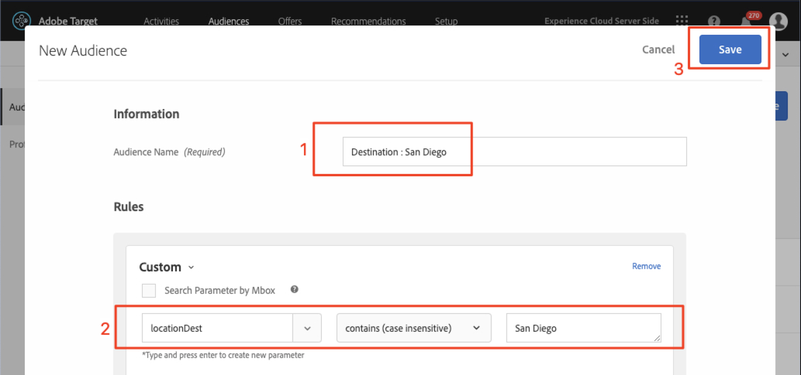

# Adobe Targetでオーディエンスとオファーを作成する

このレッスンでは、[!DNL Target]インターフェースを使って、前のレッスンで実装した3つの場所のオーディエンスとオファーを構築します。

## 学習目標

このレッスンを終了すると、次のことができます。

* Adobe Target でのオーディエンスの作成
* Adobe Targetでオファーを作成

具体的には、このレッスンでは、チュートリアルの最初に定義した個人用の使用例を達成するために必要なオーディエンスとオファーを作成します。 アプリのユーザーが旅行を予約するのにホーム画面と検索画面を使用したいと考えています。「ありがとうございます」画面を使用して、ユーザーの目的地に基づいて関連するプロモーションを表示したいと考えています。 次の表に、各場所に関するこのレッスンで作成する内容を示します。

| 場所 | オーディエンス | オファー |
| --- | --- | --- |
| wetravel_engage_home | 新しいモバイルアプリユーザー | &quot;利用可能なバスルートを検索する接触チャネルと宛先を選択してください&quot; |
| wetravel_engage_search | 新しいモバイルアプリユーザー | 「フィルターを使用して検索結果を絞り込む」 |
| wetravel_engage_home | モバイルアプリのユーザーを返す | 「おかえり！ 10%割引を受けるには、チェックアウト時にプロモーションコードBACK30を使用します。」 |
| wetravel_engage_search | モバイルアプリのユーザーを返す | デフォルトコンテンツ |
| wetravel_context_dest | 宛先：サンディエゴ | &quot;DJ&quot; |
| wetravel_context_dest | 宛先：ロサンゼルス | &quot;ユニバーサル&quot; |

## ワークスペースの選択

会社で、プロパティとワークスペースを使用してアプリとWebサイトの個人化の境界を確立し、前のレッスンでat_propertyパラメーターを実装した場合は、このレッスンに進む前に、まず適切なWorkspaceにいることを確認する必要があります。 プロパティとワークスペースを使用しない場合は、この手順を無視してください。 前のレッスンで使用したワークスペースを選択し、at_property値をコピーします。

## オーディエンスの作成

次に、アプリをパーソナライズするために使用するオーディエンスを作成します。

### 新規オーディエンスの作成

Adobe Targetオーディエンスは、訪問者の特定のグループを識別するために使用されます。 その後、オファーを特定のグループにターゲット設定できます。 最初の2つの場所では、「新規ユーザー」オーディエンスを使用します。

1. 上部のナビゲーションで&#x200B;**[!UICONTROL オーディエンス]**&#x200B;をクリックします。
1. 「**[!UICONTROL オーディエンスを作成]**」ボタンをクリックします。
   

1. オーディエンス名として「**[!UICONTROL 新しいモバイルアプリユーザー]**」と入力します。
1. 「**[!UICONTROL ルール追加]**」を選択します。
1. **[!UICONTROL カスタム]**ルールを選択します。
   

1. **[!UICONTROL a.Launches]**&#x200B;を選択します。
1. **[!UICONTROL が]**&#x200B;より小さいを選択します。
1. **5**&#x200B;と入力します。
1. 新しいオーディエンスを保存します。
   

### 再訪問者用のオーディエンスの作成

再訪問者用のオーディエンスを作成するには、上記と同じ手順に従います。

1. オーディエンスに「_モバイルアプリユーザーを返信_」という名前を付けます。
1. カスタムルールとして&#x200B;**[!UICONTROL a.Launches is greater than or equal to 5]**&#x200B;を使用します。
1. 新しいオーディエンスを保存します。

   

>[!NOTE]
>
>[!DNL Target]モバイルSDKで収集されるすべてのライフサイクル指標とディメンションは、先頭に「a」が付きます（例：a.Launches）。ドロップダウンメニューの「カスタム」オプションで使用でき、オーディエンスの作成に使用できます。

### サンディエゴへの旅行の予約をユーザーに提供するオーディエンスの作成

次に、We.Travelアプリが提供するいくつかの宛先用のオーディエンスを作成します。 最後のレッスンでは、wetravel_context_destロケーションリクエストのロケーションパラメーターとして宛先を渡しました。 そのパラメーターは、ドロップダウンメニューの「カスタム」オプションで使用できます。

>[!NOTE]
>
>「カスタム」ドロップダウンに表示される予定のパラメーターが[!DNL Target]インターフェイスに表示されない場合は、重複チェックを行い、リクエストで実際に渡されていることを確認します。 リクエスト内にあるが、[!DNL Target]インターフェイスに遅延読み込みが行われていないことを確認した場合は、パラメーター名を入力し、enterキーを押してオーディエンスの定義を続行できます

1. オーディエンスに&#x200B;_宛先の名前を付けます。サンディエゴ_。
1. 次の定義でカスタムルールを使用：_locationDestには、サンディエゴ_&#x200B;が含まれています。
1. 新しいオーディエンスを保存します。

   

### ユーザー向けのオーディエンスの作成ロサンゼルスへの旅行の予約

1. オーディエンスに&#x200B;_宛先の名前を付けます。ロサンゼルス_
1. 次の定義でカスタムルールを使用：_locationDestにロサンゼルスを含む_
1. 新しいオーディエンスを保存します。

## オファーの作成

次に、これらのメッセージを表示するオファーを作成します。 注意喚起として、オファーはコード/コンテンツのスニペットで、[!DNL Target]の応答で配信されます。 最も多くの場合、[!DNL Target]ユーザーインターフェイスで作成されますが、API経由で作成したり、Adobe Experience Managerとのエクスペリエンスフラグメント統合を使用して作成することもできます。 モバイルアプリでは、JSONオファーが一般的です。 このチュートリアルでは、HTMLオファーを使用します。HTMLメソッドは、任意の平文コンテンツ（JSONを含む）をアプリに配信するのに使用できます。

### 新規ユーザー用のオファーの作成

まず、新しいユーザーに対するメッセージのオファーを作成します。

1. 上部のナビゲーションで&#x200B;**[!UICONTROL オファー]**&#x200B;をクリックします。
1. 「 **[!UICONTROL 作成]**」をクリックします。
1. 「**[!UICONTROL HTMLオファー]**」を選択します。

   

1. オファーに&#x200B;_ホーム：新規ユーザーの関与_
1. _Select Source and Destination to search for available buses_&#x200B;をコードとして入力します。
1. 新しいオファーを保存します。

   

### 再訪問者用のオファーの作成

次に、再訪問者用の1つのオファーを作成します(2つ目のオファーはデフォルトコンテンツで、何も表示されません)。

1. オファーに&#x200B;_ホーム：リピーター_。
1. _おかえり！ 10%割引を受けるには、チェックアウト時にプロモーションコードBACK30を使用します。_ をHTMLコードとして使用する場合。
1. 新しいオファーを保存します。

   

### サンディエゴオファーの作成

「DJ」がThankYouアクティビティーに返されると、filterRecommendationBasedOnOffer()関数のロジックによって「Rock Night with DJ SAM」のバナーが表示されます。

1. オファーに&#x200B;_サンディエゴのプロモーション_&#x200B;という名前を付けます。
1. HTMLコードとして&#x200B;_DJ_&#x200B;と入力します。
1. 新しいオファーを保存します。

### ロサンゼルスに行くユーザーのオファーの作成

「ユニバーサル」が「ありがとうございます」アクティビティに返されると、filterRecommendationBasedOnOffer()関数のロジックによって「ユニバーサルスタジオ」のバナーが表示されます。

1. オファーに「_ロサンゼルスのプロモーション_」という名前を付けます。
1. HTMLコードとして&#x200B;_ユニバーサル_&#x200B;を入力します。
1. 新しいオファーを保存します。

## まとめ

オーディエンスとオファーがあります 次のレッスンでは、場所、オーディエンスおよびオファーを結び付けてパーソナライズされたエクスペリエンスを作成するアクティビティを作成します。

**[次へ：「レイアウトのパーソナライズ」>](personalize-layouts.md)**
