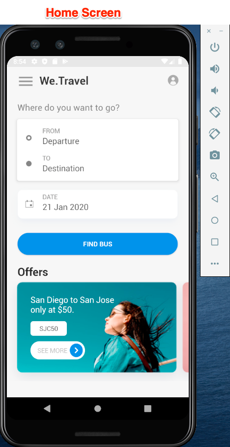
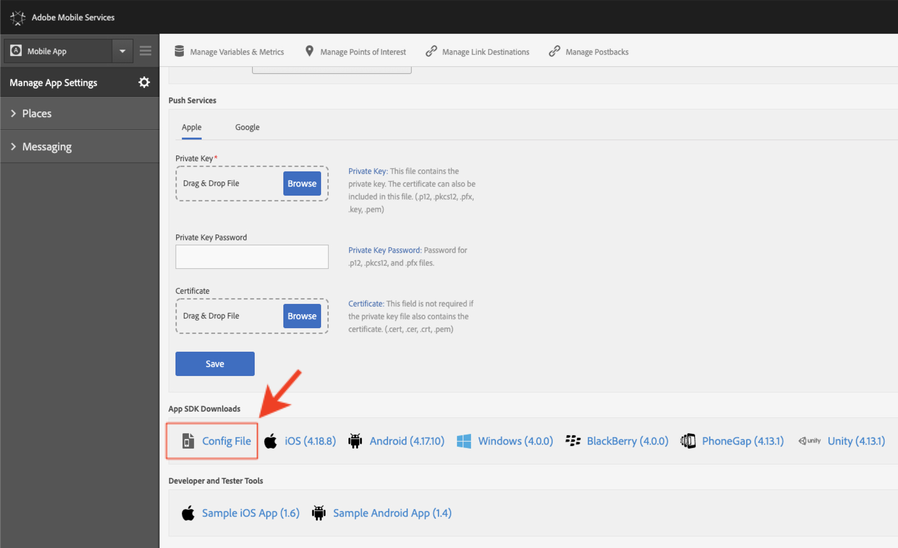
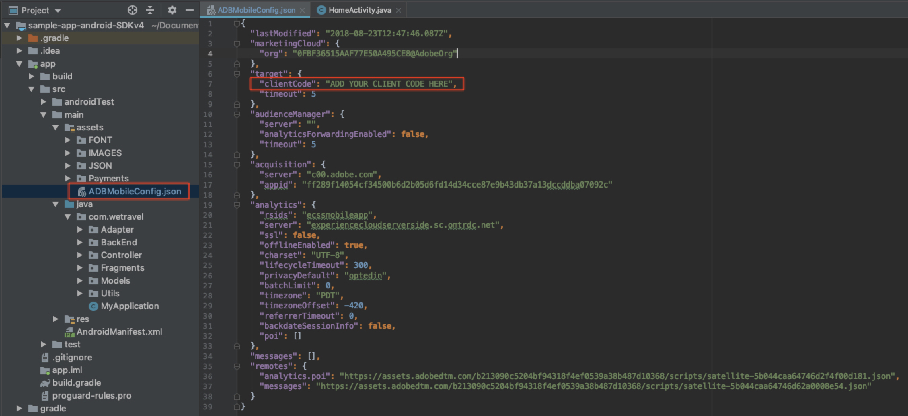

# We.Travel サンプルアプリのダウンロードと更新

We.Travel サンプルアプリは、Adobe Mobile Services SDK v4で事前に実装されています。 それを更新して、独自のExperience Cloud組織とソリューションアカウントを指すようにする必要があります。

## 学習目標

このレッスンの最後には、次のことが可能になります。

* Android StudioでWe.Travel サンプルアプリをダウンロードして開きます
* [!DNL Target]のMobile Services SDK設定の確認と更新

## We.Travel アプリのダウンロード

* [sample-app-android-SDKv4-Base-Version.zip](assets/sample-app-android-SDKv4-Base-Version.zip)をダウンロード
* zip ファイルを解凍する
* Android Studioで既存のプロジェクトとしてアプリを開きます（「無効なVCS ルートマッピング」に関するエラーは無視してください）
* エミュレーターでアプリを実行して、アプリがビルドされ、ホーム画面が表示されることを確認します
* アプリを参照し、予約プロセスを完了できることを確認します（任意の支払いオプションを選択し、「続行」をクリックして請求画面をスキップします）。

  

## [!DNL Target]のMobile Services SDK設定の確認と更新

Adobe Mobile Services SDKは、ドキュメント [&#128279;](https://experienceleague.adobe.com/docs/mobile-services/android/getting-started-android/requirements.html?lang=en)に従って、We.Travel アプリ 内にプリインストールされています。 次に、インストールを更新して、自分の[!DNL Target] アカウントを指定します。

まず、Mobile Services ユーザーインターフェイスで新しいアプリを作成します。

1. [Adobe Mobile Services インターフェイス &#x200B;](https://mobilemarketing.adobe.com/)にログインします。
1. [!UICONTROL Manage Apps]に移動し、**[!UICONTROL Add]**&#x200B;をクリックして、このチュートリアルで使用する新しいアプリを追加します（**[!UICONTROL Manage Apps]** > **[!UICONTROL Add]**）。
1. 実稼動以外のデータを含むAnalytics レポートスイートを選択し、アプリに名前を付け、**[!UICONTROL Standard]** タイプを選択して&#x200B;**[!UICONTROL Save]**&#x200B;をクリックします。
1. アプリが追加されたら、[!UICONTROL SDK Target Options] セクションの次の画面に[!DNL Target] クライアントコードを追加します（[!DNL Target] インターフェイスの&#x200B;**[!UICONTROL Setup]** > **[!UICONTROL Implementation]** > **[!UICONTROL Edit Settings]**、ダウンロード `at.js` ボタンの横にあります）。
1. [!UICONTROL Request Timeout]設定は、タイムアウト命令を実行する前に[!DNL Target] サーバーからの応答をアプリが待機する時間を決定します。 デフォルト設定のままにしておきます。
1. [!UICONTROL Visitor ID Service]を有効にし、ドロップダウンで[!UICONTROL Organization]が選択されていることを確認します。
1. ウィンドウの右上にある&#x200B;**[!UICONTROL Save]**&#x200B;をクリックして変更を保存します（[!UICONTROL Universal Links]、[!UICONTROL App Links] オプション、または[!UICONTROL Push Services] セクション内のものではありません）。
1. ページの下部にあるApp SDK Downloads セクションまでスクロールし、Config ファイルをダウンロードします。

   

1. Android Studio プロジェクトアセットフォルダーの`ADBMobileConfig.json` ファイルを置き換えます（アプリ/src/メイン/アセット）。

1. 次に、`ADBMobileConfig.json` ファイルを開き、[!DNL Target] クライアントコードやAnalyticsの詳細など、予想される変更が含まれていることを確認します。
   

設定が表示されない場合は、[!UICONTROL Mobile Services] インターフェイスの右側の&#x200B;**[!UICONTROL Save]** ボタンをクリックし、ファイルを正しい場所にコピーしたことを確認します。

おめでとうございます。 [!DNL Target] アカウントの詳細が記載されたSDKが更新されました。 次のレッスンで[!DNL Target]件のリクエストを追加した後、設定の追加の検証を行います。

**[次：「ターゲットリクエストを追加」 >](add-requests.md)**
