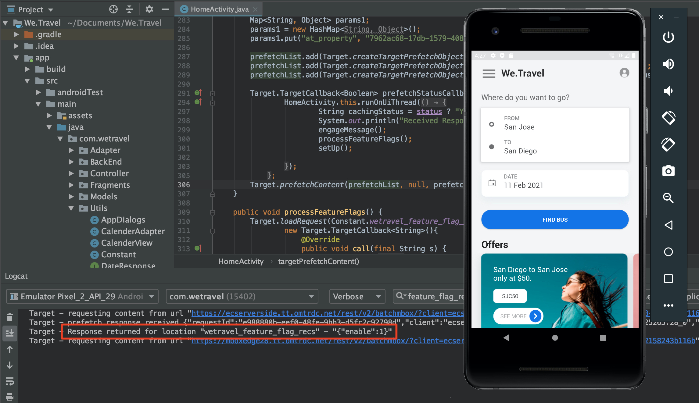

# 機能フラグ

モバイルアプリ製品の所有者は、複数のアプリリリースに投資する必要なく、アプリの新機能を柔軟に展開できる必要があります。 また、効果をテストするために、機能をユーザーベースの割合に合わせて徐々に展開する必要が生じる場合もあります。 Adobe Targetを使用して、色、コピー、ボタン、テキストおよび画像などの UX 機能を試し、それらの機能を特定のオーディエンスに提供できます。

このレッスンでは、特定のアプリ機能を有効にするトリガーとして使用できる「機能フラグ」オファーを作成します。

## 学習内容

このレッスンを最後まで学習すると、次の内容を習得できます。

* バッチプリフェッチ要求に新しい場所を追加します
* 機能フラグとして使用するオファーを含む [!DNL Target] アクティビティを作成します
* アプリで機能フラグオファーを読み込んで検証する

## プリフェッチ要求に新しい場所をホームアクティビティに追加する

前のレッスンのデモアプリで、「wetravel_feature_flag_recs」という新しい場所をホームアクティビティのプリフェッチ要求に追加し、新しい Java メソッドで画面に読み込みます。

>[!NOTE]
>
>プリフェッチ要求を使用する利点の 1 つは、新しい要求を追加しても、追加のネットワークオーバーヘッドが発生したり、追加の負荷が発生したりしない点です。プリフェッチ要求はプリフェッチ要求内にパッケージ化されるためです

まず、 wetravel_feature_flag_recs 定数が Constant.java ファイルに追加されていることを確認します。


次にコードを示します。

```java
public static final String wetravel_feature_flag_recs = "wetravel_feature_flag_recs";
```

次に、その場所をプリフェッチ要求に追加し、`processFeatureFlags()` という新しい関数を読み込みます。


完全に更新されたコードは次のとおりです。

```java
public void targetPrefetchContent() {
    List<TargetPrefetchObject> prefetchList = new ArrayList<>();

    Map<String, Object> params1;
    params1 = new HashMap<String, Object>();
    params1.put("at_property", "7962ac68-17db-1579-408f-9556feccb477");

    prefetchList.add(Target.createTargetPrefetchObject(Constant.wetravel_engage_home, params1));
    prefetchList.add(Target.createTargetPrefetchObject(Constant.wetravel_engage_search, params1));
    prefetchList.add(Target.createTargetPrefetchObject(Constant.wetravel_feature_flag_recs, params1));

    Target.TargetCallback<Boolean> prefetchStatusCallback = new Target.TargetCallback<Boolean>() {
        @Override
        public void call(final Boolean status) {
            HomeActivity.this.runOnUiThread(new Runnable() {
                @Override
                public void run() {
                    String cachingStatus = status ? "YES" : "NO";
                    System.out.println("Received Response from prefetch : " + cachingStatus);
                    engageMessage();
                    processFeatureFlags();
                    setUp();

                }
            });
        }};
    Target.prefetchContent(prefetchList, null, prefetchStatusCallback);
}

public void processFeatureFlags() {
    Target.loadRequest(Constant.wetravel_feature_flag_recs, "", null, null, null,
            new Target.TargetCallback<String>(){
                @Override
                public void call(final String s) {
                    runOnUiThread(new Runnable() {
                        @Override
                        public void run() {
                            System.out.println("Feature Flags : " + s);
                            if(s != null && !s.isEmpty()) {
                                //enable or disable features
                            }
                        }
                    });
                }
            });
}
```

### 機能フラグリクエストの検証

コードを追加したら、ホームアクティビティでエミュレーターを実行し、更新された応答を Logcat が監視します。


## 機能フラグ JSON オファーの作成

次に、特定のオーディエンス（アプリで機能のロールアウトを受け取るオーディエンス）のフラグまたはトリガーとして機能する単純な JSON オファーを作成します。 [!DNL Target] インターフェイスで、新しいオファーを作成します。


値 {&quot;enable&quot;:1} を使用して「Feature Flag v1」と名付けます。


## アクティビティの作成

次に、そのオファーを含む A/B テストアクティビティを作成します。 アクティビティの作成手順について詳しくは、前のレッスンを参照してください。 この例では、アクティビティに必要なオーディエンスは 1 つだけです。 ライブシナリオでは、特定の機能のロールアウト用に特定のカスタムオーディエンスを作成し、そのオーディエンスを使用するようにアクティビティを設定します。 この例では、トラフィック50/50（機能の更新を表示する訪問者に 50%、標準のエクスペリエンスを表示する訪問者に 50%）を割り当てます。 次に、アクティビティの設定を示します。

1. アクティビティに「機能フラグ」と名前を付けます。
1. 「wetravel_feature_flag_recs」の場所を選択します。
1. コンテンツを「機能フラグ v1」JSON オファーに変更します。

   

1. 「**[!UICONTROL エクスペリエンスを追加]**」をクリックして、エクスペリエンス B を追加します。
1. 「wetravel_feature_flag_recs」の場所をそのままにします。
1. コンテンツは **[!UICONTROL デフォルトコンテンツ]** のままにします。
1. 「**[!UICONTROL 次へ]**」をクリックして、[!UICONTROL  ターゲティング ] 画面に進みます。

   

1. [!UICONTROL  ターゲティング ] 画面で、[!UICONTROL  トラフィック配分 ] メソッドがデフォルト設定（手動）に設定され、各エクスペリエンスのデフォルトの配分が 50%であることを確認します。 **[!UICONTROL 次へ]** を選択して **[!UICONTROL 目標と設定]** に進みます。

   

1. **[!UICONTROL プライマリの目標]** を **[!UICONTROL コンバージョン]** に設定します。
1. アクションを「**[!UICONTROL Mbox が表示された]**」に設定します。 「wetravel_context_dest」の場所を使用します（この場所は確認画面にあるので、この場所を使用して、新しい機能がより多くのコンバージョンにつながるかどうかを確認できます）。
1. 「**[!UICONTROL 保存して閉じる]**」をクリックします。

   

アクティビティをアクティブ化します。

## 機能フラグアクティビティの検証

次に、エミュレーターを使用して要求を監視します。 ターゲットをユーザーの 50%に設定したので、50%に設定すると、機能フラグの応答に `{enable:1}` 値が含まれています。



`{enable:1}` の値が表示されない場合は、エクスペリエンスのターゲット設定がされていなかったことを意味します。 一時的なテストとして、オファーを強制的に表示するには、次の操作をおこないます。

1. アクティビティを非アクティブ化します。
1. 新機能のエクスペリエンスで、トラフィックの配分を 100%に変更します。
1. 保存して再開します。
1. エミュレーターでデータを消去し、アプリを再起動します。
1. これで、オファーは `{enable:1}` 値を返すようになります。

ライブシナリオでは、`{enable:1}` 応答を使用して、アプリでより多くのカスタムロジックを有効にし、ターゲットオーディエンスを表示する特定の機能セットを表示できます。

## まとめ

お疲れさま！ これで、特定のユーザーオーディエンスに機能を展開するのに必要なスキルが得られました。
