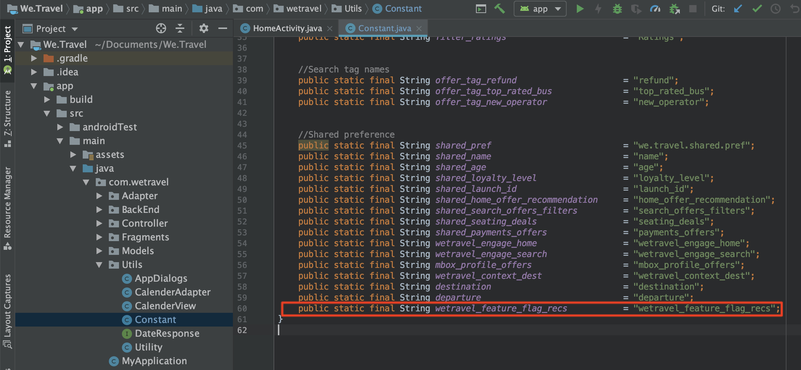
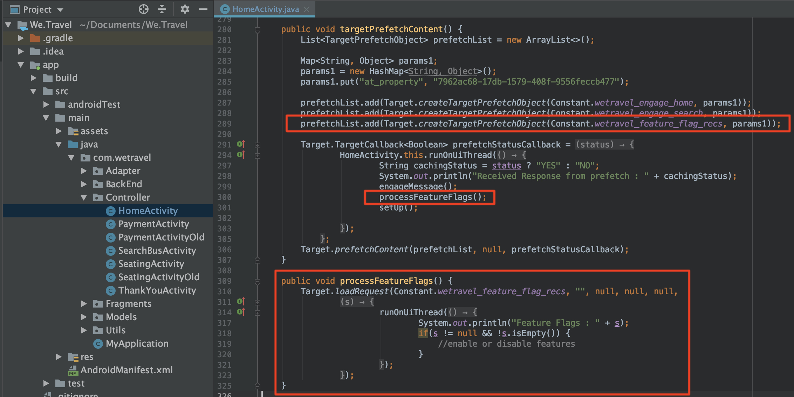
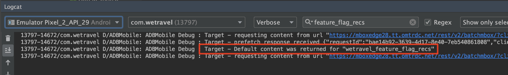
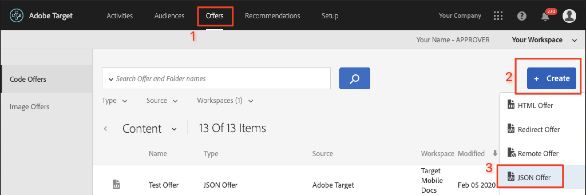
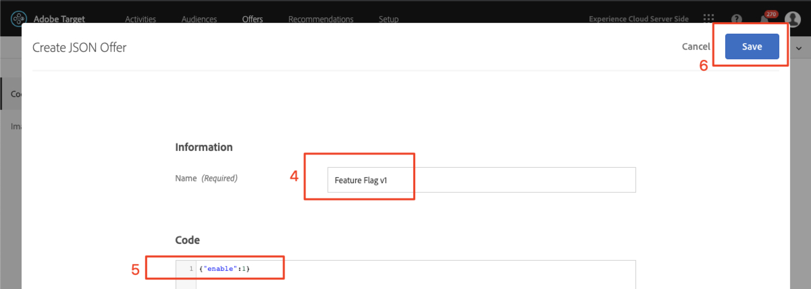
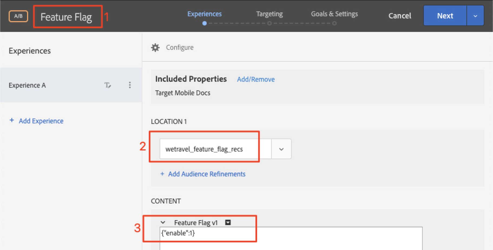
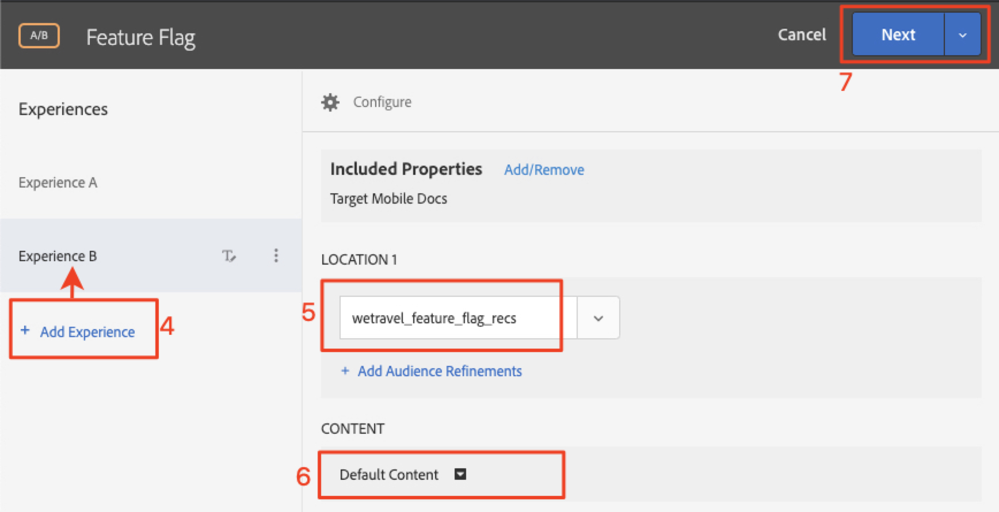
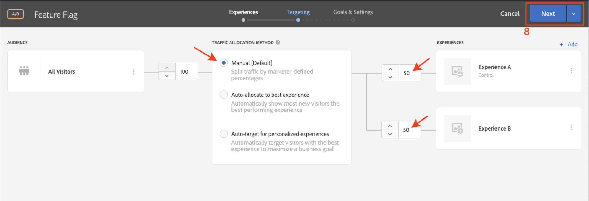
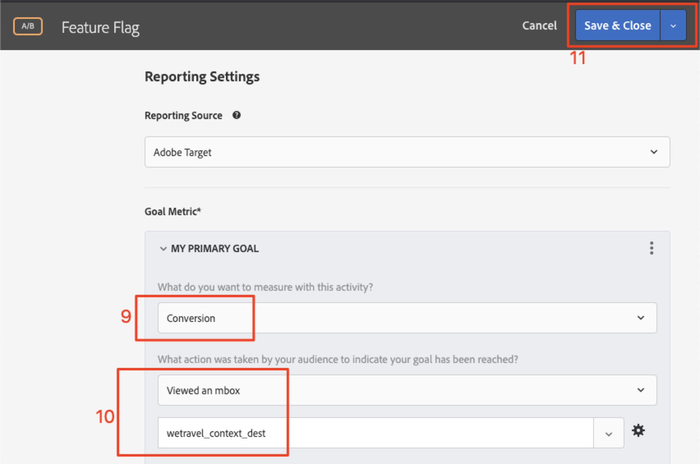
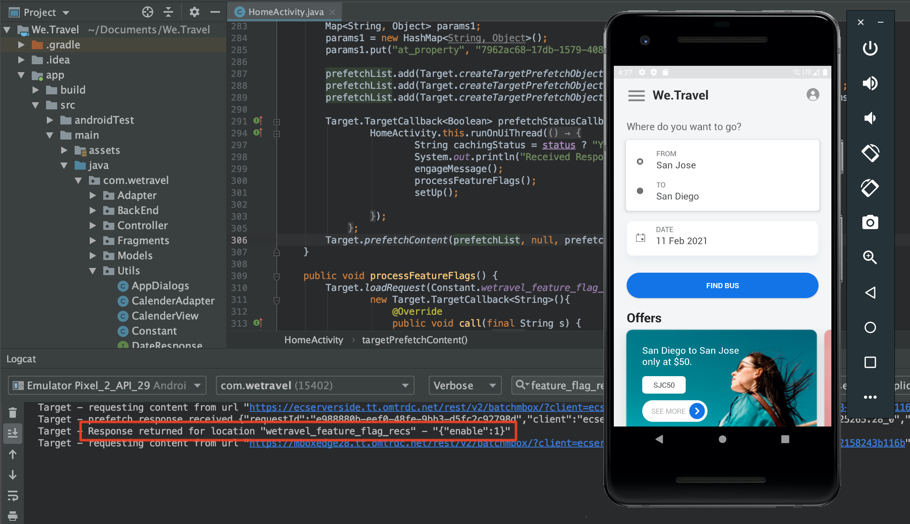

# 機能のフラグ

モバイルアプリのプロダクトオーナーは、複数のアプリリリースに投資することなく、アプリに新機能をロールアウトできる柔軟性を必要としています。 また、効果をテストするために、機能を徐々にユーザーベースのパーセンテージにロールアウトしたい場合もあります。 Adobe Targetを使用すれば、カラー、コピー、ボタン、テキスト、画像などのUX機能を試し、特定のオーディエンスにそれらの機能を提供できます。

このレッスンでは、特定のアプリ機能を有効にするトリガーとして使用できる「機能フラグ」オファーを作成します。

## 学習目標

このレッスンの最後には、次のことが可能になります。

* バッチ先行取得リクエストに新しい場所を追加
* 機能フラグとして使用されるオファーを含む[!DNL Target] アクティビティを作成します
* アプリで機能フラグオファーを読み込んで検証する

## ホーム アクティビティへの事前取得リクエストに新しい場所を追加する

以前のレッスンのデモアプリでは、「wetravel_feature_flag_recs」という新しい場所をホームアクティビティのプリフェッチリクエストに追加し、新しいJava メソッドを使用して画面に読み込みます。

>[!NOTE]
>
>プリフェッチリクエストを使用する利点の1つは、新しいリクエストを追加しても、そのリクエストがプリフェッチリクエスト内にパッケージ化されるので、ネットワークのオーバーヘッドが追加されたり、追加のロード作業が発生したりしないことです

まず、次のようにwetravel_feature_flag_recs定数がConstant.java ファイルに追加されていることを確認します。



以下はコードです。

```java
public static final String wetravel_feature_flag_recs = "wetravel_feature_flag_recs";
```

次に、プリフェッチリクエストに場所を追加し、`processFeatureFlags()`という新しい関数を読み込みます。



完全に更新されたコードは次のとおりです。

```java
public void targetPrefetchContent() {
    List<TargetPrefetchObject> prefetchList = new ArrayList<>();

    Map<String, Object> params1;
    params1 = new HashMap<String, Object>();
    params1.put("at_property", "7962ac68-17db-1579-408f-9556feccb477");

    prefetchList.add(Target.createTargetPrefetchObject(Constant.wetravel_engage_home, params1));
    prefetchList.add(Target.createTargetPrefetchObject(Constant.wetravel_engage_search, params1));
    prefetchList.add(Target.createTargetPrefetchObject(Constant.wetravel_feature_flag_recs, params1));

    Target.TargetCallback<Boolean> prefetchStatusCallback = new Target.TargetCallback<Boolean>() {
        @Override
        public void call(final Boolean status) {
            HomeActivity.this.runOnUiThread(new Runnable() {
                @Override
                public void run() {
                    String cachingStatus = status ? "YES" : "NO";
                    System.out.println("Received Response from prefetch : " + cachingStatus);
                    engageMessage();
                    processFeatureFlags();
                    setUp();

                }
            });
        }};
    Target.prefetchContent(prefetchList, null, prefetchStatusCallback);
}

public void processFeatureFlags() {
    Target.loadRequest(Constant.wetravel_feature_flag_recs, "", null, null, null,
            new Target.TargetCallback<String>(){
                @Override
                public void call(final String s) {
                    runOnUiThread(new Runnable() {
                        @Override
                        public void run() {
                            System.out.println("Feature Flags : " + s);
                            if(s != null && !s.isEmpty()) {
                                //enable or disable features
                            }
                        }
                    });
                }
            });
}
```

### 機能フラグリクエストの検証

コードが追加されたら、ホーム アクティビティでエミュレーターを実行し、更新された応答についてLogcatを監視します。



## 機能フラグ JSON オファーの作成

ここで、特定のオーディエンス（アプリで機能のロールアウトを受け取るオーディエンス）のフラグやトリガーとして機能する、シンプルなJSON オファーを作成します。 [!DNL Target] インターフェイスで、新しいオファーを作成します。



値{&quot;enable&quot;:1}を持つ「機能フラグ v1」に名前を付けましょう



## アクティビティの作成

オファーを使用してA/B テストアクティビティを作成します。 アクティビティの作成手順について詳しくは、前のレッスンを参照してください。 この例では、アクティビティに必要なオーディエンスはひとつだけです。 ライブシナリオでは、特定の機能のロールアウトに対して特定のカスタムオーディエンスを構築し、そのオーディエンスを使用するようにアクティビティを設定することができます。 この例では、トラフィックは50/50 （機能の更新を確認する訪問者には50%、標準的なエクスペリエンスを確認する訪問者には50%）だけを割り当てます。 アクティビティの設定は次のとおりです。

1. アクティビティに「機能フラグ」という名前を付けます
1. 「wetravel_feature_flag_recs」の場所を選択します
1. コンテンツを「機能フラグ v1」 JSON オファーに変更します

   

1. 「**[!UICONTROL Add Experience]**」をクリックして、エクスペリエンス Bを追加します。
1. 「wetravel_feature_flag_recs」の場所を残します
1. コンテンツに&#x200B;**[!UICONTROL Default Content]**&#x200B;を残します
1. **[!UICONTROL Next]**&#x200B;をクリックして[!UICONTROL Targeting]画面に進みます

   

1. [!UICONTROL Targeting]画面で、[!UICONTROL Traffic Allocation] メソッドが既定の設定（手動）に設定されており、各エクスペリエンスに既定の50%割り当てがあることを確認します。 **[!UICONTROL Next]**&#x200B;を選択して&#x200B;**[!UICONTROL Goals & Settings]**&#x200B;に進みます。

   

1. **[!UICONTROL Primary Goal]**&#x200B;を&#x200B;**[!UICONTROL Conversion]**&#x200B;に設定します。
1. アクションを&#x200B;**[!UICONTROL Viewed an Mbox]**&#x200B;に設定します。 「wetravel_context_dest」の場所を使用します（この場所は確認画面にあるので、この場所を使用して、新しい機能がより多くのコンバージョンにつながるかどうかを確認できます）。
1. **[!UICONTROL Save & Close]** をクリックします。

   

アクティビティをアクティブ化します。

## 機能フラグアクティビティの検証

次に、エミュレーターを使用してリクエストを監視します。 ターゲットを50%のユーザーに設定しているので、50%のユーザーが機能フラグの応答に`{enable:1}`値が含まれていることがわかります。



`{enable:1}`値が表示されない場合は、エクスペリエンスのターゲットになっていないことを意味します。 一時的なテストとして、オファーを強制的に表示するには、次の操作を行います。

1. アクティビティを無効にします。
1. 新しい機能エクスペリエンスのトラフィック配分を100%に変更します。
1. 保存して再アクティベート。
1. エミュレーターのデータを消去してから、アプリを再起動します。
1. これで、オファーは`{enable:1}`値を返す必要があります。

ライブシナリオでは、`{enable:1}`応答を使用して、アプリ内でより多くのカスタムロジックを有効にし、ターゲットオーディエンスに表示する特定の機能セットを表示できます。

## まとめ

すばらしい！ これで、特定のユーザーオーディエンスに機能をロールアウトするために必要なスキルが手に入りました。
