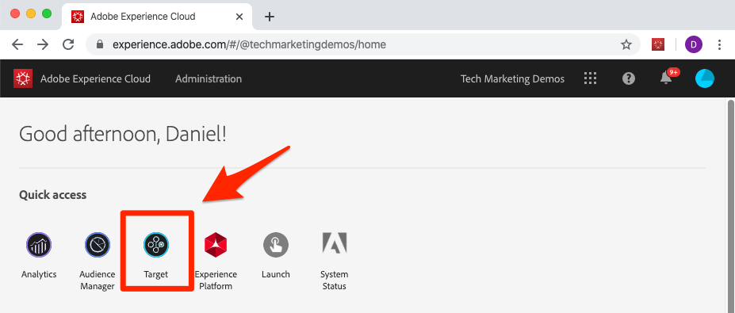
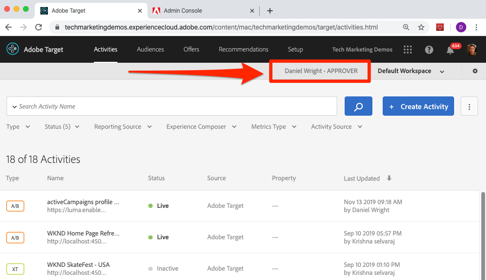
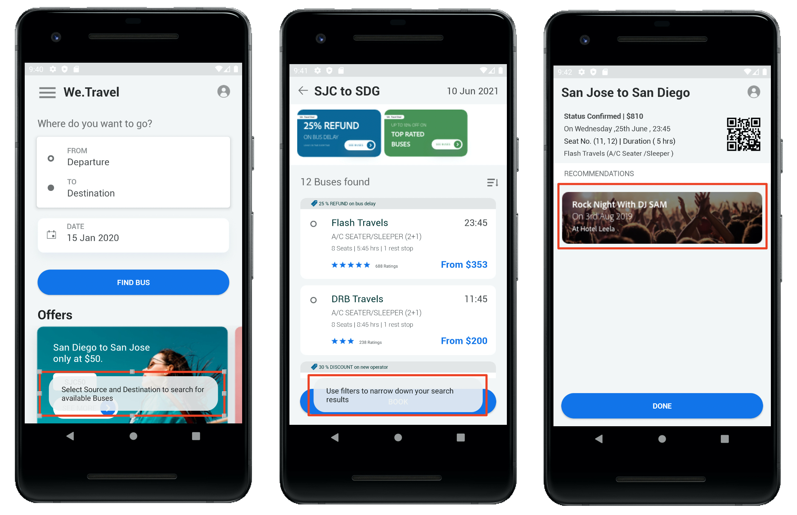

# Adobe TargetとAdobe Mobile Services SDK v4 for Android – 概要

_Adobe TargetとAdobe Mobile ServicesのSDK v4 for Android_&#x200B;は、既にAdobe Mobile Services SDK v4を使用しており、Adobe Targetでアプリ体験のパーソナライズを開始したいAndroid デベロッパーにとって最適な出発点です。

レッスンを完了するためのデモAndroid アプリが提供されます。 このチュートリアルを完了すると、独自のAndroid アプリで[!DNL Target]の実装を開始する準備が整います。

このチュートリアルでは、以下の内容について学習します。

* [Adobe Mobile Services SDK](https://experienceleague.adobe.com/docs/mobile-services/android/getting-started-android/requirements.html?lang=ja)の設定を検証します
* 次のタイプの[!DNL Target] リクエストを実装します。
   * [!DNL Target] コンテンツの先行取得
   * 1つのリクエスト内の複数の[!DNL Target] ロケーション （mbox）をバッチ処理する
   * リクエストのブロック （アプリの表示前に実行）
   * 非ブロッキング要求（バックグラウンドで実行）
   * リアルタイム（キャッシュなし）
   * キャッシュバスティングのリフェッチ
* 強化されたパーソナライゼーションのリクエストにパラメーターを追加する
* オーディエンスとオファーの作成
* レイアウトのパーソナライズ
* 機能のフラグ付けによる新機能の展開

## 前提条件

これらのレッスンでは、次のことを想定しています。

* Adobe IDと、Adobe Target インターフェイスへの承認者レベルのアクセス権を持つ（以下の確認手順を参照）
* 自分のアカウントにリクエストを行えるように、Adobe Targetのクライアントコードを把握する。 クライアントコードは、設定/実装/at.js設定画面のAdobe Target インターフェイスに表示されます
* [Mobile Services ユーザーインターフェイス &#x200B;](https://mobilemarketing.adobe.com/)にアクセスし、精通している
* Android モバイルアプリ開発用のIDEを持っている。 このチュートリアルでは、様々な手順とスクリーンショットで[Android Studio](https://developer.android.com/studio/install)を紹介します

Experience Cloud ソリューションに必要なアクセス権がない場合は、Experience Cloud管理者にお問い合わせください。

また、JavaでのAndroid開発に精通していることを前提としています。 レッスンを完了するためにJavaの専門家である必要はありませんが、コードを快適に読んで理解できれば、より多くの情報を得ることができます。

### Adobe Targetへのアクセスを確認する

このレッスンでは、Adobe Targetへのアクセスが必要です。 次の手順に進む前に、次の手順を実行してAdobe Targetにアクセスできることを確認します。

1. [Adobe Experience Cloud](https://experience.adobe.com/)にログインします
1. Experience Cloudのホーム画面で、[!DNL Target]をクリックします。
   
1. 下の図に示すように、Adobe Targetの「アクティビティ」リストにアクセスし、ユーザーが承認者レベルのアクセス権を持っていることを確認する必要があります。 [!DNL Target]にアクセスできない場合、または承認者レベルのアクセス権を確認できない場合は、会社のExperience Cloud管理者にお問い合わせください。このアクセス権をリクエストし、このチュートリアルが付与されたら再開してください。

   

## レッスンについて

これらのレッスンでは、Adobe Targetを自社のAdobe Target アカウントを使用して「We.Travel」というデモ旅行アプリに実装します。 チュートリアルの最後には、アプリの使用状況に基づいてユーザーにパーソナライズされたメッセージを配信します。 最終的なパーソナライズ体験は次のようになります。

We.Travel アプリ内での実装を完了すると、お客様のモバイルアプリで[!DNL Target]の使用を開始できるようになります。

では始めましょう。

**[NEXT :「サンプルアプリをダウンロードして更新する」 >](download-and-update-the-sample-app.md)**
