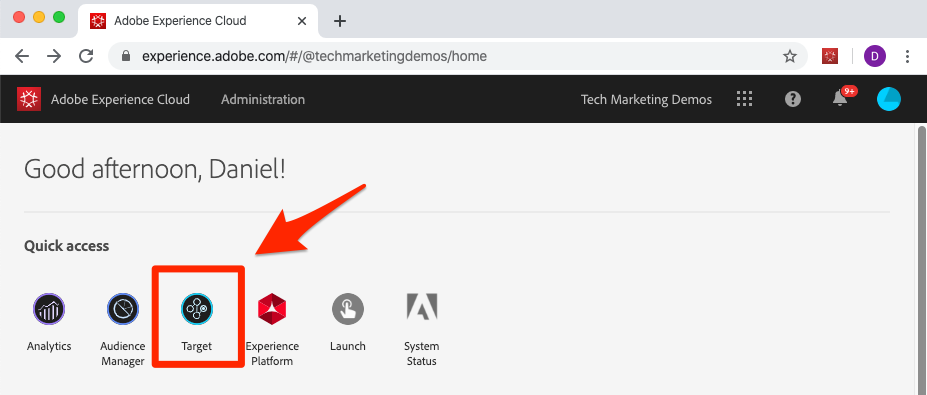
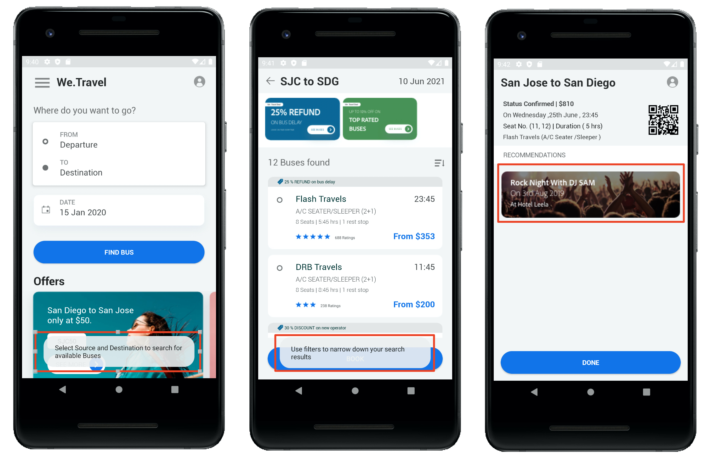

# Android 用AdobeMobile Services SDK v4 を使用したAdobe Target — 概要

_Adobe TargetとAdobeMobile Services SDK v4 for Android は、既に_ AdobeMobile Services SDK v4 を使用し、Adobe Targetでのアプリエクスペリエンスのパーソナライズを開始したい Android 開発者にとって最適な出発点です。

レッスンを完了するためのデモ Android アプリが用意されています。 このチュートリアルを完了すると、自分の Android アプリに [!DNL Target] を実装する準備が整います。

このチュートリアルでは、以下の内容について学習します。

* [AdobeMobile Services SDK](https://experienceleague.adobe.com/docs/mobile-services/android/getting-started-android/requirements.html?lang=en) の設定を検証します
* 次のタイプの [!DNL Target] リクエストを実装します。
   * [!DNL Target] コンテンツのプリフェッチ
   * 1 つのリクエストで複数の [!DNL Target] 場所 (mbox) をバッチ処理
   * リクエストのブロック（アプリの表示前に実行）
   * 非ブロックリクエスト（バックグラウンドで実行）
   * リアルタイム（非キャッシュ）
   * キャッシュバスティングのリフェッチ
* リクエストへのパラメーターの追加によるパーソナライゼーションの強化
* オーディエンスとオファーの作成
* レイアウトのパーソナライズ
* 機能フラグを設定した新機能のロールアウト

## 前提条件

このレッスンでは、次の操作を想定しています。

* Adobe TargetインターフェイスにAdobeID と承認者レベルでアクセスできる（以下の検証手順を参照）
* 独自のアカウントにリクエストをおこなえるように、Adobe Targetクライアントコードを把握しておく。 クライアントコードは、   「セットアップ」/「実装」/「 at.js 設定を編集」画面
* [Mobile Services ユーザーインターフェイス ](https://mobilemarketing.adobe.com/) にアクセスでき、詳しい
* Android モバイルアプリ開発用の IDE を持っている。 このチュートリアルは、様々な手順とスクリーンショットで [Android Studio](https://developer.android.com/studio/install) を取り上げます。

必要なExperience Cloudソリューションへのアクセス権がない場合は、Experience Cloud管理者に問い合わせてください。

また、Java での Android の開発に精通していることを前提としています。 Java の専門家でなくてもレッスンを完了できますが、コードを快適に読んで理解できれば、レッスンを最大限に活用することができます。

### Adobe Targetへのアクセスの検証

このレッスンでは、Adobe Targetにアクセスする必要があります。 次の手順を進める前に、次の手順を実行してAdobe Targetにアクセスできることを確認します。

1. [Adobe Experience Cloud](https://experience.adobe.com/) にログインします。
1. Experience Cloudのホーム画面で、[!DNL Target] をクリックします。
   
1. 次の図に示すように、Adobe Targetのアクティビティリストに移動し、ユーザーが承認者レベルのアクセス権を持っていることを確認します。 [!DNL Target] にアクセスできない場合や、承認者レベルのアクセス権を確認できない場合は、会社のExperience Cloud管理者に問い合わせて、このアクセス権を要求し、許可された後でこのチュートリアルを再開してください。

   

## レッスンについて

このレッスンでは、独自のAdobe Targetアカウントを使用して、Adobe Targetを「We.Travel」と呼ばれるデモ旅行アプリに実装します。 チュートリアルの最後までに、アプリの使用状況に基づいてパーソナライズされたメッセージをユーザーに配信します。 最終的なパーソナライゼーションエクスペリエンスは次のようになります。

We.Travel アプリ内での実装を順を追って実行すると、独自のモバイルアプリで [!DNL Target] を使い始めることができます。

始めよう！

**[次へ：「サンプルアプリのダウンロードと更新」>](download-and-update-the-sample-app.md)**
