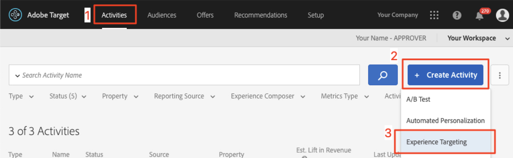
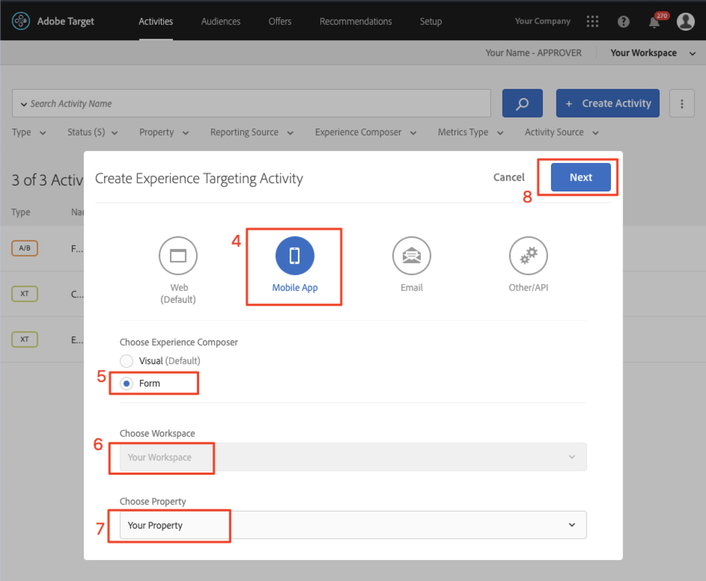
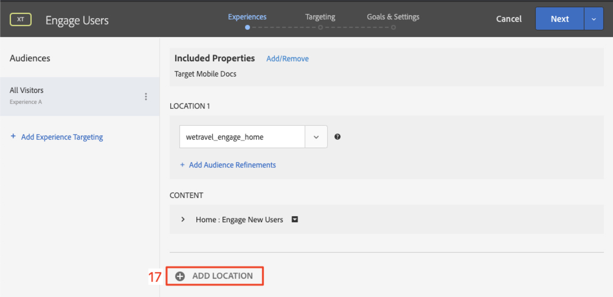
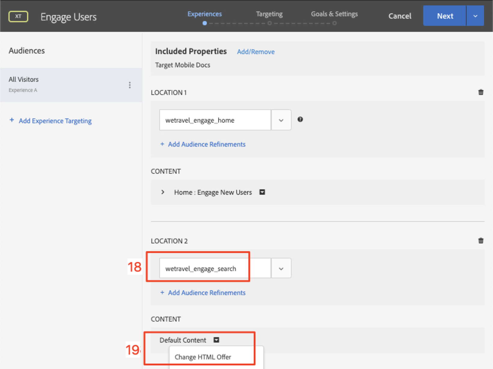
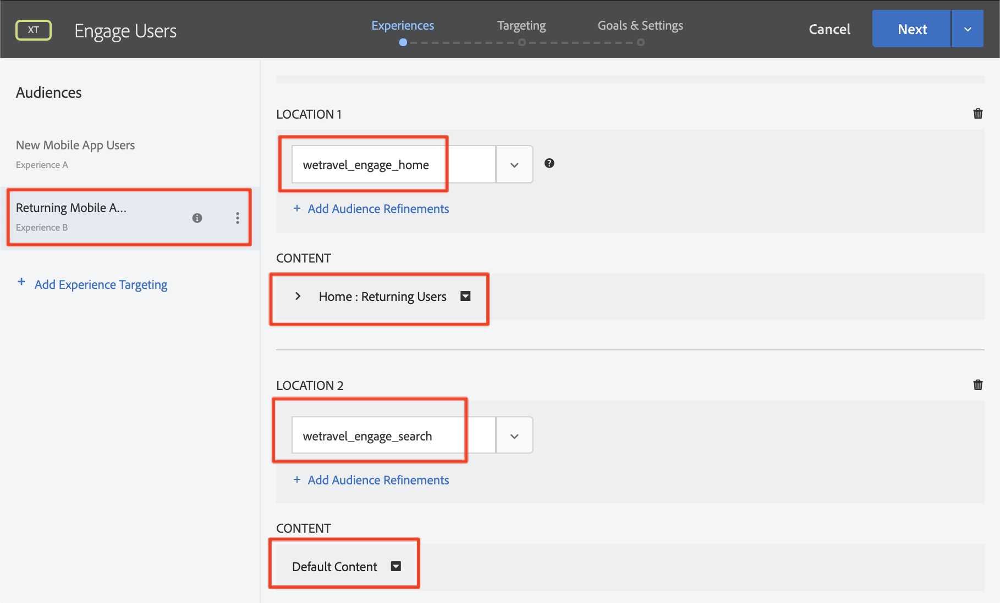
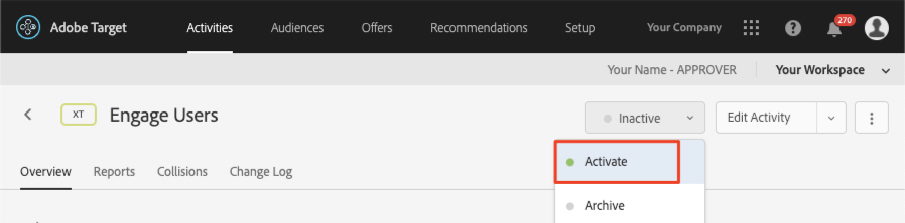

# レイアウトのパーソナライズ

今こそ、あらゆる要素をまとめ、パーソナライズされた体験を構築するときです。 _アクティビティ_&#x200B;は、場所、オーディエンス、オファーをリンクする[!DNL Target] メカニズムです。これにより、アプリからリクエストが行われた場合、[!DNL Target]はパーソナライズされたコンテンツで応答します。 [!DNL Target]で2つのパーソナライゼーションアクティビティを構築し、パーソナライズされたコンテンツが適切なユーザーに的確なタイミングで適切な場所に表示されることを検証します。

## 学習目標

このレッスンの最後には、次のことが可能になります。

* Adobe Targetでのアクティビティの構築
* サンプルアプリでのアクティビティの検証

## Adobe Targetでのアクティビティの作成

エンゲージメントユーザーとコンテキストオファーアクティビティの作成方法について説明します。

### 最初のアクティビティ – 「ユーザーのエンゲージ」

以下に、私たちが構築するアクティビティの概要を示します。

| オーディエンス | 場所 | オファー |
|---|---|---|
| 新しいモバイルアプリユーザー | wetravel_engage_home, wetravel_engage_search | ホーム：新規ユーザーのエンゲージメント、検索：新規ユーザーのエンゲージメント |
| モバイルアプリユーザーの再訪問 | wetravel_engage_home, wetravel_engage_search | ホーム：ユーザーの再表示、default_content |

[!DNL Target] インターフェイスで、次の操作を行います。

1. **[!UICONTROL アクティビティ]**/**[!UICONTROL アクティビティの作成]**/**[!UICONTROL エクスペリエンスのターゲット設定]**&#x200B;を選択します。

   

1. **[!UICONTROL モバイルアプリ]**&#x200B;をクリックします。
1. **[!UICONTROL フォームコンポーザー]**&#x200B;を選択します。
1. ワークスペース（以前のレッスンで使用したワークスペースと同じ）を選択します。
1. プロパティを選択します（以前のレッスンで使用したプロパティと同じ）。
1. 「**[!UICONTROL 次へ]**」をクリックします。

   

1. アクティビティのタイトルを&#x200B;**[!UICONTROL ユーザーをエンゲージ]**&#x200B;に変更します。
1. **[!UICONTROL 省略記号]** > **[!UICONTROL オーディエンスの変更]**を選択します。
   
1. オーディエンスを&#x200B;**[!UICONTROL 新規モバイルアプリユーザー]**&#x200B;に設定します。
1. 「**[!UICONTROL Done]**」をクリックします。
   

1. 場所を&#x200B;_wetravel_ engage_home_に変更します。
1. 「デフォルトのコンテンツ」の横にあるドロップダウン矢印を選択し、「**[!UICONTROL HTML オファーの変更]**」を選択します。

   

1. 「**[!UICONTROL ホーム：新規ユーザーのエンゲージメント]**」オファーを選択します。
1. **[!UICONTROL 完了]**&#x200B;を選択します。

   

1. **[!UICONTROL 場所を追加]**を選択します。
   

1. _wetravel_ engage_search_の場所を選択します。
1. HTMLのオファーを変更します。

   

1. **[!UICONTROL 検索：新規ユーザーのエンゲージメント]** オファーを選択します。
1. 「**[!UICONTROL Done]**」をクリックします。

   

オーディエンスを場所やオファーに結びつけ、新しいモバイルアプリユーザーにパーソナライズされた体験を提供できました。 エクスペリエンスは次のようになります。

次に、モバイルアプリユーザーをリピートするためのエクスペリエンスを作成します。

1. 左側の「**[!UICONTROL エクスペリエンスのターゲット設定を追加]**」を選択します。
1. オーディエンス **[!UICONTROL モバイルアプリユーザーを返す]**&#x200B;を選択します。
1. **[!UICONTROL 完了]**を選択します。
   

先ほど使用したのと同じプロセスを使用して、新しいエクスペリエンスを設定します。 Return Mobile App Users エクスペリエンスの設定は次のようになります。

を返しています

設定の次の画面に進みます。

1. 「**[!UICONTROL 次へ]**」をクリックして、**[!UICONTROL ターゲティング]**&#x200B;画面に進みます。
1. ターゲティングのデフォルト設定を使用します。 オーディエンスが重複している場合（例：_New York Users_&#x200B;および&#x200B;_First Time Users_）、この画面で優先順位を並べ替えることができます。
1. 「**[!UICONTROL 次へ]**」をクリックして、**[!UICONTROL 目標と設定]**&#x200B;に進みます。

   

次に、アクティビティの設定を完了します。

1. **[!UICONTROL プライマリ目標]**&#x200B;を&#x200B;**[!UICONTROL コンバージョン]**&#x200B;に設定します。
1. アクションを&#x200B;**[!UICONTROL 表示したmbox]** > _wetravel_ context_dest_に設定します（この場所は確認画面にあるので、コンバージョンを測定するために使用できます）。

   

1. 画面の他のすべての設定をデフォルトのままにします。
1. 「**[!UICONTROL 保存して閉じる]**」をクリックして、アクティビティを保存します。
1. 次の画面で&#x200B;**[!UICONTROL アクティビティ]**&#x200B;をアクティブ化します。

最初のアクティビティが公開され、テストの準備が整いました。

### 2番目のアクティビティ – 「コンテキストオファー」

ここでは、2つ目のアクティビティの概要を紹介します。

| オーディエンス | 場所 | オファー |
| --- | --- | --- |
| 目的地：サンディエゴ | wetravel_context_dest | サンディエゴのプロモーション |
| 目的地：ロサンゼルス | wetravel_context_dest | ロサンゼルスのプロモーション |

次のアクティビティの「コンテキストオファー」について、上記と同じプロセスを繰り返します。 両方のエクスペリエンスの最終的な設定を次に示します。

#### サンディエゴ

#### ロサンゼルス

目標と設定ステップで、プライマリ目標を予約確認画面の場所に変更します。

1. **[!UICONTROL レポート設定]**&#x200B;で、**[!UICONTROL プライマリ目標]**&#x200B;を&#x200B;**[!UICONTROL コンバージョン]**&#x200B;に設定します。
1. アクションを&#x200B;**[!UICONTROL Viewed an mbox]** > _wetravel_ context_dest_に設定します（このアクティビティでは、この指標はエクスペリエンスを提供する場所と同じであるため、基本的に意味がありません）。
1. 「**[!UICONTROL 保存して閉じる]**」をクリックします。

次の画面でアクティビティをアクティブ化します。

2つ目のアクティビティが公開され、テストの準備が整いました。

## ホームオファーの検証

エミュレーターを実行し、最初のオファーがホーム画面の下部に表示されるのを確認します。 5つ以上のアプリのローンチを持つリピーターの場合、_ウェルカムバック_&#x200B;のオファーが表示されます。 新規ユーザー（アプリの起動数が5未満）の場合は、_新規ユーザー_&#x200B;のメッセージが表示されます。

新しいユーザーオファーが表示されない場合は、エミュレーターのデータをワイプしてみてください。 これにより、次回の起動時にアプリの起動数が1にリセットされます。 これは、**[!UICONTROL ツール]**/**[!UICONTROL AVD Manager]**&#x200B;で実行されます。 Logcatが正常に動作しない場合は、Android Studioを再起動する必要がある場合があります。

_wetravel_ engage_home_をフィルタリングして、Logcatの応答を検証することもできます。

## 検索オファーの検証

**[!UICONTROL サンノゼ]**&#x200B;を&#x200B;**[!UICONTROL 出発地]**&#x200B;として、**[!UICONTROL サンディエゴ]**&#x200B;を&#x200B;**[!UICONTROL 目的地]**&#x200B;として選択し、**[!UICONTROL バスを検索]**&#x200B;をクリックして、利用可能なバスを検索します。

結果画面に、_フィルターを使用_ メッセージが表示されます。 5つ以上のアプリ起動を持つリピーターの場合、デフォルトのコンテンツがこの場所（空白）に設定されているため、メッセージはここに表示されません。

## サンキュー画面でのコンテキストオファーの検証

次に、予約プロセスを続行します。

* 結果画面でバスを選択します。
* チェックアウト画面で座席を選択します。
* 決済画面で「**[!UICONTROL クレジットカード]**」を選択します（決済情報は空白のままにします。実際の予約は行われません）。

サンディエゴが宛先として選択されているので、確認画面に&#x200B;_DJ SAM_ オファーのバナーが表示されます。

次に、**[!UICONTROL 完了]**&#x200B;を選択し、ロサンゼルスを目的地として別の予約を試してください。 確認画面には、_Universal Studios_ バナーが表示されます。

## まとめ

おめでとうございます。 これで、Adobe Target SDK 4.x for Android チュートリアルの主要部分が終わります。 これで、Android アプリケーションにパーソナライゼーションを実装するスキルが手に入りました。 このドキュメントとデモアプリは、今後のプロジェクトの参考資料として参照できます。

次へ：機能のフラグ付けは、AndroidのAdobe Targetで実装できるもう1つの機能です。 機能のフラグ付けについて詳しくは、次のレッスンを参照してください。

**[次：機能のフラグ設定>](feature-flagging.md)**
