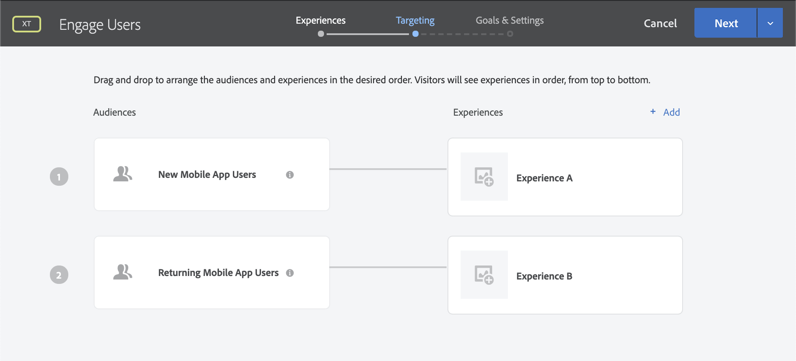
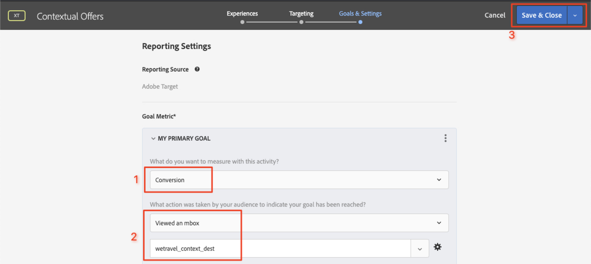

# レイアウトのパーソナライズ

今こそ、すべてをまとめ、パーソナライズされたエクスペリエンスを作成する時です。 _アクティビティ_&#x200B;は、場所、オーディエンスおよびオファーを相互にリンクする[!DNL Target]メカニズムです。アプリからリクエストが行われると、[!DNL Target]はパーソナライズされたコンテンツで応答します。 [!DNL Target]に2つのパーソナライズアクティビティを構築し、パーソナライズされたコンテンツが適切な時期に適切な場所に適切なユーザーに表示されることを検証します。

## 学習目標

このレッスンを終了すると、次のことができます。

* Adobe Targetでアクティビティを構築
* サンプルアプリのアクティビティの検証

## Adobe Targetでアクティビティを作成

ユーザーのソーシャル管理とコンテキストオファーアクティビティを作成する方法を説明します。

### 最初のアクティビティ- 「ユーザーの関与」

作成するアクティビティの概要を次に示します。

| オーディエンス | 場所 | オファー |
|---|---|---|
| 新しいモバイルアプリユーザー | wetravel_engage_home、wetravel_engage_search | ホーム：新規ユーザーの関与、検索：新規ユーザーの関与 |
| モバイルアプリのユーザーを返す | wetravel_engage_home、wetravel_engage_search | ホーム：再訪問者、default_content |

[!DNL Target]インターフェイスで、次の操作を行います。

1. **[!UICONTROL アクティビティ]**/**[!UICONTROL アクティビティを作成]**/**[!UICONTROL エクスペリエンスのターゲット設定]**&#x200B;を選択します。

   

1. 「**[!UICONTROL モバイルアプリ]**」をクリックします。
1. 「**[!UICONTROL フォームコンポーザー]**」を選択します。
1. ワークスペースを選択します（以前のレッスンで使用したのと同じワークスペース）。
1. プロパティを選択します（前のレッスンで使用したのと同じプロパティ）。
1. 「**[!UICONTROL 次へ]**」をクリックします。

   

1. アクティビティのタイトルを&#x200B;**[!UICONTROL ユーザーの関与]**&#x200B;に変更します。
1. **[!UICONTROL 省略記号]** > **[!UICONTROL オーディエンスの変更]**を選択します。
   
1. オーディエンスを&#x200B;**[!UICONTROL 新しいモバイルアプリユーザー]**&#x200B;に設定します。
1. 「 **[!UICONTROL 完了]**」をクリックします。
   

1. 場所を&#x200B;_wetravel_engage_home_&#x200B;に変更します。
1. 「Default Content」の横のドロップダウン矢印を選択し、「**[!UICONTROL Change HTMLオファー]**」を選択します。

   

1. **[!UICONTROL ホームを選択：新規ユーザーの関与]**&#x200B;オファー
1. 「**[!UICONTROL 完了]**」を選択します。

   

1. 「**[!UICONTROL 場所追加]**」を選択します。
   

1. _wetravel_engage_search_&#x200B;の場所を選択します。
1. HTMLオファーを変更します。

   

1. **[!UICONTROL 検索を選択：新規ユーザーの関与]**&#x200B;オファー
1. 「 **[!UICONTROL 完了]**」をクリックします。

   

場所やオファーにオーディエンスを接続しただけで、新しいモバイルアプリユーザー向けにパーソナライズされたエクスペリエンスを作成できました。 エクスペリエンスは次のようになります。

リターンモバイルアプリユーザー向けのエクスペリエンスを作成します。

1. 左側の「**[!UICONTROL 追加エクスペリエンスのターゲット設定]**」を選択します。
1. 「**[!UICONTROL モバイルアプリユーザーを返信]**」オーディエンスを選択します。
1. 「**[!UICONTROL 完了]**」を選択します。
   

ここで、前に新しいエクスペリエンスを設定したのと同じプロセスを使用します。 「モバイルアプリユーザー」エクスペリエンスの設定は、次のようになります。

次の画面に進みます。

1. 「**[!UICONTROL 次へ]**」をクリックして&#x200B;**[!UICONTROL ターゲット]**&#x200B;画面に進みます。
1. 「ターゲット」のデフォルト設定を使用します。 重複するオーディエンス(_ニューヨークのユーザー_&#x200B;と&#x200B;_初回ユーザー_)は、この画面で優先順位を並べることができます。
1. 「**[!UICONTROL 次へ]**」をクリックして、**[!UICONTROL 目標と設定]**&#x200B;に進みます。

   

次に、アクティビティの設定を完了します。

1. **[!UICONTROL プライマリ目標]**&#x200B;を&#x200B;**[!UICONTROL コンバージョン]**&#x200B;に設定します。
1. アクションを&#x200B;**[!UICONTROL Viewed an mbox]** > _wetravel_context_dest_&#x200B;に設定します（この場所は確認画面にあるので、コンバージョンの測定に使用できます）。

   

1. 画面上の他の設定はすべてデフォルトのままにします。
1. 「**[!UICONTROL 保存して閉じる]**」をクリックしてアクティビティを保存します。
1. 次の画面で&#x200B;**[!UICONTROL アクティビティ]**&#x200B;をアクティブにします。

我々の最初のアクティビティは今、実稼働中で、テストの準備ができている！

### 2つ目のアクティビティ- 「コンテキストオファー」

2つ目のアクティビティの概要を次に示します。

| オーディエンス | 場所 | オファー |
| --- | --- | --- |
| 宛先：サンディエゴ | wetravel_context_dest | サンディエゴのプロモーション |
| 宛先：ロサンゼルス | wetravel_context_dest | ロサンゼルスへの進出 |

次のアクティビティ「Contextual Services」に対して、上記と同じプロセスを繰り返します。 両方のエクスペリエンスの最終設定を次に示します。

#### サンディエゴ

#### ロサンゼルス

目標と設定ステップで、「プライマリ目標」を予約確認画面の場所に変更します。

1. **[!UICONTROL レポート設定]**&#x200B;の下で、**[!UICONTROL プライマリ目標]**&#x200B;を&#x200B;**[!UICONTROL コンバージョン]**&#x200B;に設定します。
1. アクションを&#x200B;**[!UICONTROL Viewed an mbox]** > _wetravel_context_dest_&#x200B;に設定します(このアクティビティでは、この指標は基本的に無意味です。これは、エクスペリエンスを提供するのと同じ場所でもあるためです)。
1. 「**[!UICONTROL 保存して閉じる]**」をクリックします。

次の画面でアクティビティをアクティブにします。

2番目のアクティビティはライブでテストの準備ができました！

## ホームオファーの検証

エミュレータを実行し、ホーム画面の下部に表示される最初のオファーを監視します。 再訪問者に対して5つ以上のアプリの起動がある場合は、_再びお問い合わせ_&#x200B;オファーが表示されます。 新規ユーザーの場合（アプリの起動回数が5回未満）、_新規ユーザー_&#x200B;のメッセージが表示されます。

新しいユーザーオファーが表示されない場合は、エミュレーターのデータをワイプしてみてください。 これにより、次回の起動時にアプリが1にリセットされます。 これは&#x200B;**[!UICONTROL ツール]** > **[!UICONTROL AVDマネージャ]**&#x200B;で行います。 Logcatが正しく動作しない場合は、Android Studioも再起動する必要がある可能性があります。

_wetravel_engage_home_&#x200B;のフィルタリングを行うことで、Logcatの応答を検証することもできます。

## 検索オファーの検証

**[!UICONTROL 出発]**&#x200B;として&lt;a0/>サンノゼ&#x200B;]**を、**[!UICONTROL &#x200B;出発&lt;a3/>として&#x200B;**[!UICONTROL サンディエゴ]**&#x200B;を選択し、**[!UICONTROL 目的地]**&#x200B;として&#x200B;**[!UICONTROL バス]**&#x200B;を検索します。

結果画面に、「_フィルターを使用_」というメッセージが表示されます。 再訪問者のユーザーが5回以上のアプリの起動を行った場合、この場所にデフォルトコンテンツが設定されているので、ここにメッセージは表示されません（空白）。

## 「ありがとうございます」画面でのコンテキストオファーの検証

次に、予約プロセスを続けます。

* 結果画面でバスを選択します。
* チェックアウト画面のシートを選択します。
* 支払い画面で「**[!UICONTROL クレジットカード]**」を選択します（支払い情報は空白のままにします。実際の予約は行われません）。

宛先としてサンディエゴが選択されたので、確認画面に&#x200B;_DJ SAM_&#x200B;オファーバナーが表示されます。

次に、「**[!UICONTROL 完了]**」を選択し、ロサンゼルスを目的地として別の予約を試します。 確認画面には、_ユニバーサルスタジオ_&#x200B;バナーが表示されます。

## まとめ

おめでとう！ これで、「Android用Adobe TargetSDK 4.xチュートリアル」の主な部分は終わりです。 Androidアプリにパーソナライゼーションを実装するスキルが身につきました。 このドキュメントとデモアプリは、今後のプロジェクトの参考として参照できます。

次：機能のフラグ付けは、AndroidのAdobe Targetで実装できるもう1つの機能です。 機能のフラグ付けについては、次のレッスンを参照してください。

**[次へ：機能のフラグ付け>](feature-flagging.md)**
