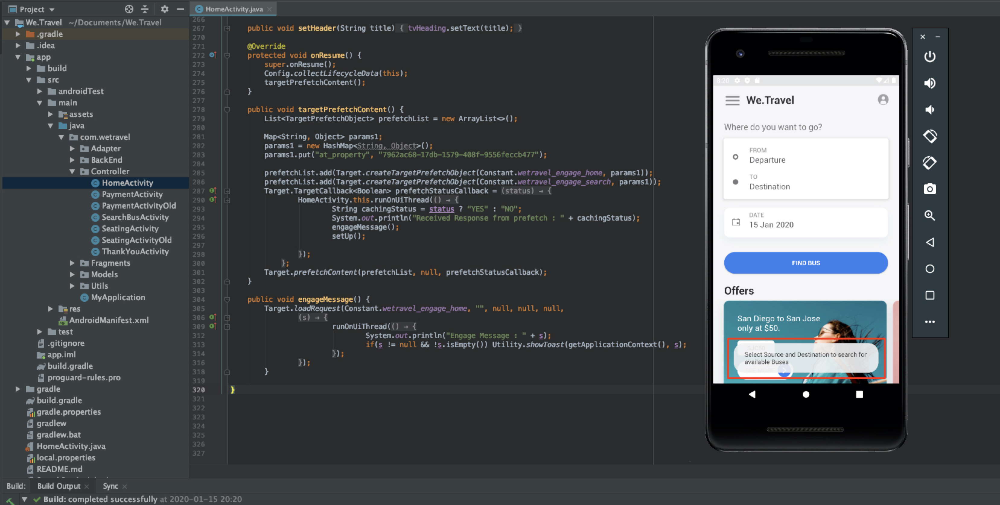

# レイアウトのパーソナライズ

次に、すべてをまとめ、パーソナライズされたエクスペリエンスを作成します。 _アクティビティ_ は、場所、オーディエンスおよびオファーを相互にリンクする [!DNL Target] メカニズムで、アプリからリクエストがおこなわれると、 [!DNL Target] はパーソナライズされたコンテンツで応答します。 [!DNL Target] で 2 つのパーソナライゼーションアクティビティを作成し、パーソナライズされたコンテンツが適切なタイミングで適切な場所に適切なユーザーに表示されることを検証します。

## 学習内容

このレッスンを最後まで学習すると、次の内容を習得できます。

* Adobe Targetでのアクティビティの作成
* サンプルアプリでのアクティビティの検証

## Adobe Targetでのアクティビティの作成

ユーザーの関心を向けるアクティビティとコンテキストオファーアクティビティの作成方法を説明します。

### 最初のアクティビティ — 「ユーザーのエンゲージメント」

作成するアクティビティの概要を次に示します。

| オーディエンス | 場所 | オファー |
|---|---|---|
| 新しいモバイルアプリユーザー | wetravel_engage_home, wetravel_engage_search | ホーム：新規ユーザーのエンゲージメント、検索：新しいユーザーの惹き付け |
| モバイルアプリユーザーの再訪問 | wetravel_engage_home, wetravel_engage_search | ホーム：ユーザーの再訪問， default_content#ユーザーノサク# |

[!DNL Target] インターフェイスで、次の操作を行います。

1. **[!UICONTROL アクティビティ]** / **[!UICONTROL アクティビティを作成]** / **[!UICONTROL エクスペリエンスのターゲット設定]** を選択します。

   

1. 「**[!UICONTROL モバイルアプリ]**」をクリックします。
1. 「**[!UICONTROL フォームコンポーザー]**」を選択します。
1. ワークスペース（前のレッスンで使用したのと同じワークスペース）を選択します。
1. プロパティ（前のレッスンで使用したのと同じプロパティ）を選択します。
1. 「**[!UICONTROL 次へ]**」をクリックします。

   

1. アクティビティのタイトルを **[!UICONTROL ユーザーのエンゲージ]** に変更します。
1. **[!UICONTROL 省略記号]** > **[!UICONTROL Change Audience]** を選択します。
   
1. オーディエンスを「**[!UICONTROL 新しいモバイルアプリユーザー]**」に設定します。
1. 「 **[!UICONTROL 完了]**」をクリックします。
   

1. 場所を _wetravel_engage_home_ に変更します。
1. 「デフォルトコンテンツ」の横のドロップダウン矢印を選択し、「**[!UICONTROL HTMLオファーを変更]**」を選択します。

   

1. **[!UICONTROL ホームを選択します。新しいユーザーのエンゲージメント]** オファー。
1. **[!UICONTROL 完了]** を選択します。

   

1. 「**[!UICONTROL 場所を追加]**」を選択します。
   

1. _wetravel_engage_search_ の場所を選択します。
1. HTMLオファーを変更

   

1. **[!UICONTROL 検索を選択します。新しいユーザーのエンゲージメント]** オファー。
1. 「 **[!UICONTROL 完了]**」をクリックします。

   

オーディエンスを場所とオファーに接続し、新しいモバイルアプリユーザー向けにパーソナライズされたエクスペリエンスを作成しました。 エクスペリエンスは次のようになります。

モバイルアプリユーザーを再訪問するエクスペリエンスを作成します。

1. 左側の「**[!UICONTROL エクスペリエンスのターゲットを追加]**」を選択します。
1. 「オーディエンス **[!UICONTROL モバイルアプリユーザーを再訪問]**」を選択します。
1. **[!UICONTROL 完了]** を選択します。
   

次に、前の手順と同じ手順を使用して、新しいエクスペリエンスを設定します。 「モバイルアプリユーザーを再訪問」エクスペリエンスの設定は次のようになります。

次の画面に進みます。

1. 「**[!UICONTROL 次へ]**」をクリックして、**[!UICONTROL ターゲティング]** 画面に進みます。
1. 「ターゲット設定」のデフォルト設定を使用します。 重複するオーディエンスのエクスペリエンスがある場合 ( 例：_New York Users_ と _First Time Users_) この画面で優先順位を並べることができます。
1. 「**[!UICONTROL 次へ]**」をクリックして、「**[!UICONTROL 目標と設定]**」に進みます。

   

次に、アクティビティの設定を完了します。

1. **[!UICONTROL プライマリの目標]** を **[!UICONTROL コンバージョン]** に設定します。
1. アクションを「**[!UICONTROL mbox]** を表示した/_wetravel_context_dest_」に設定します（この場所は確認画面に表示されるので、コンバージョンの測定に使用できます）。

   

1. 画面上のその他の設定はすべてデフォルトのままにします。
1. 「**[!UICONTROL 保存して閉じる]**」をクリックして、アクティビティを保存します。
1. 次の画面で **[!UICONTROL アクティビティ]** をアクティブにします。

最初のアクティビティが実稼働し、テストの準備が整いました。

### 2 つ目のアクティビティ — 「コンテキストオファー」

2 つ目のアクティビティの概要を次に示します。

| オーディエンス | 場所 | オファー |
| --- | --- | --- |
| 宛先：サンディエゴ | wetravel_context_dest | サンディエゴのプロモーション |
| 宛先：ロサンゼルス | wetravel_context_dest | ロサンゼルスのプロモーション |

次のアクティビティ「コンテキストオファー」に対して、上記と同じ手順を繰り返します。 両方のエクスペリエンスの最終設定を次に示します。

#### サンディエゴ

#### ロサンゼルス

目標と設定ステップで、プライマリ目標を予約確認画面の場所に変更します。

1. 「**[!UICONTROL レポート設定]**」で、**[!UICONTROL プライマリの目標]** を **[!UICONTROL コンバージョン]** に設定します。
1. アクションを **[!UICONTROL Viewed an mbox]** / _wetravel_context_dest_ に設定します（このアクティビティでは、この指標もエクスペリエンスを提供する同じ場所なので、基本的にこの指標は無意味です）。
1. 「**[!UICONTROL 保存して閉じる]**」をクリックします。

次の画面で「アクティビティ」をアクティブにします。

2 つ目のアクティビティはライブで、テストの準備が整いました。

## ホームオファーの検証

エミュレーターを実行し、ホーム画面の下部に表示される最初のオファーを監視します。 5 つ以上のアプリを起動した再ユーザーの場合は、_ようこそ_ オファーが表示されます。 新しいユーザー（アプリの起動回数が 5 回未満）の場合は、_新しいユーザー_ メッセージが表示されます。

新しいユーザーオファーが表示されない場合は、エミュレーターでデータを消去してみてください。 これにより、次回起動したときにアプリが 1 にリセットされます。 これは **[!UICONTROL ツール]** > **[!UICONTROL AVD マネージャ]** で行います。 Logcat が正常に動作しない場合は、Android Studio も再起動する必要がある場合があります。

_wetravel_engage_home_ に対するフィルタリングを使用して、Logcat での応答を検証することもできます。

## 検索オファーの検証

**[!UICONTROL 出発]** として **[!UICONTROL サンノゼ]** を選択し、**[!UICONTROL 目的地]** として **[!UICONTROL サンディエゴ]** を選択して、「**[!UICONTROL バスを検索]**」をクリックし、利用可能なバスを検索します。

結果画面に、「_use filters_」というメッセージが表示されます。 アプリの起動回数が 5 回以上の再訪問者の場合、この場所（空白）のデフォルトコンテンツが設定されているので、ここにはメッセージは表示されません。

## ありがとう画面でのコンテキストオファーの検証

次に、予約プロセスを続行します。

* 結果画面でバスを選択します。
* チェックアウト画面で座席を選択します。
* 支払い画面で「**[!UICONTROL クレジットカード]**」を選択します（支払い情報は空白のままにします。実際の予約は行われません）。

San Diego が宛先に選ばれたので、確認画面に _DJ SAM_ のオファーバナーが表示されます。

次に、**[!UICONTROL 完了]** を選択し、別の予約先にロサンゼルスを選択してみてください。 確認画面に _Universal Studios_ のバナーが表示されます。

## まとめ

おめでとう！ これで、「 Android 向けAdobe Target SDK 4.x のチュートリアル」の主な部分は終わりです。 これで、Android アプリでパーソナライゼーションを実装するスキルが身につきました。 このドキュメントとデモアプリを、今後のプロジェクトのリファレンスとして参照できます。

次へ：機能フラグ付けは、Android でAdobe Targetで実装できる機能です。 機能のフラグ付けについては、次のレッスンを参照してください。

**[次へ：機能フラグ付け >](feature-flagging.md)**
