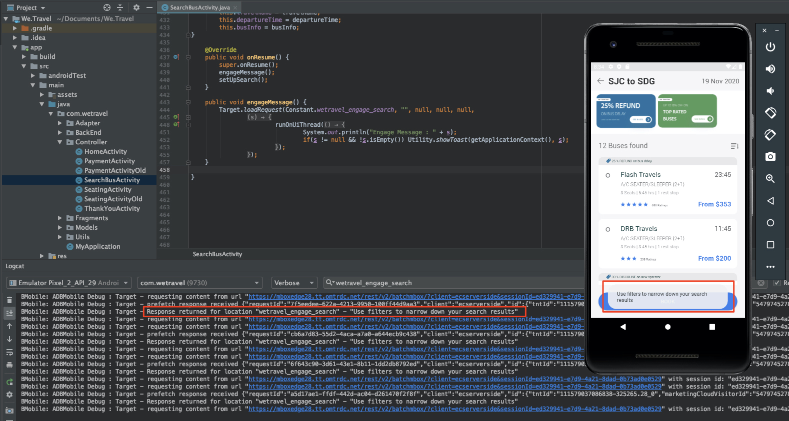

# レイアウトのパーソナライズ

今こそ、すべてをまとめ、パーソナライズされたエクスペリエンスを作成する時です。 _アクティビティ_ とは、場所、オーディエンスおよびオファーを相互にリンクするメカニズムです。これにより、アプリからリクエストが行われる際に、パーソナライズされたコンテンツ [!DNL Target][!DNL Target] に応答します。 で2つのパーソナライズアクティビティを作成 [!DNL Target] し、パーソナライズされたコンテンツが適切な時期に適切な場所に適切なユーザーに表示されることを検証します。

## 学習目標

このレッスンを終了すると、次のことができます。

* Adobe Targetでのアクティビティの作成
* サンプルアプリのアクティビティの検証

## Adobe Targetでのアクティビティの作成

ユーザーのソーシャル管理とコンテキストオファーアクティビティを作成する方法を説明します。

### 最初のアクティビティ- 「ユーザーの関与」

作成するアクティビティの概要を次に示します。

| オーディエンス | 場所 | オファー |
|---|---|---|
| 新しいモバイルアプリユーザー | wetravel_engage_home、wetravel_engage_search | ホーム： 新規ユーザーの関与、検索： 新規ユーザーの関与 |
| モバイルアプリのユーザーを返す | wetravel_engage_home、wetravel_engage_search | ホーム： 再訪問者、default_content |

インター [!DNL Target] フェイスで、次の操作を行います。

1. **[!UICONTROL アクティビティ]** /アクティビティを **[!UICONTROL 作成]** /エクスペリエンスのターゲット設定を選択します ****。

   

1. 「 **[!UICONTROL モバイルアプリ]**」をクリックします。
1. 「 **[!UICONTROL フォームコンポーザー]**」を選択します。
1. ワークスペースを選択します（以前のレッスンで使用したのと同じワークスペース）。
1. プロパティを選択します（前のレッスンで使用したのと同じプロパティ）。
1. 「**[!UICONTROL 次へ]**」をクリックします。

   

1. アクティビティのタイトルを「 **[!UICONTROL ユーザーの関与]**」に変更します。
1. **[!UICONTROL 省略記号]** / **[!UICONTROL 変更オーディエンスを選択します]**。
   
1. オーディエンスを「 **[!UICONTROL 新しいモバイルアプリユーザー]**」に設定します。
1. 「 **[!UICONTROL 完了]**」をクリックします。
   

1. 場所を _wetravel_engage_homeに変更します_。
1. 「デフォルトコンテンツ」の横のドロップダウン矢印を選択し、「HTMLオファーを **[!UICONTROL 変更]**」を選択します。

   

1. ホー **[!UICONTROL ムを選択： 新規ユーザーの関与]** オファーを参照してください。
1. 「 **[!UICONTROL 完了]**」を選択します。

   

1. 「 **[!UICONTROL 追加場所]**」を選択します。
   

1. wetravel_engage_search _の場所を選択します_ 。
1. HTMLオファーを変更します。

   

1. 検 **[!UICONTROL 索を選択します。 新規ユーザーの関与]** オファーを参照してください。
1. 「 **[!UICONTROL 完了]**」をクリックします。

   

場所やオファーにオーディエンスを接続しただけで、新しいモバイルアプリユーザー向けにパーソナライズされたエクスペリエンスを作成できました。 エクスペリエンスは次のようになります。

リターンモバイルアプリユーザー向けのエクスペリエンスを作成します。

1. 左側の「 **[!UICONTROL 追加エクスペリエンスのターゲット設定]** 」を選択します。
1. 「モバイルアプリの **[!UICONTROL 再訪オーディエンス]**」を選択します。
1. 「 **[!UICONTROL 完了]**」を選択します。
   

ここで、前に新しいエクスペリエンスを設定したのと同じプロセスを使用します。 「モバイルアプリユーザー」エクスペリエンスの設定は、次のようになります。

次の画面に進みます。

1. Click **[!UICONTROL Next]** to advance to the **[!UICONTROL Targeting]** screen.
1. 「ターゲット」のデフォルト設定を使用します。 重複するオーディエンス( _ニューヨークのユーザー_ 、 _初回ユーザーなど_)に対するエクスペリエンスがある場合は、この画面で優先順位を設定できます。
1. 「 **[!UICONTROL 次へ]** 」をクリックして **[!UICONTROL 目標と設定に進みます]**。

   

次に、アクティビティの設定を完了します。

1. 「 **[!UICONTROL プライマリ目標]** 」を「コンバージョン **[!UICONTROL 」に設定します]**。
1. アクションを **[!UICONTROL Viewed an mbox]** / _wetravel_context_dest_ （この場所は確認画面にあるので、コンバージョンの測定に使用できます）に設定します。

   

1. 画面上の他の設定はすべてデフォルトのままにします。
1. Click **[!UICONTROL Save &amp; Close]** to save the Activity.
1. 次の画面で **[!UICONTROL アクティビティ]** をアクティブにします。

我々の最初のアクティビティは今、実稼働中で、テストの準備ができている！

### 2つ目のアクティビティ- 「コンテキストオファー」

2つ目のアクティビティの概要を次に示します。

| オーディエンス | 場所 | オファー |
| --- | --- | --- |
| 宛先： サンディエゴ | wetravel_context_dest | サンディエゴのプロモーション |
| 宛先： ロサンゼルス | wetravel_context_dest | ロサンゼルスへの進出 |

次のアクティビティ「Contextual Services」に対して、上記と同じプロセスを繰り返します。 両方のエクスペリエンスの最終設定を次に示します。

#### サンディエゴ

#### ロサンゼルス

目標と設定ステップで、「プライマリ目標」を予約確認画面の場所に変更します。

1. 「 **[!UICONTROL レポート設定]**」で、 **[!UICONTROL プライマリ目標]** (Goal **[!UICONTROL )を「コンバージョン]**」に設定します。
1. アクションを **[!UICONTROL Viewed an mbox]** / _wetravel_context_dest_ (このアクティビティでは、この指標もエクスペリエンスを提供する同じ場所なので、基本的にこの指標は無意味です)に設定します。
1. 「**[!UICONTROL 保存して閉じる]**」をクリックします。

次の画面でアクティビティをアクティブにします。

2番目のアクティビティはライブでテストの準備ができました！

## ホームオファーの検証

エミュレータを実行し、ホーム画面の下部に表示される最初のオファーを監視します。 再訪問者に対して5回以上のアプリの起動がある場合は、「 _ようこそ_ 」オファーが表示されます。 新規ユーザーの場合（アプリの起動回数が5回未満）は、 _新規ユーザー_ :

新しいユーザーオファーが表示されない場合は、エミュレーターのデータをワイプしてみてください。 これにより、次回の起動時にアプリが1にリセットされます。 これは、 **[!UICONTROL ツール]** / **[!UICONTROL AVDマネージャーで行います]**。 Logcatが正しく動作しない場合は、Android Studioも再起動する必要がある可能性があります。

また、 _wetravel_engage_homeに対するフィルタリングを行うことで、Logcatの応答を検証できます_。

## 検索オファーの検証

出発地として **[!UICONTROL サンノゼ]** 、出発地としてサンノゼを選択し **[!UICONTROL ます。出発地としてサンディ]** エゴを選択し、 **[!UICONTROL クリック目的地として]********** サンノゼロを選択します。また、利用可能なバスに対して検索するバスをクリックします。

結果画面に、「 _フィルターを_ 使用」メッセージが表示されます。 再訪問者のユーザーが5回以上のアプリの起動を行った場合、この場所にデフォルトコンテンツが設定されているので、ここにメッセージは表示されません（空白）。

## 「ありがとうございます」画面でのコンテキストオファーの検証

次に、予約プロセスを続けます。

* 結果画面でバスを選択します。
* チェックアウト画面のシートを選択します。
* 支払い画面で「 **[!UICONTROL クレジットカード]** 」を選択します（支払い情報を空欄にしておき、実際の予約は行われません）。

宛先としてサンディエゴが選択されたので、確認画面に _DJ SAM_ オファーバナーが表示されます。

次に、「 **[!UICONTROL 完了]** 」を選択し、目的地としてロサンゼルスを使用する別の予約を試します。 確認画面に _Universal Studios_ バナーが表示されます。

## まとめ

おめでとう！ これで、「Android向けAdobe TargetSDK 4.xのチュートリアル」の主な部分は終わりです。 Androidアプリにパーソナライゼーションを実装するスキルが身につきました。 このドキュメントとデモアプリは、今後のプロジェクトの参考として参照できます。

次： 機能のフラグ付けは、AndroidのAdobe Targetと共に実装できるもう1つの機能です。 機能のフラグ付けについては、次のレッスンを参照してください。

**[次へ： 機能のフラグ付け>](feature-flagging.md)**
