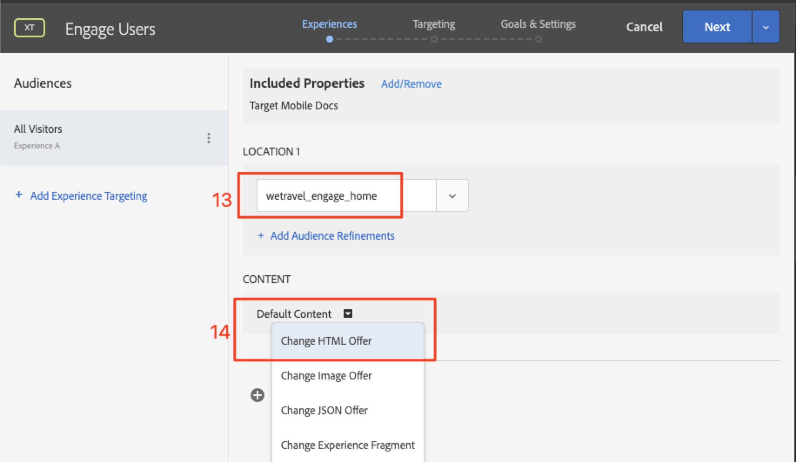
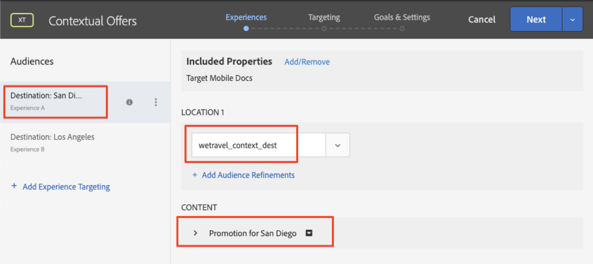

# レイアウトのパーソナライズ

次は、すべてを統合し、パーソナライズされたエクスペリエンスを作成します。 _アクティビティ_ は、場所、オーディエンスおよびオファーをリンクする [!DNL Target] のメカニズムで、アプリからリクエストが行われると、パーソナライズされたコンテンツで応答するよ [!DNL Target] にします。 [!DNL Target] で 2 つのパーソナライゼーションアクティビティを作成し、パーソナライズされたコンテンツが適切なタイミング、適切な場所で適切なユーザーに表示されることを検証します。

## 学習目標

このレッスンを終了すると、次の操作を実行できるようになります。

* Adobe Targetでのアクティビティの作成
* サンプルアプリでのアクティビティの検証

## Adobe Targetでのアクティビティの作成

Engage ユーザーとコンテキストオファーアクティビティを作成する方法を説明します。

### 最初のアクティビティ – 「ユーザーのエンゲージメント」

作成するアクティビティの概要は次のとおりです。

| オーディエンス | 場所 | オファー |
|---|---|---|
| 新規モバイルアプリユーザー | wetravel_engage_home, wetravel_engage_search | ホーム：新しいユーザーと関わる、検索：新しいユーザーと関わる |
| 再びモバイルアプリユーザー | wetravel_engage_home, wetravel_engage_search | ホーム：再来訪ユーザー、default_content |

[!DNL Target] インターフェイスで以下を行います。

1. **[!UICONTROL Activities]**/**[!UICONTROL Create Activity]**/**[!UICONTROL Experience Targeting]** を選択します。

   

1. **[!UICONTROL Mobile App]** をクリックします。
1. **[!UICONTROL Form composer]** を選択します。
1. ワークスペース（前のレッスンで使用したのと同じワークスペース）を選択します。
1. プロパティ（前のレッスンで使用したのと同じプロパティ）を選択します。
1. **[!UICONTROL Next]** をクリックします。

   

1. アクティビティのタイトルを **[!UICONTROL Engage Users]** に変更します。
1. **[!UICONTROL ellipsis]** > **[!UICONTROL Change Audience]** を選択します。
   
1. オーディエンスを **[!UICONTROL New Mobile App Users]** に設定します。
1. **[!UICONTROL Done]** をクリックします。
   

1. 場所を _wetravel_engage_home_ に変更します。
1. 「デフォルトコンテンツ」の横にあるドロップダウン矢印を選択し、「**[!UICONTROL Change HTML Offer]**」を選択します。

   

1. **[!UICONTROL Home: Engage New Users]** オファーを選択します。
1. 「**[!UICONTROL Done]**」を選択します。

   

1. 「**[!UICONTROL Add Location]**」を選択します。
   

1. _wetravel_engage_search_ の場所を選択します。
1. HTML オファーを変更します。

   

1. **[!UICONTROL Search: Engage New Users]** オファーを選択します。
1. **[!UICONTROL Done]** をクリックします。

   

オーディエンスを場所とオファーに接続し、新しいモバイルアプリユーザー向けにパーソナライズされたエクスペリエンスを作成しました。 エクスペリエンスは次のようになります。

次に、再モバイルアプリユーザー向けのエクスペリエンスを作成します。

1. 左側の「**[!UICONTROL Add Experience Targeting]**」を選択します。
1. オーディエンス **[!UICONTROL Returning Mobile App Users]** を選択します。
1. 「**[!UICONTROL Done]**」を選択します。
   

次に、以前に新しいエクスペリエンスを設定したのと同じプロセスを使用します。 「モバイルアプリのユーザーを返す」エクスペリエンスの設定は、次のようになります。

設定の次の画面に進みます。

1. **[!UICONTROL Next]** をクリックして、**[!UICONTROL Targeting]** の画面に進みます。
1. ターゲティングのデフォルト設定を使用します。 オーディエンスのエクスペリエンスが重複している場合（例：_ニューヨークのユーザー_ および _初回のユーザー_）、この画面で優先順位を並べ替えることができます。
1. **[!UICONTROL Next]** をクリックして **[!UICONTROL Goals & Settings]** に進みます。

   

次に、アクティビティの設定を完了します。

1. **[!UICONTROL Primary Goal]** を **[!UICONTROL Conversion]** に設定します。
1. アクションを **[!UICONTROL Viewed an mbox]** > _wetravel_context_dest_ に設定します（この場所は確認画面にあるので、コンバージョンの測定に使用できます）。

   

1. 画面のその他すべての設定をデフォルトのままにします。
1. 「**[!UICONTROL Save & Close]**」をクリックして、アクティビティを保存します。
1. 次の画面で **[!UICONTROL Activity]** をアクティブにします。

最初のアクティビティが実稼働し、テストする準備が整いました。

### 2 つ目のアクティビティ – 「コンテキストオファー」

作成する 2 つ目のアクティビティの概要を次に示します。

| オーディエンス | 場所 | オファー |
| --- | --- | --- |
| 目的地：サンディエゴ | wetravel_context_dest | サンディエゴのプロモーション |
| 目的地：ロサンゼルス | wetravel_context_dest | ロサンゼルスのプロモーション |

次のアクティビティ「コンテキストオファー」に対して、上記と同じプロセスを繰り返します。 両方のエクスペリエンスの最終的な設定を次に示します。

#### サンディエゴ

#### ロサンゼルス

目標と設定ステップで、プライマリ目標を予約確認画面の場所に変更します。

1. **[!UICONTROL Reporting Settings]** の下で、**[!UICONTROL Primary Goal]** を **[!UICONTROL Conversion]** に設定します。
1. アクションを **[!UICONTROL Viewed an mbox]** > _wetravel_context_dest_ に設定します（このアクティビティでは、エクスペリエンスを配信する場所も同じなので、この指標は基本的に意味がありません）。
1. **[!UICONTROL Save & Close]** をクリックします。

次の画面でアクティビティをアクティブにします。

これで、2 つ目のアクティビティが稼働し、テストの準備が整いました。

## ホームオファーの検証

エミュレーターを実行し、ホーム画面の下部に表示される最初のオファーを確認します。 アプリの起動数が 5 つ以上の再ユーザーの場合は、「ようこそ _オファーが表示され_ す。 新規ユーザー（アプリの起動数が 5 未満）の場合は、_新規ユーザー_ というメッセージが表示されます。

新しいユーザーオファーが表示されない場合は、エミュレーターのデータを消去してみてください。 これにより、次回の起動時にアプリの起動回数が 1 にリセットされます。 これは、**[!UICONTROL Tools]**/**[!UICONTROL AVD Manager]** で行います。 Logcat が正しく動作しない場合は、Android Studio も再起動する必要がある可能性があります。

また、_wetravel_engage_home_ をフィルタリングすることで、Logcat の応答を検証することもできます。

## 検索オファーの検証

**[!UICONTROL San Jose]** として **[!UICONTROL Departure]** を選択し、**[!UICONTROL San Diego]** として **[!UICONTROL Destination]** を選択し、**[!UICONTROL Find Bus]** をクリックして利用可能なバスを検索します。

結果画面に「_フィルターを使用_」メッセージが表示されます。 アプリの起動数が 5 つ以上の再ユーザーの場合、この場所（空白）にはデフォルトコンテンツが設定されているので、メッセージはここに表示されません。

## ありがとう画面でのコンテキストオファーの検証

次に、予約プロセスを続行します。

* 結果画面でバスを選択します。
* チェックアウト画面で席を選択します。
* 支払い画面で **[!UICONTROL Credit Card]** を選択します（支払い情報は空白のままにします – 実際の予約は行われません）。

サンディエゴが目的地として選択されたので、確認画面に _DJ SAM_ のオファーバナーが表示されます。

次に、**[!UICONTROL Done]** を選択して、ロサンゼルスを目的地として別の予約を試してください。 確認画面に _Universal Studios_ のバナーが表示されます。

## まとめ

おめでとうございます。 これで、Android用Adobe Target SDK 4.x チュートリアルの主要部分は終了です。 これで、Android アプリでパーソナライゼーションを実装するスキルが身につきました。 今後のプロジェクトの参考として、このドキュメントとデモアプリを参照できます。

次のトピック：機能フラグは、AndroidのAdobe Targetで実装できるもう 1 つの機能です。 機能のフラグ設定について詳しくは、次のレッスンを参照してください。

**[次へ：機能フラグの設定 >](feature-flagging.md)**
