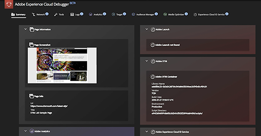

# Adobe Targetの使用方法を学ぶ

Adobe Target は、顧客のエクスペリエンスのカスタマイズやパーソナライズに必要なすべてのツールを提供する Adobe Experience Cloud ソリューションです。Web サイト、モバイルサイト、アプリ、ソーシャルメディアおよびその他のデジタルチャネルでの収益性を最大化することができます。これらのビデオとチュートリアルを使用して、Adobe Targetの多くのコンポーネントを学びます。

## 最新情報

* **[Analysis Workspace for Auto-TargetアクティビティでのA4Tレポートの設定](integrations/set-up-a4t-reports-in-analysis-workspace-for-auto-target-activities.md)**

   *実務担当者向け：自動ターゲットにA4Tを使用しているか。以下の手順に従って、Analysis WorkspaceでA4Tレポートを設定し、自動ターゲットアクティビティの実行時に期待どおりの結果が得られることを確認します。*
* **[オンデバイス判定の概要](implementation/on-device-decisioning-overview.md)**

   *アーキテクト向け：ゼロに近いレイテンシーエクスペリエンスを消費者に提供するための、デバイス上での判定を開始します。*
* **[Recommendations APIの使用（チュートリアル）](recommendations-api-tutorial/recs-api-overview.md)**
   *開発者向け：APIを使用して、カタログやカス [!DNL Recommendations] タム条件の設定と管 [!DNL Recommendations] 理などを実践できます。*

<!--* **[Implement Adobe Target with Adobe Mobile Services SDK v4 for Android (Tutorial)](mobile-v4/overview.md)**
    *For developers who are already using Adobe Mobile Services SDK v4: learn how to start personalizing app experiences with Adobe Target. These steps are provided as legacy user support.*<!-- Concepts learned here are also applicable to Adobe Experience Platform Mobile SDK (v5).-->

<!--* **[Use Recommendations Offers (Video)](recommendations/use-recommendations-offers.md)**
    *For all Target Users: Learn how to use product recommendations in A/B and Experience Targeting Activities.*-->

<!--
* **[Create a Recommendations Activity (Video)](recommendations/create-a-recommendations-activity.md)**
     
    *Recommend products to your customers at scale with this Premium feature.* -->

## スタッフのおすすめ

<table>
<tr>
  <td>
    
    

      <a href="https://docs.adobe.com/content/help/en/experience-cloud/implementing-in-websites-with-launch/implement-solutions/target.html">
    <strong>Adobe Experience Platform Launchを使用したTargetの実装</strong>
    </a>
    

    

    <em>Launchを使用したWeb実装の高速化</em>
    

  </td>
  <td>
    
    

      <a href="implementation/implement-atjs-20-in-a-single-page-application.md">
    <strong>シングルページアプリケーション(SPA)でのat.js 2.0の実装</strong>
    </a>
    

    

    <em>at.js 2.xによるSPAのサポートを参照してください。</em>
    

  </td>
  <td>
    
    

      <a href="troubleshooting/troubleshoot-with-the-experience-cloud-debugger.md">
    <strong>Experience Cloud Debugger</strong>
    </a>
    

    

    <em>実装を拡大します。</em>
    

  </td>
</tr>
</table>
