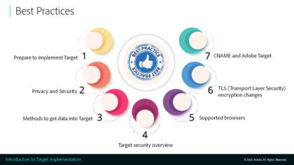

# Adobe Targetの使い方を学ぶ

[!DNL Adobe Target] が [!DNL Adobe Experience Cloud] 顧客体験をカスタマイズし、パーソナライズするために必要なすべてを提供するソリューション。 [!DNL Target] は、Web サイト、モバイルサイト、アプリ、ソーシャルメディア、その他のデジタルチャネルの売上高を最大化するのに役立ちます。これらのビデオとチュートリアルを使用して、の多くのコンポーネントを学習します。 [!DNL Adobe Target].

>[!NOTE]
>
>このガイドに加えて、次の手順を実行します。 [!DNL Adobe Target] ガイドも利用できます。
>
>* *[Adobe Target ビジネス実践者ガイド](https://experienceleague.adobe.com/docs/target/using/target-home.html?lang=ja){target=_blank}*
>
>* *[Adobe Target 開発者ガイド](https://experienceleague.adobe.com/docs/target-dev/developer/overview.html){target=_blank}*

## 最新情報

以下のリソースが新しく追加されました。

* **[での A4T レポートの設定 [!DNL Analysis Workspace] 対象 [!DNL Auto-Allocate] アクティビティ](integrations/set-up-a4t-reports-in-analysis-workspace-for-auto-allocate-activities.md){target=_blank}**

   *実務担当者向け：この [!UICONTROL Analytics for Target] (A4T) 統合： [!UICONTROL 自動配分] レポートデータを [!DNL Adobe Analytics]を使用すると、 [!DNL Analytics].*

* **[ [!DNL Analysis Workspace]  での [!UICONTROL 自動ターゲット]アクティビティ用 A4T レポートの設定](integrations/set-up-a4t-reports-in-analysis-workspace-for-auto-target-activities.md){target=_blank}**

   *実務担当者向け：A4T を [!UICONTROL 自動ターゲット]? 次の手順に従って、で A4T レポートを設定します。 [!DNL Analysis Workspace] 実行時に期待どおりの結果が得られるようにする [!UICONTROL 自動ターゲット] アクティビティ。*

* **[オンデバイス判定](implementation/on-device-decisioning-overview.md)**

   *アーキテクトの場合：の基本を学ぶ [!UICONTROL オンデバイス判定] 待ち時間がほぼゼロのエクスペリエンスを消費者に提供する。*

* **[移行 [!DNL Target] at.js 2.x から [!DNL Platform Web SDK]](https://experienceleague.adobe.com/docs/platform-learn/migrate-target-to-websdk/introduction.html?lang=ja){target=_blank}**

   *移行方法を学ぶ [!DNL Target] at.js の実装 [!DNL Adobe Experience Platform Web SDK].*

## 最頻訪問ビデオ

<table>
<tr>
  <td>
    
    

      <a href="https://experienceleague.adobe.com/docs/target-dev/developer/server-side/on-device-decisioning/overview.html">
    <strong>オンデバイス判定の概要</strong>
    </a>
    

    <!--- 

    <em>Learn how to implement the Adobe Target extension with a page load request and custom parameters.</em>
    
 --->
  </td>
   <td>
    
    

    <a href="https://experienceleague.adobe.com/docs/target-learn/tutorials/implementation/2.1-intro-to-target-implementation.html">
    <strong>Adobe Target実装の概要</strong>
    </a>
    

    <!--- 

    <em> Learn how to implement at.js 2.0 (and later) in SPAs.</em>
    
 --->
  </td>
  <td>
    
    

      <a href="https://experienceleague.adobe.com/docs/target-learn/tutorials/audiences/create-profile-scripts.html">
    <strong>Adobe Targetでのプロファイルスクリプトの作成</strong>
    </a>
    

    <!--- 

    <em>Learn how to use the Adobe Experience Cloud Debugger to understand your [!DNL Target] implementation. Learn how to quickly view your library configuration, examine requests to make sure that your custom parameters are being passed correctly, turn on console logging, and disable all [!DNL Target] requests, and use the Mbox Trace tool.</em>
    
 --->
  </td>
</tr>
</table>

## スタッフのおすすめ

<table>
<tr>
  <td>
    
    

      <a href="https://experienceleague.adobe.com/docs/platform-learn/implement-in-websites/implement-solutions/target.html">
    <strong>Adobe Experience Platformタグを使用した Target の実装</strong>
    </a>
    

    

    <em>ページ読み込みリクエストとカスタムパラメーターを使用してAdobe Target拡張機能を実装する方法について説明します。</em>
    

  </td>
   <td>
    
    

    <a href="https://experienceleague.adobe.com/docs/target-learn/tutorials/implementation/implement-atjs-20-in-a-single-page-application.html">
    <strong>シングルページアプリケーション (SPA) での at.js 2.0 を使用したAdobe Targetの実装</strong>
    </a>
    

    

    <em> SPAで at.js 2.0（およびそれ以降）を実装する方法について説明します。</em>
    

  </td>
  <td>
    
    

      <a href="https://experienceleague.adobe.com/docs/target-learn/tutorials/troubleshooting/troubleshoot-with-the-experience-cloud-debugger.html">
    <strong>Experience Cloud Debuggerでの Target のトラブルシューティング</strong>
    </a>
    

    

    <em>Adobe Experience Cloud Debugger を使用して [!DNL Target] 実装。 ライブラリ設定をすばやく表示し、要求を調べて、カスタムパラメーターが正しく渡されていることを確認し、コンソールログを有効にし、すべてを無効にする方法を説明します [!DNL Target] リクエストを実行し、Mbox Trace ツールを使用します。</em>
    

  </td>
</tr>
</table>