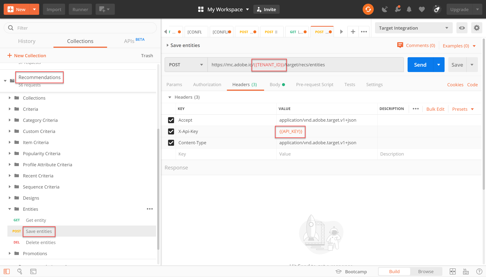

# APIを使用した [!DNL Recommendations] カタログの管理

この時点で、JWT認証フローを使用してアクセストークンを生成し、AdobeI/OでAdobe Target管理APIを使用する方法を学びました。

[RecommendationsAPIを使用して](https://developers.adobetarget.com/api/recommendations/) 、レコメンデーションカタログの品目の追加、更新または削除を行うことができます。 他のAdobe Target管理APIと同様に、APIでは認証が必要 [!DNL Recommendations] です。

>[!TIP]
>
>IMSを送信し **[!UICONTROL ます。 認証用にアクセストークンを更新する必要が生じた場合は、24時間後に期限切れになるので、JWT Generate + Auth via User Token]** requestを使用して認証を行います。 手順については、「AdobeAPI認証の [設定](../apis/configure-io-target-integration.md) 」を参照してください。


>[!NOTE]
>
>先に進む前に、 [Recommendations郵便配達のコレクションを取得し](https://developers.adobetarget.com/api/recommendations/#section/Postman)ます。

## エンティティの保存APIを使用した項目の作成と更新

CSV製品フィードや製品ページで発生するリクエストではなくAPIを使用して [!DNL Recommendations] 製品データベースを入力するには、 [!DNL Target] エンティティを保存APIを使用します [](https://developers.adobetarget.com/api/recommendations/#operation/saveEntities)。 このリクエストは、1つの [!DNL Target] 環境内のアイテムを追加または更新します。 構文：

```
POST https://mc.adobe.io/{{TENANT_ID}}/target/recs/entities
```

例えば、「エンティティの保存」を使用すると、在庫や価格のしきい値など、特定のしきい値を満たした場合に品目を更新し、品目にフラグを付けてレコメンデーションされないようにできます。

1. アイテムを追加または更新する環境 **[!DNL Target]IDを取得するには、[!UICONTROL セットアップ/]ホスト[!UICONTROL /]環境**[!DNL Target] に移動します。

   

2. 前に確立したPostman環境変数 `TENANT_ID` を確認し、 `API_KEY` 参照します。 比較には、次の画像を使用してください。 必要に応じて、APIリクエストのヘッダーとパスを、以下の画像のヘッダーとパスに一致するように変更します。

   

3. JSONを **生のコードとして** 本文に入力します ****。 変数を使用して、環境IDを指定するのを忘れないでく `environment` ださい。 (次の例では、環境IDは6781です)。

   

   >!![NOTE]
   以下のサンプルJSONは、Toaster Oven製品のエンティティ値を関連付けたentity.id kit2001を環境6781に追加します。

   ```
      {
      "entities": [{
              "name": "Toaster Oven",
              "id": "kit2001",
              "environment": 6781,
              "categories": [
                  "housewares:appliances"
              ],
              "attributes": {
                  "inventory": 77,
                  "margin": 23,
                  "message": "crashing helicopter",
                  "pageUrl": "www.foobar.foo.com/helicopter.html",
                  "thumbnailUrl": "www.foobar.foo.com/helicopter.jpg",
                  "value": 19.2
              }
          }]
      }
   ```

4. 「**送信**」をクリックします。次の回答を受け取ります。

   

JSONオブジェクトは、複数の製品を送信するように拡大・縮小できます。 例えば、このJSONは2つのエンティティを指定します。

```
    {
        "entities": [{
                "name": "Toaster Oven",
                "id": "kit2001",
                "environment": 6781,
                "categories": [
                    "housewares:appliances"
                ],
                "attributes": {
                    "inventory": 89,
                    "margin": 11,
                    "message": "Toaster Oven",
                    "pageUrl": "www.foobar.foo.com/helicopter.html",
                    "thumbnailUrl": "www.foobar.foo.com/helicopter.jpg",
                    "value": 102.5
                }
            },
            {
                "name": "Blender",
                "id": "kit2002",
                "environment": 6781,
                "categories": [
                    "housewares:appliances"
                ],
                "attributes": {
                    "inventory": 36,
                    "margin": 5,
                    "message": "Blender",
                    "pageUrl": "www.foobar.foo.com/helicopter.html",
                    "thumbnailUrl": "www.foobar.foo.com/helicopter.jpg",
                    "value": 54.5
                }
            }
        ]
    }
```

1. 今度は君の番だ！ エンティティを **保存** APIを使用して、次の項目をカタログに追加します。 上記のサンプルJSONを基にしてください。 （JSONを拡張して、追加のエンティティを含める必要があります）。

   

おお、この2つのアイテムは所属していないようだ。 Get Entity **APIを使用してエンティティを調べ、必要に応じて** Delete Entities **** APIを使用して削除します。

## Get Entity APIを使用した品目の詳細の取得

既存の品目の詳細を取得するには、 [Get Entity APIを使用します](https://developers.adobetarget.com/api/recommendations/#operation/getEntity)。 構文：

```
GET https://mc.adobe.io/{{TENANT_ID}}/target/recs/entities/[entity.id]
```

エンティティの詳細は、一度に1つのエンティティに対してのみ取得できます。 「エンティティの取得」を使用すると、カタログ内で更新が行われたことを期待どおりに確認したり、カタログの内容を監査したりできます。

1. APIリクエストで、変数を使用してエンティティIDを指定し `entityId`ます。 次の例では、entityId=kit2004を持つエンティティの詳細が返されます。

   

2. 前に確立したPostman環境変数 `TENANT_ID` を確認し、 `API_KEY` 参照します。 比較には、次の画像を使用してください。 必要に応じて、APIリクエストのヘッダーとパスを、以下の画像のヘッダーとパスに一致するように変更します。

   

3. リクエストを送信します。

   上の例に示すように、エンティティが見つからなかったというエラーが発生した場合は、リクエストを正しい [!DNL Target] 環境に送信していることを確認してください。

   >[!NOTE]
   環境が明示的に指定されていない場合、Get Entityは、 [デフォルト環境からのみエンティティを取得しようとします](https://docs.adobe.com/content/help/en/target/using/administer/hosts.html#section_4F8539B07C0C45E886E8525C344D5FB0) 。 デフォルトの環境以外の環境から取り込む場合は、環境IDを指定する必要があります。

4. 必要に応じて、 `environmentId` パラメーターを追加し、リクエストを再送信します。

   

5. 別の **Get Entity** リクエストを送信します。ここでは、entityId=kit2005を持つエンティティを検査します。

   

これらのエンティティをカタログから削除する必要があると判断したとします。 エンティティの **削除** APIを使用します。

## エンティティの削除APIを使用した項目の削除

カタログから項目を削除するには、エンティティの [削除APIを使用します](https://developers.adobetarget.com/api/recommendations/#operation/deleteEntities)。 構文：

```
DELETE https://mc.adobe.io/{{TENANT_ID}}/target/recs/entities?ids=[comma-delimited-entity-ids]&environment=[environmentId]
```

>[!WARNING]
このAPIは、指定したIDで参照されているエンティティを削除します。
エンティティIDが指定されない場合、指定された環境内のすべてのエンティティが削除されます。 環境IDを指定しない場合、エンティティはすべての環境から削除されます。 これは注意して使用してください。

1. アイテムを削除する環境 **[!DNL Target]IDを取得するには、[!UICONTROL /]セットアップ[!UICONTROL /]ホスト[!UICONTROL /環境]**[!DNL Target] に移動します。

   

2. APIリクエストで、構文 `&ids=[comma-delimited-entity-ids]` (クエリパラメーター)を使用して、削除するエンティティのエンティティIDを指定します。 複数のエンティティを削除する場合は、IDをコンマで区切ります。

   

3. 構文を使用して環境IDを指定します。指定しない場合 `&environment=[environmentId]`は、すべての環境のエンティティが削除されます。

   

4. 前に確立したPostman環境変数 `TENANT_ID` を確認し、 `API_KEY` 参照します。 比較には、次の画像を使用してください。 必要に応じて、APIリクエストのヘッダーとパスを、以下の画像のヘッダーとパスに一致するように変更します。

   

5. リクエストを送信します。

   

6. 「エンティティを **取得**」を使用して結果を確認します。これは、削除されたエンティティが見つからないことを示すはずです。

   

   

おめでとう！ APIを使用して、カタログ内のエンティティの詳細を作成、更新、削除、取得できるようになりました。 [!DNL Recommendations] 次の節では、カスタム条件の管理方法について学びます。

[次の「カスタム条件の管理」>](manage-custom-criteria.md)
