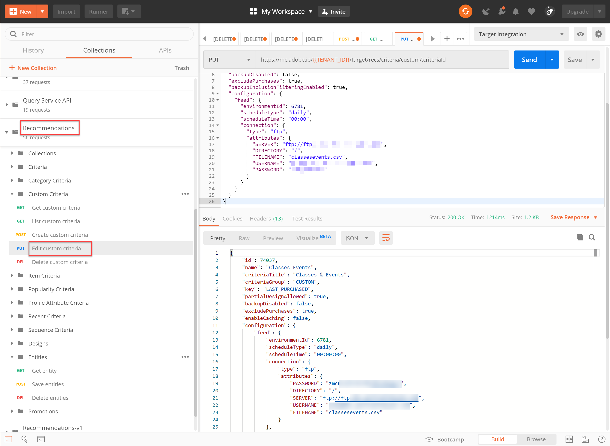
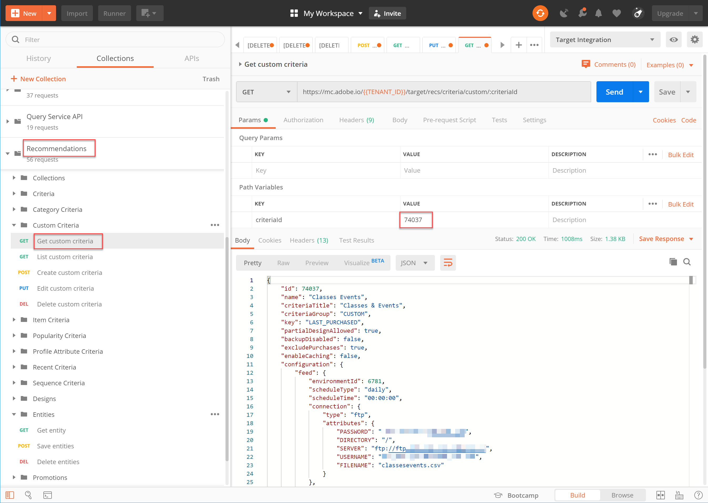

# カスタム条件の管理

によって提供されるアルゴリズム [!DNL Recommendations] は、プロモーションしたい特定の品目を表示できない場合があります。 このような場合、カスタム条件を使用すると、特定の主要品目またはカテゴリに対してレコメンデーション品目の特定のセットを配信できます。 主要品目またはカテゴリとレコメンデーション品目の間のマッピングを定義し、そのマッピングをカスタム条件として読み込みます。 This process is described in the [custom criteria documentation](https://docs.adobe.com/content/help/en/target/using/recommendations/criteria/recommendations-csv.html). ドキュメントに記載されているように、ユーザーインターフェイス(UI)を使用して、カスタム条件を作成、編集および削除でき [!DNL Target] ます。 ただし、 [!DNL Target] カスタム条件をより詳細に管理できるカスタム条件APIのセットも用意されています。

>[!IMPORTANT]
>
>カスタム条件については、次の使用ガイドラインに従います。
>
> APIを使用して、特定のカスタム条件に対してすべての操作（作成、編集、削除）を行うか、またはUIを使用してすべての操作（作成、編集、削除）を行います。 UIとAPIを組み合わせてカスタム条件を管理すると、情報が競合したり予期しない結果が生じたりする場合があります。 例えば、UIでカスタム条件を作成し、その後APIで編集した場合、APIで表示されるように、バックエンドで更新される場合でも、UIでの更新が反映されません。

## カスタム条件の作成

カスタム条件を [作成APIを使用してカスタム条件を作成するには](https://developers.adobetarget.com/api/recommendations/#operation/createCriteriaCustom)、構文を次に示します。

`POST https://mc.adobe.io/{{TENANT_ID}}/target/recs/criteria/custom`

>[!WARNING]
>
>この実習で説明するように、カスタム条件を作成APIを使用して作成したカスタム条件は、UIに表示され、UIで保持されます。 UIでは、これらを編集または削除できません。 API **を使用して編集または削除できますが**、どちらの方法でも、これらは [!DNL Target] UIに引き続き表示されます。 UIからの編集または削除のオプションを維持するには、カスタム条件を作成APIを使用するのではなく、ドキュメントご [とに](https://docs.adobe.com/content/help/en/target/using/recommendations/criteria/recommendations-csv.html)、UIを使用してカスタム条件を作成します。

上記の警告を読み、UIから削除できない新しいカスタム条件を作成しやすい場合にのみ、このチュートリアルを進めてください。

1. カスタム条件 `TENANT_ID` を作成する検証 `API_KEY` と条件で **** 、先ほど確立したPostman環境変数を参照します。 比較には、次の画像を使用してください。

   

2. 追加 **Bodyは、カスタム条件のCSVファイルの場所を定義する****** 生のJSONとして設定します。 カスタム条件の [作成API](https://developers.adobetarget.com/api/recommendations/#operation/getAllCriteriaCustom) （英語のみ）のドキュメントに記載されている例をテンプレートとして使用し、必要に応じ `environmentId` てお客様や他の値を指定します。 この例では、LAST_PURCHASEDをキーとして使用します。

   

3. リクエストを送信し、作成したカスタム条件の詳細が含まれる応答を観察します。

   

4. カスタム条件が作成されたことを確認するには、Adobe Targetから **[!UICONTROL Recommendations][!UICONTROL /]** 条件 **(Criteria** )に移動し、名前で条件を検索するか、次の手順でリストカスタム条件API(API)を使用します。

   

この場合、エラーが発生します。 リストカスタム条件APIを使用して、カスタム条件をより詳細に調べて、エラーを調査しま **す**。

## リストカスタム条件

すべてのカスタム条件のリストと各条件の詳細を取得するには、 [リストカスタム条件API](https://developers.adobetarget.com/api/recommendations/#operation/getAllCriteriaCustom)。 構文：

`GET https://mc.adobe.io/{{TENANT_ID}}/target/recs/criteria/custom`

1. 以前 `TENANT_ID` と同様に確認 `API_KEY` し、リクエストを送信します。 この応答では、カスタム条件IDと、前述のエラーメッセージに関する詳細をメモしておきます。
   

この場合、サーバー情報が正しくなく、カスタム条件定義を含むCSVファイルにアクセスできないこ [!DNL Target] とが原因で、エラーが発生していました。 カスタム条件を編集して修正しましょう。

## カスタム条件を編集

カスタム条件の定義の詳細を変更するには、カスタム条件の [編集API](https://developers.adobetarget.com/api/recommendations/#operation/updateCriteriaCustom)。 構文：

`POST https://mc.adobe.io/{{TENANT_ID}}/target/recs/criteria/custom/:criteriaId`

1. 前 `TENANT_ID` と同じように、と `API_KEY`を確認します。
   

1. 編集する（単一の）カスタム条件の条件IDを指定します。
   

1. Body内で、更新したJSONに正しいサーバー情報を指定します。 （この手順では、アクセス可能なサーバーへのFTPアクセスを指定します）。
   

1. リクエストを送信し、応答をメモします。
   

カスタム条件の **取得APIを使用して、更新されたカスタム条件の成功を確認します**。

## カスタム条件の取得

特定のカスタム条件のカスタム条件の詳細を表示するには、 [Get Custom Criteria API](https://developers.adobetarget.com/api/recommendations/#operation/getCriteriaCustom). 構文：

`GET https://mc.adobe.io/{{TENANT_ID}}/target/recs/criteria/custom/:criteriaId`

1. 詳細を取得するカスタム条件の条件IDを指定します。 リクエストを送信し、応答を確認します。
   
1. 成功を確認します。 （この場合、FTPエラーがないことを確認します）。
   
1. （オプション）更新がUIに正確に反映されることを確認します。
   

## カスタム条件の削除

前述の条件IDを使用して、カスタム条件の [削除APIを使用してカスタム条件を削除します](https://developers.adobetarget.com/api/recommendations/#operation/deleteCriteriaCustom)。 構文：

`DELETE https://mc.adobe.io/{{TENANT_ID}}/target/recs/criteria/custom/:criteriaId`

1. 削除する（単一の）カスタム条件の条件IDを指定します。 「**送信**」をクリックします。
   

1. 「カスタム条件を取得」を使用して条件が削除されていることを確認します。
   この場合、予期される404エラーは、削除された条件が見つからないことを示します。

>[!NOTE]
>注意：条件は、カスタム条件を作成APIを使用して作成されたので、削除されても、 [!DNL Target] UIから削除されません。

おめでとう！ これで、 [!DNL Recommendations] APIを使用して、カスタム条件の作成、リスト、編集、削除および詳細の取得を行うことができます。 次の節では、 [!DNL Target] 配信APIを使用してレコメンデーションを取得します。

[次に、「サーバ側配信APIでRecommendationsを取得する」>](fetch-recs-server-side-delivery-api.md)
