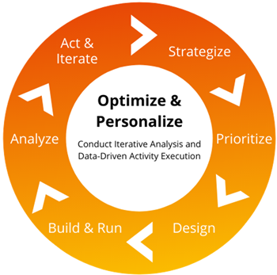

# Adobe Targetを活用した最適化のベストプラクティス

Adobeの最適化の6つの基本と、その適用方法について説明します。

強力なデジタルプレゼンスの構築には、多くの課題が直面します。 その上、何百人、何千人もの顧客を惹きつけるだけでなく、顧客は時間の経過とともに変化する様々な独自の行動や嗜好を表示します。その変化に対応するだけでなく、予測し、戦略を効率的かつ正確に実行するのは企業の役割です。 これは、継続的な反復とクラス最高のテクノロジーを必要とする、永続的なコンテンツマラソンでの競合他社との競争です。

この多面的な課題の解決策として、Adobe Targetを利用した最適化が挙げられます。これにより、デジタルプレゼンスを進化させ、適切で価値のある、つまづきのない体験を提供できます。 [!DNL Target]を展開する技術的なアーキテクチャとチャネルは、顧客によって大きく異なりますが、この強力なツールの機能を最大限に活用するために、あらゆるチームが使用できるベストプラクティスと最適化戦略のリストを用意しました。

## 最適化について

最適化とは、「状況やリソースを最大限または最も効果的に活用する行動」と定義されます。 これは、加えた変更に価値があることを証明する定性データを保持するための最も効率的な方法です。 真の意味での最適化を実現するには、取り組みの効果と価値を測定する必要があります。 そうしなければ、変更は最小限の利益で高いコストにつながります。 これを効果的かつ効率的に実現するためには、まず戦略的プランニングから始める必要があります。 最適化に戦略的プランニングを含めなければ、推測に過ぎません。

### 最適化の6つの基本

1. **戦略化**: ビジネス目標に沿った、データに基づく活動の機会を特定します。
1. **優先順位付け**: ビジネスの調整、労力レベル、潜在的な影響に基づいてアクティビティをランク付けおよびスケジュールします。
1. **デザイン**: アクティビティ エクスペリエンスの最終的なビジュアルを作成し、詳細な基準を使用してアクティビティ プランを作成します。
1. **ビルドして実行**: [!DNL Target]のセットアップ、コード開発、QA テストを含むアクティビティを開発します。
1. **分析**: [!DNL Target] アクティビティを実稼動環境に起動し、アクティビティ期間中のパフォーマンスを監視します。
1. **アクションと反復**: テストまたはパーソナライゼーションアクティビティのパフォーマンスに基づいて推奨事項を作成します。

変化は絶え間なく起こり続けることを理解しているアドビの最適化戦略は、変化し続ける顧客ニーズに対応するための反復的な実行サイクルである必要があります（下の図1参照）。

_図1 – 最適化の反復サイクル_

## 最適化戦略の構築

最適化戦略を策定するプロセスは、（1）テストアクティビティ計画を作成する、（2）最適化の基本を理解するといったプロセスに分けることができます。

1：試験実施計画書を作成する。 これにより、テスト活動アプリケーションに関しては、品質の最小限の基準を確保できます。 テストアクティビティプランには、以下を含める必要があります。

* **名前と説明：**&#x200B;実験で焦点を当てている内容の直感的なアクティビティ名と説明。 「どうやって？ 目的： いつ？ どこで？ なぜ？」

* **目標：**&#x200B;活動の目的と、それが影響を与えるように設計されているビジネス目標を調整します。

* **仮説：**&#x200B;仮説とは、実験を実行する前に作成した予測です。 この文書では、テスト対象、結果が何であると考えているか、なぜそれが当てはまると思うのかを明確に記述しています。 この実験を行うと、仮説が証明されるか反証されるかのどちらかになります。

完全な仮説には3つの部分があります。

* _変数_&#x200B;の場合
* 次に&#x200B;_結果_
* 理由：_根拠_

* **場所：** URL、ページセクション、デバイスタイプ。
* **目標指標：**&#x200B;成功はどのように測定されますか？
* **セカンダリ指標：**&#x200B;影響と計画のイテレーションをより深く理解する目的で評価する、その他の重要な重要業績評価指標（KPI）。
* **アクティビティオーディエンス：**&#x200B;必要なテスト露出フィルタリングの説明。
* **レポート オーディエンス：**&#x200B;分析に使用する訪問者サブセットの説明のリスト。
* **エクスペリエンスの概念：** モックアップ、例ワイヤーフレーム、および説明。

**一般注：** ビジネス価値を高めたり、insightで価値を提供するweb ページの要素は、テストできます。 一般的な種類のテストアクティビティには、次のようなものがあります。

* Headline text
* コンテンツテキスト
* ボタンテキスト
* ページレイアウト
* フォト
* ボタンの色
* 要素レイアウト
* 要素の削除と追加
* ナビゲーションの順序
* ナビゲーション分類
* 検索強調

2：戦略の第2段階は、テスト要素自体の理解を含む最適化基本を理解することです。 最適化のテスト要素は次のとおりです。

    A.要素の値
    
    これは、サイトに特定の要素が存在する理由や、コンテンツが特定の目的を果たしているかどうかを尋ねることで実現します。 これらの質問は、サイトのデザインを変更したばかりの場合や、新しい機能が最近導入された場合に始めるとよいでしょう。 要素値を決定するために使用される戦術は、包含/除外テストと呼ばれます。 包含/除外テストは、要素が表示されるページ上で適切な値の読み取りを提供します。
    
    B.要素のプレゼンテーション 
    
    要素の全体的なルックアンドフィールと、それが全体的なページプレゼンテーションにどのように影響するかを考えるところです。 プレゼンテーションに使用される戦術は、効果的なコンテンツと要素ページの変更に焦点を当てることです。
    
    C.要素関数
    
    ここでは、ページ上の要素が本来の操作を行っているかどうかを尋ねます。 インタラクションは成功し、意図したとおりに機能しているか。 インタラクションは自然なものなのか、それともフリクションのポイントなのか？ 機能に使用される戦術は、コストに影響を与えることなく、使いやすい機能に焦点を当てたエクスペリエンスを構築することです。

## 最適化とパーソナライゼーションの違い

ここまで戦略の構成要素を分析してリストアップしてきましたが、最適化施策とPersonalization施策を区別することが重要です。 最適化とは、状況やリソースを最大限に活用または最も効果的に活用する活動です。一方、Personalizationは、個人の要件を満たすために何かを設計または制作する活動です。

大まかなレベルでは：

* 最適化とは、デジタルプレゼンスを利用するあらゆる人にとって最も効率的で最も効果的なものを見つけるためのテストに重点を置いています。
* Personalizationでは、デジタルプレゼンスを利用する顧客にとって、最も効率的で効果的な施策を特定するためのテストを実施しています。

最適化に焦点を当てる場合、最も一般的なテストアクティビティは次のとおりです。

* **A/B テスト：** 2つ以上のページまたはページ要素を互いに比較してリアルタイム テストし、お客様の好みに合わせた定量的なinsightを取得します。
* **多変量テスト：** ページ上の要素の間のオファーの組み合わせを比較して、どの組み合わせが最も効果的かを確認します。 また、多変量テストでは、ページのどの要素がコンバージョンを向上させるのに最適かを特定します。

Personalizationに焦点を当てると、Optimizationと同じテストアクティビティが表示される可能性がありますが、より特定のオーディエンスを対象としています。 例えば、A/B テストでは、エクスペリエンス内にページやオーディエンスを追加して、Personalizationをさらに充実させる可能性があります。

Personalizationには、定義されたルールと基準にもとづいて、特定のオーディエンスにコンテンツを配信する、エクスペリエンスのターゲット設定テストのアクティビティタイプも含まれています。 Adobe Personalizationが普及するに伴い、以下のようなAdobe Targetのプレミアム機能も活用する必要があります。

* Automated Personalization アクティビティタイプ
* Recommendation アクティビティ タイプ

## パーソナライゼーション前の最適化

上記の理解を踏まえ、Adobeでは、パーソナライズする前に最適化し、Personalizationを幅広い段階から詳細な段階に進めることが推奨されています。 Personalization アクティビティを幅広いものから詳細なものまで成熟させるには、一対多のパーソナライゼーション（幅広い）スタイルを使用し始め（A/B テストを使用）、次に一対一のパーソナライゼーション（詳細なパーソナライゼーション）スタイルに移行します（Automated Personalization アクティビティを使用）。

詳しくは、「[ パーソナライゼーションテストとロードマップの作成に関するクイックスタート ](https://experienceleague.adobe.com/en/perspectives/quickstart-for-personalization-testing-and-roadmap-creation)」を参照してください。

戦略とソートリーダーシップについて詳しくは、[視点](https://experienceleague.adobe.com/en/perspectives) ハブを参照してください。
